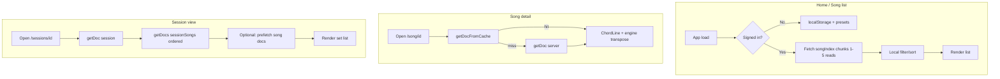

# LF ChordApp — Architecture

> One-page map of the current MVP and the planned Firebase layer. **Do not modify `engine.ts`** — it is production-grade and shared with future mobile clients.

---

## Data model

```
Song → Section[] → LyricLine → ChordMark { chord, position }
```

| Type | Fields | Notes |
|---|---|---|
| **Song** | `id`, `title`, `originalKey` (`Key`), `sections` | Firestore adds metadata later (`artist`, `status`, `version`, …) |
| **Section** | `label`, `lines` | e.g. "Verse 1", "Chorus" |
| **LyricLine** | `lyrics`, `chords` | Full lyric string + chord marks |
| **ChordMark** | `chord`, `position` | Character index in `lyrics` (monospace `ch` units in UI) |

**Why position-indexed?** Chords are data, not inline markup. Transpose, validate, and render independently. ChordPro (`[Am]lyrics`) is a *import* format only — parsed by `presets.ts` `L()` helper or bulk import scripts.

**Presets:** `src/data/presets.ts` — read-only seed data. `SongPreset.presetId` is for URL routing only; it is **not** stored on `Song`.

---

## Engine (`src/lib/engine.ts`)

Pure TypeScript — zero React/Firestore imports.

| Export | Role |
|---|---|
| `transposeChord` | Move a chord between keys |
| `chordToDegree` | Numbers-system display |
| `getDiatonicChords` | 6 diatonic triads per key |
| `isValidChord` | Parse guard |
| `parseChord` | Internal parser |
| `ALL_KEYS` / `Key` | 12 major keys |

---

## UI components (current)

| Component | File | Role |
|---|---|---|
| **HomePage** | `components/HomePage.tsx` | Library search, key filter, browse cap (100) |
| **SongToolbar** | `components/SongToolbar.tsx` | Responsive song header (transpose, edit, session) |
| **ChordLine** | `components/ChordLine.tsx` | One lyric line (chord row + lyrics) |
| **ChordRow** | `components/ChordRow.tsx` | Absolute `ch` positioning; shared by song view and editor |
| **InteractiveEditor** | `components/InteractiveEditor.tsx` | Import step 2 — click-to-place chords |
| **PageLoading / PageError** | `components/` | Shared loading and error states |

Routes: `/`, `/import`, `/login`, `/song/[id]`, `/song/[id]/edit`, `/sessions`, `/sessions/new`, `/sessions/[id]`, `/admin/songs`.

---

## Validation & storage (current)

| Module | Role |
|---|---|
| `validation.ts` | `validateSong()` before every write |
| `storage.ts` | `localStorage` key `lf-chord-app-songs` |
| `editorParser.ts` | Paste lyrics → `Section[]` (no chord extraction) |

**Tests:** Vitest unit + integration (`src/lib/*.test.ts`, `__tests__/integration/`). Playwright smoke in `e2e/`. Dev read counter: `NEXT_PUBLIC_READ_COUNTER=true`.

---

## Data flow (Firebase)

```
firestore/*.ts (pure SDK, no React)
        ↓
   hooks/ (useAuth, useSongSearch, usePaginatedSongs, …)
        ↓
   components/ (HomePage, SongToolbar, ChordLine, …)
```

| Module | Responsibility |
|---|---|
| `firestore/songs.ts` | CRUD, soft-archive |
| `firestore/songIndex.ts` | Fetch/write index chunks; upsert re-chunks full index |
| `firestore/sessions.ts` | Session CRUD |
| `firestore/sessionSongs.ts` | Set-list items, fractional `order` |
| `firestore/songEdits.ts` | Draft/publish with `runTransaction` |

**Auth:** Firebase Auth + custom claim `admin` for write gates. Musician self-signup creates `users/{uid}` with `role: "musician"` (immutable). See `docs/03`.

**Offline:** Firestore persistent cache. `getDocFromCache` → server fallback for song detail. Library index fetched once, filtered locally (zero reads per keystroke).

**Fallback (R17):** When not signed in, keep `localStorage` + built-in presets. Firestore is primary when authed.

---

## Read paths (planned)



---

## Hosting note

**Recommended:** Vercel Hobby — `/song/[id]` is dynamic server-rendered; works without static export.

Firebase Hosting requires `output: 'export'` or query-param routing (`/song?id=…`) unless you add Cloud Functions (Blaze).

See `docs/05` ticket P0-09.
