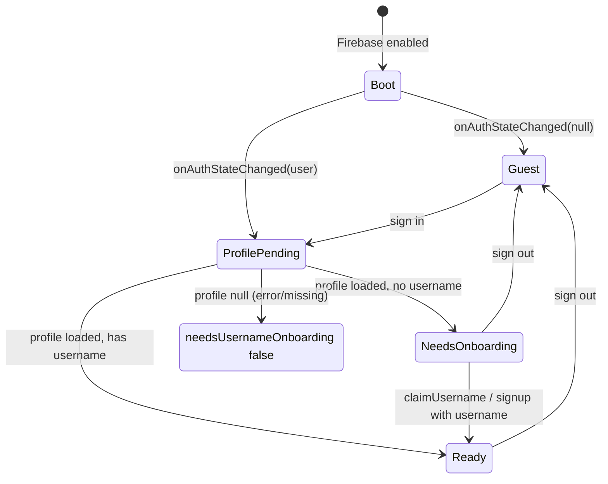

# Web MVP auth parity report (Phase A)

**Purpose:** Ground-truth behavior of `webmvp/` auth, onboarding, redirects, and Firestore writes for Flutter Phase 1.  
**Generated:** Phase A code read (no Flutter implementation in this pass).  
**Spec cross-check:** [`flutter-phase-1-auth.md`](flutter-phase-1-auth.md) — conflicts noted as **WEB WINS** or **DOC WINS**.

---

## 1. Auth state machine

States are derived from `AuthProvider` (`webmvp/src/components/AuthProvider.tsx`) plus route gates (`UsernameGate`, page-level guards).

| State | Conditions | UI / routing behavior |
|-------|------------|------------------------|
| **Boot / loading** | `loading === true` while Firebase enabled (`AuthProvider.tsx:115-116`, `174-175`) | Auth pages show spinner; `UsernameGate` shows “Loading…” (`UsernameGate.tsx:43-44`) |
| **Guest** | `user === null` after auth callback (`AuthProvider.tsx:168-171`) | `profile === null`, `needsUsernameOnboarding === false`, `isAdmin === false` |
| **Signed-in, profile pending** | `user !== null && profileResolved === false` (`AuthProvider.tsx:149`, `UsernameGate.tsx:26-27`) | `UsernameGate` shows loading (`UsernameGate.tsx:43-44`) |
| **Signed-in, profile loaded (no username doc field)** | `profile !== null && !profile.username` → `needsUsernameOnboarding === true` (`AuthProvider.tsx:159-161`) | `UsernameGate` redirects to onboarding unless already on `/onboarding/username` (`UsernameGate.tsx:27-41`) |
| **Signed-in, profile load failed / missing doc** | `loadProfile` catch → `null` (`AuthProvider.tsx:103-108`); outer catch sets `profile === null`, **`needsUsernameOnboarding === false`** (`AuthProvider.tsx:163-166`) | **No** forced onboarding (`safeRedirect.test.ts` case “does not route to onboarding when profile failed to load”) |
| **Signed-in, ready (has username)** | `profile !== null && profile.username` truthy → `needsUsernameOnboarding === false` (`AuthProvider.tsx:159-161`) | App shell routes render normally |
| **Signed-in, legacy doc without username** | Legacy `ensureLegacyUserProfile` creates doc **without** `username` (`AuthProvider.tsx:83-95`) | Same as “no username doc field” → onboarding |

**Firebase disabled:** `loading` starts `false`, `profileResolved` starts `true` (`AuthProvider.tsx:115-116`); auth `useEffect` returns early (`AuthProvider.tsx:122-125`).

**Note:** `ensureLegacyUserProfile` lives in **`AuthProvider.tsx:74-96`**, not in `webmvp/src/lib/firestore/users.ts` (phase doc checklist names the function but file path differs — **WEB WINS**).

---

## 2. Ordered side effects on sign-in (auth state listener)

On **`onAuthStateChanged`** when `nextUser` is non-null (`AuthProvider.tsx:147-176`), order is:

1. **`setUser(nextUser)`**, **`setProfileResolved(false)`** (`AuthProvider.tsx:148-149`)
2. **`ensureLegacyUserProfile(nextUser)`** — **skipped** when `signUpInProgressRef.current === true` (`AuthProvider.tsx:153-155`)
3. **`touchLastLogin(nextUser.uid)`** — always called; no-op if `users/{uid}` missing (`users.ts:165-174`, `AuthProvider.tsx:156`)
4. **`loadProfile(uid)`** → `getUserProfile` with try/catch → `null` on error (`AuthProvider.tsx:103-108`, `157-158`)
5. **`setNeedsUsernameOnboarding(loadedProfile !== null && !loadedProfile.username)`** (`AuthProvider.tsx:159-161`)
6. **`readIsAdmin(nextUser)`** via `getIdTokenResult().claims.admin === true` (`AuthProvider.tsx:98-101`, `162`)
7. On **any** error in the try block: `profile = null`, `needsUsernameOnboarding = false`, `isAdmin = false` (`AuthProvider.tsx:163-166`)
8. **`setProfileResolved(true)`**, **`setLoading(false)`** (`AuthProvider.tsx:174-175`)

When `nextUser` is null: clear profile, onboarding flag, admin (`AuthProvider.tsx:168-171`), then step 8.

**Before** the listener is registered (same mount effect):

1. **`getRedirectResult(auth)`** — Google redirect completion (`AuthProvider.tsx:134-135`)
2. **`clearAuthRedirectPending()`** on success (`AuthProvider.tsx:135`)
3. On redirect error: `clearAuthRedirectPending()` + `setAuthError(formatAuthError(error))` (`AuthProvider.tsx:136-140`)

**Email `signUp` parallel path:** Sets `signUpInProgressRef.current = true` before Auth create (`AuthProvider.tsx:229`), clears in `finally` (`AuthProvider.tsx:267-268`). After successful `createUserProfile`, updates profile state locally without waiting for a second listener tick (`AuthProvider.tsx:253-257`).

---

## 3. Email signup sequence

### 3.1 `AuthProvider.signUp` (server-side order)

Source: `AuthProvider.tsx:204-270`.

| Step | Action | Citation |
|------|--------|----------|
| 1 | Firebase enabled check | `:211-213` |
| 2 | `displayName.trim()` — throw `"Display name is required"` if empty | `:215-218` |
| 3 | `validateUsername(username)` — throw validation error | `:220-223` |
| 4 | `isUsernameAvailable(normalized)` — throw `"That username is already taken"` | `:225-227` |
| 5 | `signUpInProgressRef.current = true` | `:229` |
| 6 | `createUserWithEmailAndPassword` | `:236-240` |
| 7 | `updateProfile(credential.user, { displayName: trimmedName })` | `:242-244` |
| 8 | `createUserProfile({ uid, email, displayName, username })` | `:246-251` |
| 9 | `loadProfile` + set profile / `needsUsernameOnboarding` | `:253-257` |
| **Rollback** | If `credential?.user` after any failure: **`deleteUser(credential.user)`** (best effort, swallow errors) | `:258-265` |
| **Finally** | `signUpInProgressRef.current = false` | `:267-268` |

### 3.2 `SignupForm` (UI validation order)

Source: `SignupForm.tsx:57-78`, `:40-55`.

| Step | Action |
|------|--------|
| 1 | On submit: `validateUsernameField` → `validateUsername` then `onCheckUsername` (availability) |
| 2 | Re-validate username before `onSubmit` |
| 3 | `onSubmit(displayName.trim(), normalized, email, password)` — parameter order differs from `signUp(email, password, displayName, username)` in page handler (`signup/page.tsx:65-72`) |

**Password:** HTML `minLength={6}` only (`SignupForm.tsx:181`, `LoginForm.tsx:95`) — no extra check in `AuthProvider.signUp`.

### 3.3 `createUserProfile` batch (Firestore)

Source: `users.ts:48-86`.

**Pre-checks:** `validateUsername`, `isUsernameAvailable`, derive `displayName` fallback (`users.ts:52-64`).

**Batch writes:**

`users/{uid}`:

- `email`, `displayName`, `username`, `usernameLower` (equal lower), `role: "musician"`, `avatarInitials`, `createdAt`, `lastLoginAt` (server timestamps) — `users.ts:68-77`

`usernames/{usernameLower}`:

- `uid`, `usernameLower`, `createdAt` — `users.ts:79-83`

---

## 4. Google flow (web)

| Step | Web behavior | Citation |
|------|----------------|----------|
| Provider config | `GoogleAuthProvider` + `setCustomParameters({ prompt: "select_account" })` | `googleAuth.ts:3-6` |
| Sign-in API | **`signInWithRedirect(auth, provider)`** — full page navigation | `AuthProvider.tsx:197-201` |
| Pending UX | `markAuthRedirectPending()` → `sessionStorage` key `authRedirectPending` | `authRedirect.ts:3-8`, `AuthProvider.tsx:197` |
| Return from redirect | `getRedirectResult(auth)` on app boot; clear pending; errors → `authError` | `AuthProvider.tsx:134-140` |
| Login page | `isAuthRedirectPending()` → “Completing sign-in…” while loading | `login/page.tsx:30-31`, `107-110` |
| Post Google click | `signInWithGoogle()` then `navigateAfterAuth()` **only if** `currentUser` already set — usually **false** for redirect; completion via `useEffect` when user + profile resolve | `login/page.tsx:82-86`, `47-51` |

**Mobile replacement (pre-approved, not web behavior):** native `google_sign_in` + `signInWithCredential`; no `getRedirectResult` / `authRedirect` sessionStorage — see `flutter-phase-1-auth.md` §2.3, § “Mobile vs web”.

---

## 5. Safe redirect matrix

Constants: `ADMIN_HOME_PATH = "/admin"`, `USERNAME_ONBOARDING_PATH = "/onboarding/username"` (`safeRedirect.ts:6-7`).

### 5.1 `getSafeRedirectPath(next)`

| Input `next` | Output | Evidence |
|--------------|--------|----------|
| `"/playlists/abc"` | `"/playlists/abc"` | Test: **“allows same-origin relative paths”** |
| `null`, `"https://evil.com"`, `"//evil.com"` | `null` | Test: **“rejects external and malformed paths”** |
| `USERNAME_ONBOARDING_PATH` (`/onboarding/username`) | `null` | Test: **“rejects external and malformed paths”** (`safeRedirect.ts:14-16`) |
| Path not starting with `/` | `null` | `safeRedirect.ts:11-12` (no dedicated test) |

**DOC vs web:** Phase doc §2.5 adds mobile-only rejection of `/admin`, `/import`, admin edit paths — **not implemented on web** (`getSafeRedirectPath` has no such checks) — **WEB WINS** for web; **DOC WINS** for intended Flutter.

### 5.2 `resolvePostAuthPath(nextPath, isAdmin)`

| `nextPath` | `isAdmin` | Destination | Evidence |
|------------|-----------|-------------|----------|
| `null` | `true` | `/admin` | Test: **“sends admins to the dashboard by default”** |
| `null` | `false` | `/` | Test: **“sends musicians to home by default”** |
| `"/join/p/token"` | `true` | `"/join/p/token"` | Test: **“honours an explicit next path for admins”** |
| any non-null safe path | either | that path | `safeRedirect.ts:25-27` |

### 5.3 `resolvePostAuthDestination(nextPath, isAdmin, profile)`

| `nextPath` | `isAdmin` | `profile` | Destination | Evidence |
|------------|-----------|-----------|-------------|----------|
| `null` | `false` | object, **no** `username` | `/onboarding/username` | Test: **“routes users without a username to onboarding”** |
| `"/playlists/abc"` | `false` | object, no username | `/onboarding/username?next=%2Fplaylists%2Fabc` | Same test |
| `null` or `"/playlists/abc"` | `false` | **`null`** | `/` or `/playlists/abc` (no onboarding) | Test: **“does not route to onboarding when profile failed to load”** |
| `null` | `false` | has username | `/` | Test: **“sends users with a username to their destination”** |
| `"/playlists/abc"` | `false` | has username | `/playlists/abc` | Same test |
| `null` | `true` | has username | `/admin` | Same test |

Logic: `profile && !profile.username` → onboarding with optional `?next=` (`safeRedirect.ts:37-41`); else `resolvePostAuthPath` (`safeRedirect.ts:44`).

### 5.4 Async helpers (login `navigateAfterAuth`)

**`resolvePostAuthPathForUser(nextPath, user)`** (`safeRedirect.ts:47-57`):

- If `nextPath` **or** `!user` → `resolvePostAuthPath(nextPath, **false**)` — **admin claim ignored when `next` is set** (`safeRedirect.ts:51-52`)
- Else → read token; `resolvePostAuthPath(null, admin claim)`

**`resolvePostAuthDestinationForUser(nextPath, user)`** (`safeRedirect.ts:59-78`):

- `!user` → `resolvePostAuthPath(nextPath, false)`
- Else → load profile (errors → `null`), read admin claim, `resolvePostAuthDestination(next, isAdmin, profile)`

**Login/signup auto-redirect when already signed in:** uses **context** `profile` + `isAdmin`, not re-fetch — `resolvePostAuthDestination(nextPath, isAdmin, profile)` (`login/page.tsx:47-51`, `signup/page.tsx:41-45`).

---

## 6. Username gate matrix

**Global gate:** `(app)/layout.tsx` wraps **`UsernameGate` → `AppShell`** for all musician shell routes (`layout.tsx:11-14`).

**`UsernameGate` rules** (`UsernameGate.tsx:26-45`):

- Redirect when: signed in + `profileResolved` + `needsUsernameOnboarding` + pathname **not** under `/onboarding/username`
- Redirect target: `/onboarding/username` + optional `?next=` from **`getSafeRedirectPath(pathname)`** (current path, not query `next`)
- Blocks render (loading UI) while: `loading`, `user && !profileResolved`, or pending redirect

**Per-route guest / auth (actual code):**

| Route | Guest (no Firebase user) | Signed in, no username | Signed in, has username |
|-------|--------------------------|-------------------------|-------------------------|
| **`/`** (home) | **Allowed** — no `SignInRequired` on `(app)/page.tsx` | **Blocked** by `UsernameGate` → onboarding | Allowed |
| **`/playlists`** (and subpaths) | **Blocked** by `SignInRequired` — static “Sign in required”, link **`/login` without `?next=`** (`SignInRequired.tsx:22-36`, `playlists/page.tsx:80`) | **Blocked** by `UsernameGate` first (loading → onboarding) | Allowed |
| **`/profile`** | **Allowed** — inline “Sign in” link to `/login` (`profile/page.tsx:78-84`) | **Blocked** by `UsernameGate` | Allowed |
| **`/join/p/:token`** | **Outside** `UsernameGate` — invite UI + login/signup links with **`?next=/join/p/{token}`** (`join/p/[token]/page.tsx:55-80`) | After sign-in: auto-join if token valid (Phase 5 API); onboarding enforced elsewhere when browsing shell | Same |

**DOC vs web (playlists login `next=`):** Phase doc §2.9 implies `next=` for login — web `SignInRequired` uses plain `/login` — **WEB WINS**.

**DOC vs web (profile guest):** Phase doc §2.7 says mobile may redirect guests earlier — web allows guest view — **WEB WINS** for web; Flutter may differ per doc.

---

## 7. Firestore field checklist (rules-aligned)

Rules: `firestore.rules:171-280`.

### 7.1 `validUsernameFields()` (create user with username + username claim update)

- `username` and `usernameLower` strings, equal, length 3–20 (`firestore.rules:171-176`)

### 7.2 Signup create — `validUserCreate()` + batch username doc

**`users/{uid}` create** must include (`firestore.rules:179-186` + web batch `users.ts:68-77`):

| Field | Value |
|-------|--------|
| `email` | string |
| `displayName` | string |
| `role` | `"musician"` |
| `avatarInitials` | string |
| `createdAt` | timestamp |
| `lastLoginAt` | timestamp |
| `username` / `usernameLower` | equal, normalized lower |

**`usernames/{usernameLower}` create** (`firestore.rules:274-279`, `users.ts:79-82`):

| Field | Value |
|-------|--------|
| `uid` | `request.auth.uid` |
| `usernameLower` | matches doc id |
| `createdAt` | timestamp |

### 7.3 Legacy create — `validLegacyUserCreate()` + `ensureLegacyUserProfile`

**Required by rules** (`firestore.rules:189-197`):

| Field | Web write (`AuthProvider.tsx:83-95`) |
|-------|----------------------------------------|
| `email` | `user.email ?? ""` |
| `displayName` | displayName \|\| email local part \|\| `"Musician"` |
| `role` | `"musician"` |
| `createdAt` | server timestamp |
| `username` | **must be absent** |
| `lastLoginAt` | optional in rules; web **sets** server timestamp |

**Extra fields web writes (allowed by rules):** `avatarInitials` (`AuthProvider.tsx:89-91`) — not listed in `validLegacyUserCreate()` but not forbidden.

**DOC vs web:** Phase doc §2.1 lists `avatarInitials` on legacy create — matches web write — **WEB WINS** (rules do not require it).

### 7.4 Claim username — `validUsernameClaim()` + username doc create

**User update** (`users.ts:133-136`, `firestore.rules:251-256`):

- Prior doc: **`username` must not exist** on `resource.data`
- Changed keys only: `username`, `usernameLower`
- Must satisfy `validUsernameFields()`

**New `usernames/{lower}` doc:** same as signup username doc (`users.ts:137-141`).

### 7.5 Profile display name update — `validProfileUpdate()`

`updateUserDisplayName` sets `displayName`, `avatarInitials` (`users.ts:98-101`) — allowed keys subset (`firestore.rules:242-248`).

### 7.6 `touchLastLogin`

Updates `lastLoginAt` only if doc exists (`users.ts:165-174`).

---

## 8. Error mapping table (`formatAuthError`)

Source: `authErrors.ts:12-41`. Tests: **`formatAuthError` → “maps common Firebase auth codes to friendly messages”** (`authErrors.test.ts:6-17`).

| Firebase `code` | User string |
|-----------------|-------------|
| `auth/popup-closed-by-user` | Sign-in was cancelled. |
| `auth/popup-blocked` | Pop-up was blocked. Allow pop-ups for this site or try again. |
| `auth/cancelled-popup-request` | Sign-in was interrupted. Please try again. |
| `auth/account-exists-with-different-credential` | This email already has an account. Sign in with email and password instead. |
| `auth/email-already-in-use` | An account with this email already exists. Try signing in. |
| `auth/invalid-credential` | Incorrect email or password. |
| `auth/wrong-password` | Incorrect email or password. |
| `auth/user-not-found` | Incorrect email or password. |
| `auth/invalid-login-credentials` | Incorrect email or password. |
| `auth/too-many-requests` | Too many attempts. Wait a moment and try again. |
| `auth/network-request-failed` | Network error. Check your connection and try again. |
| `auth/redirect-cancelled-by-user` | Sign-in was cancelled. |
| `auth/unauthorized-domain` | This site is not authorized for sign-in. Contact support if this persists. |
| `auth/operation-not-allowed` | Google sign-in is not enabled for this app. |
| *(default)* | `formatError(error)` → `Error.message`, string, object `.message`, or **“Something went wrong”** (`formatError.ts:1-24`) |

**Non-auth errors in auth flows (plain `Error` messages, not codes):**

| Source | Message |
|--------|---------|
| `signUp` / forms | `"Display name is required"`, username validation strings from `validation.ts`, `"That username is already taken"` |
| `claimUsername` | `"Profile not found"`, `"Username is already set"`, `"That username is already taken"` (`users.ts:119-129`) |
| Firebase disabled | `"Firebase is not configured"` (`AuthProvider.tsx:187-188`) |

**DOC vs web:** Phase doc §2.6 adds **`auth/weak-password`** mapping for Flutter — **not in web** `authErrors.ts` — **DOC WINS** for mobile-only addition.

---

## 9. Gaps / ambiguities

| Topic | Notes |
|-------|--------|
| **Race on email signup** | `onAuthStateChanged` may run between Auth user creation and `createUserProfile` while `signUpInProgress` skips legacy ensure; `touchLastLogin` no-ops; `loadProfile` may briefly be `null` → `needsUsernameOnboarding false` until `signUp` completes local state update. **TBD — ask product** if UI flicker matters. |
| **Profile null + signed in** | User can enter shell without username gate (onboarding skipped). Web tests codify post-auth paths with `profile === null`. Product risk if username is business-required. **TBD — ask product**. |
| **`ensureLegacyUserProfile` missing `avatarInitials` in rules function** | Web sends `avatarInitials`; rules don’t require it for legacy. Harmless unless rules tighten. |
| **Onboarding error formatting** | `onboarding/username/page.tsx:78` uses `formatAuthError` for `claimUsername` failures (often plain `Error`, not Firebase) — works via `formatError` fallback. |
| **Profile inline claim** | No client-side `validateUsername` before `claimUsername` on profile page (`profile/page.tsx:57-62`) — server validates in `users.claimUsername`. |
| **Join route signed-in path** | Web calls `joinPlaylistByInviteToken` immediately (`join/p/[token]/page.tsx:22-35`) — Flutter Phase 1 stub per phase doc §2.10 — **DOC WINS** for mobile scope. |
| **Demo accounts** | `NEXT_PUBLIC_DEMO_LOGIN` on login only (`login/page.tsx:19`) — out of mobile Phase 1 scope per doc. |

---

## 10. Intentional mobile differences (pre-approved)

From [`flutter-phase-1-auth.md`](flutter-phase-1-auth.md) § “Mobile vs web” and §2.5:

| Topic | Web | Flutter Phase 1 |
|-------|-----|-----------------|
| Google auth | `signInWithRedirect` + `authRedirect` sessionStorage | Native `GoogleSignIn` → credential; no redirect pending flag |
| Default post-auth home | `/` or `/admin` for admins | **`MOBILE_HOME_PATH` `/home`**; ignore admin claim for routing |
| Navigation | Sidebar + mobile drawer (`AppShell.tsx`) | Bottom nav: Home, Playlists, Profile (Groups stub Phase 7) |
| `getSafeRedirectPath` | Rejects `//`, non-relative, onboarding path | Same **plus** reject web-only paths (`/admin`, `/import`, song edit URLs) per doc §2.5 |
| `resolvePostAuthDestinationForUser` | Uses real admin claim | Use **`isAdmin: false`** for destination (doc §2.5) |
| Admin UX | `isAdmin` in profile + nav (`profile/page.tsx:139`, `AppShell.tsx:85-86`) | No admin routes/labels |
| Join playlist | Live Firestore/API join | Phase 1 UI + auth gating only |
| Password reset | None on web | Do not add unless product asks |

### Proposed mobile-only changes (not implemented until listed here)

| Change | Rationale |
|--------|-----------|
| **Guest profile route → redirect to `/login?next=/profile`** | Phase doc §2.7 allows stricter router guard vs web inline copy — improves parity with playlists guard and deep links. **Await approval** (doc says “may redirect earlier”). |
| **Playlists `SignInRequired` → include `?next=`** | Fixes web gap where return URL is lost (`SignInRequired.tsx:32`); aligns with join flow and phase doc §2.9 intent. **Await approval** (behavior change vs strict web parity). |
| **Phase 1 join stub copy** | Show “Join will be enabled in a later update” when signed in on join route instead of calling API — per doc §2.10. **Pre-approved in phase doc**. |

---

## Appendix: Username validation (web)

Port target for Flutter `domain/validation.dart`.

| Rule | Implementation |
|------|----------------|
| Normalize | trim, strip leading `@`, lower case (`validation.ts:7-8`) |
| Empty | `"Username is required"` (`validation.ts:16-18`) |
| Length | 3–20 — `"Username must be 3–20 characters"` (`validation.ts:20-22`) |
| Charset | `/^[a-z0-9_]{3,20}$/` — `"Use lowercase letters, numbers, and underscores only"` (`validation.ts:5`, `24-28`) |

Tests (`validation.test.ts`): **“accepts valid usernames”**, **“normalizes uppercase input”**, **“rejects empty usernames”**, **“rejects too long usernames”**, **“rejects invalid characters”**.

---

## Appendix: App shell (musician nav, no admin on mobile)

Web `buildSidebarNav(false)` → Home `/`, Playlists, Groups, Profile (`sidebarNav.ts:8-13`). Admin entry only when `isAdmin` (`sidebarNav.ts:22-26`). Guest footer: Sign in button → `/login` (`AppShell.tsx:170-177`). Sign out → `/login` via `AuthProvider.signOut` (`AuthProvider.tsx:278-283`).

---

*Phase B sections below.*

---

## Flutter implementation map

| Web | Dart | Tests |
|-----|------|-------|
| `getSafeRedirectPath` / `resolvePostAuthDestination` / `resolvePostAuthPath` | `lib/domain/safe_redirect.dart` | `test/domain/safe_redirect_test.dart` |
| `formatAuthError` | `lib/domain/auth_errors.dart` | `test/domain/auth_errors_test.dart` |
| `validateUsername` | `lib/domain/validation.dart` | `test/domain/validation_test.dart` |
| `userInitials` / `userDisplayName` | `lib/domain/user_display.dart` | `test/domain/user_display_test.dart` |
| `suggestUsername` | `lib/domain/username_suggestions.dart` | (covered indirectly via onboarding UI) |
| `firestore/users.ts` | `lib/data/repositories/user_repository.dart` | — |
| `AuthProvider.tsx` | `lib/providers/auth_providers.dart` + `lib/data/repositories/auth_repository.dart` | — |
| `UsernameGate.tsx` | `lib/core/routing/app_router.dart` redirect rules | — |
| `AppShell.tsx` / `sidebarNav.ts` | `lib/features/shell/app_shell.dart` | — |
| `login/page.tsx` / `LoginForm.tsx` | `lib/features/auth/login_screen.dart` + `widgets/login_form.dart` | `test/widget_test.dart` |
| `signup/page.tsx` / `SignupForm.tsx` | `lib/features/auth/signup_screen.dart` + `widgets/signup_form.dart` | — |
| `onboarding/username/page.tsx` | `lib/features/onboarding/username_onboarding_screen.dart` | — |
| `profile/page.tsx` (musician) | `lib/features/profile/profile_screen.dart` | — |
| `join/p/[token]/page.tsx` (stub) | `lib/features/join/join_playlist_screen.dart` | — |
| `lib/theme.ts` | `lib/core/theme/theme_controller.dart` | — |
| `googleAuth.ts` + redirect | `GoogleSignIn.instance.authenticate` in `auth_repository.dart` | — |

---

## Verified intentional diffs

| Item | Notes |
|------|--------|
| Default post-auth home | `/home` not `/` or `/admin` (`safe_redirect.dart`) |
| Admin claim | Not read for routing; profile shows **Musician** only |
| Google auth | Native `google_sign_in` v7 + Firebase credential; no `authRedirect.ts` |
| `getSafeRedirectPath` | Also rejects `/admin`, `/import`, paths containing `/edit` |
| Playlists/profile guests | Router redirects to `/login?next=` (web playlists use plain `/login`) |
| Join route signed-in | Stub message; web calls `joinPlaylistByInviteToken` |
| Bottom nav | Home / Playlists / Profile (no Groups until Phase 7) |

---

## Open parity risks

| Risk | Mitigation |
|------|------------|
| Profile read failure → no username gate | Same as web; user could reach shell without onboarding if Firestore read fails |
| Email signup race in auth listener | `signUpInProgress` skips legacy ensure; local profile set after batch |
| Google Sign-In v7 API / SHA | Documented in `mobile/README.md`; requires device verification |
| `resolvePostAuthDestinationForUser` admin token | Mobile uses profile-only helper with `isAdmin: false` |
| No Firestore emulator integration tests | Unit tests only for domain; rules validated manually |

---

## Appendix: Manual QA (Phase 1G)

Checklist from `flutter-phase-1-auth.md` §9 — **not run on physical device in this implementation pass** (agent environment):

| Check | Result |
|-------|--------|
| Email sign-up → Auth + `users` + `usernames` | **Not verified** — needs device + Firebase |
| Email login / wrong password message | **Not verified** |
| Google login (Android SHA) | **Not verified** |
| Google new user → onboarding → claim | **Not verified** |
| Guest `/home` OK; playlists/profile require login | **Code** — router rules in `app_router.dart` |
| Signed-in without username blocked on shell | **Code** — username gate redirect |
| `next=/join/p/...` through login/signup | **Code** — safe redirect tests include join path |
| Theme persists `lf-theme` | **Not verified** on device |
| Sign out → `/login` | **Code** — profile + onboarding |
| `flutter analyze` | **Pass** (info-level lints only) |
| `flutter test` | **Pass** (17 tests) |

**Action:** Run manual rows on Android with SHA configured per `mobile/README.md` before marking Phase 1 fully shipped.

