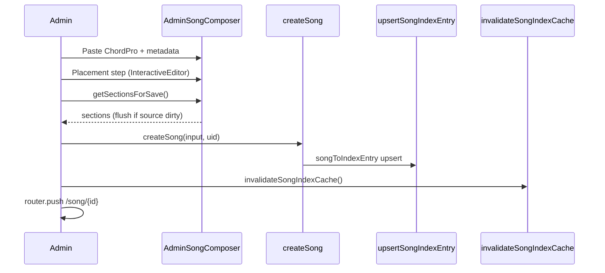

# Flutter Phase 10 — Web MVP admin parity report (Phase A)

**Date:** 2026-03-24  
**Scope:** Read-only audit of `webmvp/` admin flows for Flutter Phase 10 planning  
**Spec under test:** [`flutter-phase-10-admin.md`](flutter-phase-10-admin.md) §2  
**Flutter admin UI:** **Not implemented** (this report only)

---

## Product gate (required before Phase B)

| # | Gate | Status |
|---|------|--------|
| 1 | Musician v1.1 **shipped** (Phase 9) or explicitly waived | **BLOCKED** — product confirmed Phase 8/9 not done yet (2026-03-24) |
| 2 | Church wants **admin on mobile** | **YES** (product confirmed) |
| 3 | Test Firebase user(s) with **`admin: true`** custom claim | **Ops required** — see below |

**Phase B must not start until product marks gate #1 YES (ship/waive Phase 9) and gate #3 ready for QA.**

### Admin custom claim (gate #3 — plain language)

Admin is **not** a Firestore `users.role` field. Ops runs **`scripts/set-admin.ts`** (Firebase Admin SDK) to set **`admin: true`** on a user’s **ID token**. The app reads that claim after sign-in / token refresh. For Phase 10 QA you need **two accounts**: one normal musician (no claim) and one with the claim. Until ops runs the script, you can still **develop** admin UI against emulators with mock claims, but **not** sign off production parity.

---

## 1. Authorization model

### Claim-only admin (never `users.role`)

| Layer | Behavior | Citation |
|-------|----------|----------|
| Client | `readIsAdmin(user)` → `getIdTokenResult()` → `token.claims.admin === true` | `webmvp/src/components/AuthProvider.tsx:98-100` |
| Profile create | `role == 'musician'` on user doc; rules forbid role change | `firestore.rules:182-183`, `265-266` |
| Firestore | `isAdmin()` = `request.auth.token.admin == true` | `firestore.rules:9-11` |

### Non-admin UX on admin URLs

| Route | Non-admin signed-in | Guest |
|-------|---------------------|-------|
| `/admin` | `useEffect` → `router.replace("/")` when `!isAdmin` (`admin/page.tsx:66-73`); render `null` if `!isAdmin` (`142-144`) | `SignInRequired` wrapper |
| `/import` | Static “Admin only” + link home (`import/page.tsx:42-55`) | Sign-in required |
| `/song/:id/edit` | “Admin only” + link to song (`edit/page.tsx:259-270`) | Sign-in required |

### Firestore enforcement (musician vs admin)

| Collection | Musician read | Musician write | Admin write |
|------------|---------------|----------------|-------------|
| `songs/*` | Active only | **Denied** | create/update/delete (`firestore.rules:29-35`) |
| `songEdits/*` | **Denied** | **Denied** | read/create/update/delete (`45-53`) |
| `songIndex/*` | Public read | **Denied** | create/update/delete (`37-43`) |

**Integration proof:** `songEdits.integration.test.ts` uses `authenticatedContext("admin-uid", { admin: true })` — tests `createDraft`, `updateDraft`, `publishDraft`, conflict path.

---

## 2. Route map

| Web route | Purpose | Flutter (planned) | Musician access |
|-----------|---------|-------------------|-----------------|
| `/admin` | Dashboard, search, archive | `/admin` (10A) | Redirect / no UI |
| `/import` | New song | `/import` (10E–10I) | Blocked |
| `/song/[id]/edit` | Draft edit + publish | `/song/:id/edit` (10D–10J) | Blocked |
| `/song/[id]` | Read chart | `/song/:id` (Phase 3) | Allowed (active songs) |

**Mobile today:** No admin routes; `resolvePostAuthPath` **ignores** admin claim → always `/home` (`mobile/lib/domain/safe_redirect.dart:20-25`, `app_router.dart:97`). Phase 10 will add guarded routes without exposing nav to non-admins.

---

## 3. Dashboard flow

1. **Gate:** Wait for auth; redirect non-admin (`admin/page.tsx:66-73`).
2. **Stats:** `getAdminStats()` — song count = `loadSongIndex().length`; playlist/group = `getCountFromServer` on `sessions`, `groups` (`adminStats.ts:19-35`).
3. **Index list:** Initial `peekFullSongIndexCache()`; `subscribeSongIndexUpdates` updates entries + bumps `songCount` (`admin/page.tsx:106-118`).
4. **Search:** `useSongSearch(entries, searchQuery)` — same ranking as library (`admin/page.tsx:64`).
5. **Row actions:** `AdminSongRow` → Edit → `/song/${id}/edit`; Delete → confirm → `archiveSong` + `invalidateSongIndexCache` (`AdminSongRow.tsx:31-43`, `admin/page.tsx:123-139`).
6. **Refresh:** Manual “Refresh library” → `invalidateSongIndexCache()` (`177-181`).

---

## 4. Archive flow

`archiveSong(songId)` (`songs.ts:219-226`):

1. `updateDoc` → `status: "archived"`, `updatedAt`.
2. `removeSongIndexEntry(songId)` — song drops from public index.

**Musician impact:** Rules allow read only `status == 'active'` (`firestore.rules:30`) — archived songs invisible on chart/home.

**Admin UI:** Optimistic list filter + decrement stats (`admin/page.tsx:130-134`).

---

## 5. IMPORT path (no `songEdits`)



| Step | Detail | Citation |
|------|--------|----------|
| Gate | `user && !isAdmin` → Admin only message | `import/page.tsx:42-55` |
| Flush | `composerRef.getSectionsForSave()` before save | `import/page.tsx` footer handler (via composer ref pattern same as edit) |
| Create | `createSong({ title, artist, originalKey, sections, tags }, uid)` — `version: 1`, `status: active` | `songs.ts:100-149` |
| Index | `upsertSongIndexEntry` inside `createSong` | `songs.ts:131-143` |
| Cache | `invalidateSongIndexCache()` | `import/page.tsx:77` |
| Navigate | `/song/${created.id}` | `import/page.tsx:78` |

**No draft doc** is created on import.

---

## 6. EDIT path (`songEdits` mandatory)

```mermaid
sequenceDiagram
  participant Admin
  participant Edit as edit/page.tsx
  participant SE as songEdits.ts
  participant Songs as songs.ts
  participant Cache as invalidateSongIndexCache

  Edit->>Songs: getSong(songId)
  Edit->>SE: getDraftForSong(songId)
  alt no draft
    Edit->>SE: createDraft(songId, uid)
  end
  Edit->>SE: reconcileDraftWithSong(draftId, song.version)
  Note over Edit: Composer bound to draft fields; artist/tags from live song

  Admin->>Edit: Save draft
  Edit->>Edit: getSectionsForSave()
  Edit->>SE: updateDraft(id, title, key, sections, notes)
  Edit->>Songs: updateSong(songId, { artist, tags }) only
  Edit->>Cache: invalidateSongIndexCache()

  Admin->>Edit: Publish
  Edit->>SE: updateDraft (same fields)
  Edit->>SE: reconcileDraftWithSong
  Edit->>SE: publishDraft(id, uid, { artist, tags })
  Edit->>Cache: invalidateSongIndexCache()

  Admin->>Edit: Discard
  Edit->>SE: discardDraft(id)
```

### `publishDraft` transaction (what touches Firestore)

Inside `runTransaction` (`songEdits.ts:259-311`):

| Step | Action |
|------|--------|
| Read | Draft doc; live `songs/{songId}` |
| Check | `song.version === edit.baseVersion` else **`DraftVersionConflictError`** (`280-282`) |
| Archive | New `songEdits` doc `status: archived` with **previous** live title/key/sections/notes (`284-297`) |
| Live song | `update` title, originalKey, **`sections: serializeSectionsForPublish(edit.sections)`**, notes, **version: edit.version**, optional artist/tags from extras (`299-308`) |
| Draft | **`delete`** draft doc (`310`) |

Post-transaction: trim archived edits to **`MAX_ARCHIVED_VERSIONS` (10)** (`313-332`); **`upsertSongIndexEntry`** from live song (`334-348`).

### What edit publish does **NOT** do

- Does **not** call `updateSong` with **sections** for publish (sections go only through `publishDraft` transaction).
- Does **not** write chart sections directly to `songs` without draft + transaction.

### Save draft nuance (web — doc gap)

**Save draft** (`edit/page.tsx:146-191`):

- **`updateDraft`** for title, originalKey, sections, notes.
- **`updateSong(songId, { artist, tags })`** only — metadata on live song, best-effort with warning if fails (`169-178`).
- **`invalidateSongIndexCache`** then navigate to song chart.

Phase 10 Flutter must port this **artist/tags on save draft** behavior; [`flutter-phase-10-admin.md`](flutter-phase-10-admin.md) §2.7 mentions artist/tags on **publish** but should explicitly include **save draft → updateSong(metadata only)** — **WEB WINS**.

---

## 7. Version conflict

| Condition | Error | User copy |
|-----------|-------|-----------|
| `song.version !== edit.baseVersion` at publish | `DraftVersionConflictError` | `"The song changed while publishing. Reload this page and try again."` (`edit/page.tsx:231-234`) |

**Reconcile before publish:** `reconcileDraftWithSong` updates draft `baseVersion` / `version` when song advanced without deleting draft (`songEdits.ts:132-153`).

**Test:** `songEdits.integration.test.ts` — conflict scenario (read remainder of file if needed).

---

## 8. Composer two-step UX

| Step | UI | Citation |
|------|-----|----------|
| **1 Source** | Title, artist, language tags, original key grid, notes; `ChordProSourcePanel`; Continue → flush via `tryFlushChordSource` | `AdminSongComposer.tsx:242-258`, `chordSourceSync.ts:23-35` |
| **2 Placement** | Back to source; `InteractiveEditor` `layout="stacked"` | `AdminSongComposer.tsx:260-283` |
| Ref API | `getSectionsForSave`, `flushSourceToSections` | `AdminSongComposer.tsx:131-141` |

### Placement behaviors

| Feature | Web | Citation |
|---------|-----|----------|
| Touch vs desktop | `useTouchEditor()` — coarse pointer / max-width 1024 | `useTouchEditor.ts:6-17` |
| Line editor | `LyricLineEditor` + `useLyricChordOffsets` | `LyricLineEditor.tsx` |
| Selection | `useTextSelection` — grapheme range, word collapse | `InteractiveEditor.tsx:29`, `LyricLineEditor` imports |
| Chord marks | `createChordMark`, normalize, tap chord chip | `InteractiveEditor.tsx:10-12`, `findChordAtStart` |
| Chord-only lines | `isChordOnlyLine` | `LyricLineEditor.tsx:7` |
| Inline source tab | `InteractiveEditor` tabs mode (import uses stacked only in composer) | `InteractiveEditor.tsx:32-48` |

---

## 9. Layout reuse (Flutter Phase 3 / 3.5)

Editor **preview** on web uses same chord-over-lyric DOM measurement as performance chart (`useLyricChordOffsets` + `ChordRow`).

**Flutter Phase 10 (10G) must call:**

| Module | Path |
|--------|------|
| `measureChordOffsets`, `measureLyricCharOffset` | `mobile/lib/features/song/layout/chord_label_measure.dart` |
| `wrapLyricLine`, `charsPerLine` | `mobile/lib/domain/wrap_lyric_line.dart` |
| `resolveChordLayout` | `mobile/lib/domain/chord_layout.dart` |
| Display row | `ChordRowWidget` / `ChordLineWidget` (read-only preview) |

**Do not** fork layout math in `features/song_edit/`.

---

## 10. Index / cache

| Event | `upsertSongIndexEntry` | `invalidateSongIndexCache` |
|-------|------------------------|----------------------------|
| **`createSong`** | Yes, in `createSong` | Yes, import page after create |
| **`publishDraft`** | Yes, post-transaction in `publishDraft` | Yes, edit page after publish |
| **`archiveSong`** | **`removeSongIndexEntry`** (not upsert) | Yes, admin dashboard after archive |
| **Save draft** | No (unless `updateSong` artist/tags triggers index upsert in `updateSong` when tags change — `songs.ts:192-215`) | Yes, edit save draft |

Admin dashboard also **subscribes** to index updates (`subscribeSongIndexUpdates`, `songIndexCache.ts:153+`).

**Flutter:** Mirror invalidation on Riverpod/index repo after create, publish, archive, and draft save (metadata path).

---

## 11. Coverage matrix (phase doc §5 + parity)

| Web capability | Web code | Phase 10 doc | Parity |
|----------------|----------|--------------|--------|
| Admin gate | `AuthProvider.tsx:98-100` | 10A | **PASS** |
| Dashboard + archive | `admin/page.tsx` | 10B–10C | **PASS** |
| Import create | `import/page.tsx`, `createSong` | 10E–10I | **PASS** |
| Edit draft open | `createDraft`, `getDraftForSong` | 10D | **PASS** |
| Save draft | `updateDraft` | 10D | **PARTIAL** — add **`updateSong(artist,tags)`** on save draft |
| Publish edit | `publishDraft` | 10J | **PASS** |
| Discard draft | `discardDraft` | 10D | **PASS** |
| Version conflict | `DraftVersionConflictError` | 10D/10J | **PASS** |
| Composer flush | `getSectionsForSave` | 10H | **PASS** |
| Placement UI | `InteractiveEditor`, `LyricLineEditor` | 10F–10G | **PASS** (implementation TBD) |
| Index cache invalidate | `invalidateSongIndexCache` | 10I–10J | **PASS** |
| List archived versions | `listArchivedVersions` | Not in phase doc | **N/A** — web API exists; no UI requirement in admin page |
| Ops CLI | scripts | Out of scope | **PASS** |

---

## 12. Musician regression checklist (post–Phase 10)

Re-run [`flutter-phase-8-release.md`](flutter-phase-8-release.md) **§2.9** on builds **without** admin claim:

| Check | Expected |
|-------|----------|
| No admin/import/edit in UI | PASS |
| No writes to `songs`, `songIndex`, `songEdits` | PASS (rules + no client code) |
| Join API-only `sharedWith` | PASS (unchanged) |
| Deep link `/admin` as musician | Redirect home / 404 guard |
| Post-auth still `/home` for admin users unless product changes default | **Decision:** web admins land on `/admin`; mobile doc allows profile entry only |

---

## 13. Doc vs web (`flutter-phase-10-admin.md` §2)

| Topic | Verdict |
|-------|---------|
| Import vs edit split (`createSong` vs `publishDraft`) | **DOC WINS** (aligned after Bugbot fix) |
| Save draft + live **`updateSong` metadata** | **WEB WINS** — add to §2.7 / 10D |
| Edit hydrate artist/tags from **`getSong`**, not draft | **WEB WINS** — `edit/page.tsx:112-113` |
| `publishDraft` extras `{ artist, tags }` | **DOC WINS** |
| Admin redirect `/` vs Flutter `/home` | **DOC WINS** (intentional mobile path) |

**Action:** Patch phase doc with save-draft `updateSong(artist, tags)` + load artist/tags from live song.

---

## 14. Risks & scope cuts

| Risk | Mitigation |
|------|------------|
| Placement editor **15–25 d** | Ship **10A → 10C → 10H → 10D/10J** with read-only composer or minimal line edit before full **10F–10G** |
| Parser parity | Port `chordProParser.test.ts`, `chordMarks.test.ts`, `editorParser.test.ts` to Dart first (**10H**) |
| Draft + publish bugs | Port `songEdits.integration.test.ts` scenarios to emulator/Firestore rules tests |
| Admin on public Play track | Internal/closed track or hidden routes (Phase C) |
| Claim refresh | Phase 1 must refresh ID token after ops sets claim |

**Minimum shippable admin (before placement):** Dashboard + archive + import create with **paste-only** sections (no visual placement) — **not** web parity; product call.

---

## 15. Proposed mobile-only changes

| Change | Priority | Notes |
|--------|----------|-------|
| Admin entry via **Profile** menu (not default post-auth) | P0 | Keeps musician UX; optional admin home for claim users |
| Sticky **Save / Publish / Discard** on edit (web `sm:hidden` footer) | P0 | `edit/page.tsx:346-369` |
| `useTouchEditor` → Flutter: `MediaQuery` + pointer kind | P0 | Always true on phones |
| Share-intent → import paste | P2 | Phase doc already |
| No sidebar **Admin** nav item for all users | P0 | Claim-gated list tile only |

---

## Tests to port (Phase B)

| Web test file | Target |
|---------------|--------|
| `songEdits.integration.test.ts` | `SongEditsRepository` + rules emulator |
| `chordProParser.test.ts` | `lib/domain/chord_pro_parser.dart` |
| `chordMarks.test.ts` | `lib/domain/chord_marks.dart` |
| `editorParser.test.ts` / `parseImportText` | Domain import helpers |

---

## Phase A conclusion

Web admin behavior is **well bounded**: claim gate, dashboard + archive, **import = `createSong`**, **edit = `songEdits` draft + `publishDraft` transaction**. Flutter phase doc is **~95% aligned**; patch **save-draft metadata `updateSong`** before Phase B.

**Next step:** Product confirms §Product gate (3× YES) → Phase B implementation per [`flutter-phase-10-admin.md`](flutter-phase-10-admin.md) §3 order.

**Phase C** (after B): [`flutter-phase-10-admin-signoff.md`](flutter-phase-10-admin-signoff.md) — manual DoD pending.

---

## Phase B — Implementation map (2026-03-24)

**Report § / Phase doc § / Flutter**

| Sub-phase | Files |
|-----------|--------|
| **10A** Gate + routes | `auth_repository.readIsAdmin`, `AuthSession.isAdmin`, `admin_route_gate.dart`, `route_paths.dart`, `app_router.dart` redirects, Profile admin tile |
| **10B–10C** Dashboard + archive | `admin_dashboard_screen.dart`, `admin_stats_repository.dart`, `songs_admin_repository.archiveSong` |
| **10H** Chord source | `domain/chord_pro_parser.dart`, `chord_source_sync.dart`, `section_headers.dart`, `admin_song_composer.dart` |
| **10D + 10J** Draft edit | `song_edits_repository.dart`, `song_edit_screen.dart` (`updateDraft`, `publishDraft`, `discardDraft`, conflict copy) |
| **10E + 10I** Import | `admin_import_screen.dart`, `SongsAdminRepository.createSong` |
| **10F–10G** Placement (MVP) | `placement_editor.dart` — ChordPro line fields + **`ChordLineWidget`** preview (not full web `useTouchEditor` yet) |
| Index writes | `song_index_admin.dart`, `SongIndexRepository.upsert/remove` |

### Intentional mobile diffs (approved)

- Admin entry: **Profile → Admin** (not default post-auth `/admin`).
- Placement: **ChordPro per-line editing + live preview** instead of full DOM-style touch selection editor (web parity target for follow-up).
- Musician post-auth still **`/home`** even for admin claim (`safe_redirect` unchanged for login destination).

### Musician regression (code review — manual §2.9 still required)

| Check | Status |
|-------|--------|
| Admin routes redirect non-admin to `/home` | Implemented |
| Admin nav only if `session.isAdmin` | Implemented |
| No musician writes to `songs` / `songEdits` in existing repos | Unchanged |
| `flutter test` | **101 passed** |

### Remaining for sign-off §6

- Manual admin import + publish on device with **`admin: true`** claim user.
- Cross-platform chord position check (3 fixtures).
- Phase 8 §2.9 checklist on musician account build.
- Full touch placement editor parity (optional v2.1).

---

## References (quick index)

| File | Role |
|------|------|
| `webmvp/src/components/AuthProvider.tsx` | `readIsAdmin` |
| `webmvp/src/app/(app)/admin/page.tsx` | Dashboard |
| `webmvp/src/app/(app)/import/page.tsx` | Import |
| `webmvp/src/app/(app)/song/[id]/edit/page.tsx` | Edit + draft UI |
| `webmvp/src/lib/firestore/songEdits.ts` | Draft lifecycle |
| `webmvp/src/lib/firestore/songs.ts` | `createSong`, `archiveSong`, `updateSong` |
| `webmvp/src/lib/firestore/adminStats.ts` | Stats |
| `webmvp/src/lib/firestore/songIndexCache.ts` | Cache |
| `webmvp/src/components/AdminSongComposer.tsx` | Composer |
| `firestore.rules` | `isAdmin()` |
