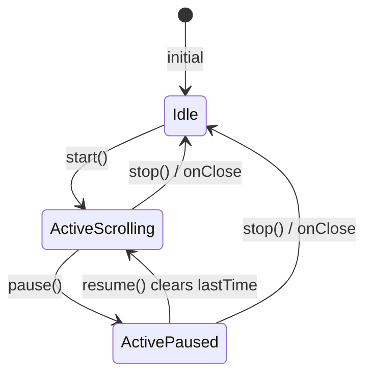

# Web MVP performance UX parity report (Phase 4A)

**Purpose:** Ground-truth for Flutter Phase 4 — how `webmvp/` layers performance features on the Phase 3 song chart.  
**Generated:** Phase A code read (no Phase 4 Flutter UI in this pass).  
**Cross-check:** [`flutter-phase-4-performance.md`](flutter-phase-4-performance.md), [`flutter-phase-3-web-song-chart-report.md`](flutter-phase-3-web-song-chart-report.md), [`flutter-roadmap.md`](flutter-roadmap.md) Phase 4.

---

## 1. Two-flag model (`performanceMode` ≠ `isMobile`)

Both hooks use breakpoint **768** (`max-width: 767px`) but **different OR conditions**.

| Signal | Source | Rule | Citation |
|--------|--------|------|----------|
| **`performanceMode`** | `usePerformanceMode(sessionId)` | `matchMedia(max-width: 767px)` **OR** `sessionId !== null` | `usePerformanceMode.ts:11-14` |
| **`isMobile`** | `useIsMobile()` | `matchMedia(max-width: 767px)` **only** | `useIsMobile.ts:11-12` |
| **`immersive`** | Derived on song page | `autoscroll.active \|\| fullscreen.active` | `page.tsx:368` |

### What each flag controls (web)

| Concern | Driven by | Evidence |
|---------|-----------|----------|
| Line wrap + `useChartLayout` / `maxChars` | **`performanceMode`** | `page.tsx:87`, `497` `wrapEnabled={performanceMode}` |
| `song-performance-page` on `<html>`/`<body>` | **`performanceMode`** | `page.tsx:115-127` |
| Header `compact` | **`isMobile \|\| performanceMode`** | `page.tsx:400` |
| Extra bottom padding `pb-28` (non-immersive) | **`isMobile && !immersive`** | `page.tsx:369` |
| `song-page--performance` CSS class on `<main>` | **`performanceMode`** | `page.tsx:375-376` |
| **`PerformanceBottomBar`** | **`isMobile && !autoscroll && !fullscreen`** | `page.tsx:520-538` |
| **`SongControlBar`** (full desktop) vs mobile strip | **`showMobileControls={isMobile}`** | `page.tsx:408-414`, `SongControlBar.tsx:156-167` |
| Hide **`SongControlBar`** during autoscroll | **`isMobile && autoscroll`** (not fullscreen-only rule) | `page.tsx:408` |
| Fixed **`100dvh`** immersive shell | **`immersive`** | `page.tsx:378-380` |

**Proof they diverge:** Tablet width ≥768 with `?playlist=s1&index=0` → `performanceMode=true`, `isMobile=false` → wrap + performance page class + **no** bottom bar; desktop **`SongControlBar`** with autoscroll/fullscreen toggles remains (`page.tsx:408-428`).

**Flutter Phase 4:** Port **two booleans** (`performanceModeProvider`, `isMobileProvider`) — do not merge into one “performance” flag (phase doc §2.0 **ALIGNED** with web).

---

## 2. Chrome visibility matrix (from JSX)

`define immersive = autoscroll.active || fullscreen.active`

| UI element | Idle (mobile) | Idle (desktop) | Autoscroll only | Fullscreen only |
|------------|---------------|----------------|-----------------|-----------------|
| **`SongHeader`** | Shown | Shown | **Shown** (`!fullscreen.active`) | **Hidden** | `page.tsx:394-401` |
| **`SongControlBar`** | Mobile strip (view mode + share/add) | Full bar + autoscroll/fullscreen | **Hidden** if `isMobile` | **Hidden** | `page.tsx:408` |
| **`AutoscrollBar`** | Hidden | Hidden | **Shown** | Hidden | `page.tsx:439-454` |
| **`PerformanceBottomBar`** | Shown if mobile | Hidden | Hidden | Hidden | `page.tsx:520` |
| **`PerformanceFullscreen` overlay** | Hidden | Hidden | Hidden | **Shown** | `page.tsx:507-517` |
| **`<main>` layout** | Normal / max-w-2xl | Same | **`fixed inset-0 z-60 100dvh`** if immersive | Same | `page.tsx:374-381` |
| **Chart scroll container** | Default | Default | `overflow-y-auto`, `pb-24` if autoscroll **or** fullscreen | Same | `page.tsx:465-473` |
| **App sidebar / mobile topbar** | Visible | Visible | Hidden if autoscroll (`song-autoscroll-active`) | Hidden if fullscreen class | `globals.css:314-331` |

**Common port bug:** Hiding header during autoscroll-only — **web keeps header** (`page.tsx:394`).

---

## 3. Autoscroll spec

### Constants (`autoscrollSpeed.ts`)

| Constant | Value | Line |
|----------|-------|------|
| `AUTOSCROLL_MIN_SPEED` | 0.1 | 1 |
| `AUTOSCROLL_MAX_SPEED` | 2 | 2 |
| `AUTOSCROLL_DEFAULT_DESKTOP` | 0.7 | 3 |
| `AUTOSCROLL_DEFAULT_TOUCH` | 0.4 | 4 |
| `AUTOSCROLL_TOUCH_RATE_MULTIPLIER` | 0.85 | 5 |
| `AUTOSCROLL_BASE_PX_PER_SEC` | 20 | 6 |
| Slow step | 0.05 (`speed < 1`) | 8-9, 19-20 |
| Fast step | 0.1 (`speed ≥ 1`) | 9-10 |

### Formulas

- **px/sec:** `AUTOSCROLL_BASE_PX_PER_SEC * speed * (isTouchDevice ? 0.85 : 1)` — `autoscrollSpeed.ts:37-42`
- **Touch device:** `detectTouchAutoscrollDevice()` — `(max-width: 1024px) OR (pointer: coarse) OR (hover: none)` OR touch points — `autoscrollSpeed.ts:55-59`
- **Display:** `formatAutoscrollSpeed` — 2 decimals if `< 1`, else 1 decimal — `autoscrollSpeed.ts:45-47`

### Engine (`useAutoscroll.ts`)

| Behavior | Detail | Citation |
|----------|--------|----------|
| Scroll guard | Apply delta only if `scrollHeight - clientHeight > 4` | `useAutoscroll.ts:30-32` |
| rAF loop | `deltaSeconds * pxPerSec` → `scrollTop += delta` | `useAutoscroll.ts:146-160` |
| Pause | Skips delta; does not update `lastTime` while paused | `useAutoscroll.ts:151-164` |
| Resume | `lastTimeRef.current = null` then continues | `useAutoscroll.ts:104-106` |
| Start | Default speed for device; `active=true`, `paused=false` | `useAutoscroll.ts:79-82` |
| Stop | `active=false`, `paused=false` | `useAutoscroll.ts:74-76` |
| Body overflow | `document.body.style.overflow = hidden` while active | `useAutoscroll.ts:117-126` |
| Scroll transfer on activate | If `document.scrollingElement.scrollTop > 0`, move to chart container and zero root | `useAutoscroll.ts:85-97` |

**Flutter recommendation:** Single `ScrollController` on chart `SingleChildScrollView`; on autoscroll start, `jumpTo` if ancestor had offset; `Ticker` or `SchedulerBinding.scheduleFrameCallback` with same px/sec math; `NeverScrollableScrollPhysics` on outer scaffold while autoscroll active.

### State diagram



---

## 4. Autoscroll bar (`AutoscrollBar.tsx`)

Fixed bottom `z-40`, safe-area padding — `AutoscrollBar.tsx:23`.

| Control | Action | Aria |
|---------|--------|------|
| ✕ Close | `onClose` → `autoscroll.stop()` | `Close autoscroll` |
| − / + | `decreaseSpeed` / `increaseSpeed` | `Slower` / `Faster` |
| Center label | `{formatAutoscrollSpeed(speed)}x` | — |
| ▶ / ❚❚ | Toggle pause/resume | `Resume` / `Pause autoscroll` |

Wired from `page.tsx:439-453`.

---

## 5. Wake lock (`useWakeLock.ts`)

| Rule | Citation |
|------|----------|
| Enabled when | `fullscreen.active \|\| autoscroll.active` | `page.tsx:90` |
| API | `navigator.wakeLock.request("screen")` | `useWakeLock.ts:33` |
| Release | On disable or unmount | `useWakeLock.ts:21-25`, `63-66` |
| Re-acquire | `visibilitychange` → if `visible && enabled`, call `acquire()` again | `useWakeLock.ts:55-58` |

**Flutter:** `wakelock_plus` + `WidgetsBindingObserver` / `AppLifecycleState.resumed` retry (phase doc §2.3 **ALIGNED**).

Tests: `useWakeLock.test.ts` — `isWakeLockSupported` only.

---

## 6. Fullscreen (`usePerformanceFullscreen.ts` + `PerformanceFullscreen.tsx`)

| Step | Web behavior | Citation |
|------|--------------|----------|
| Enter | `setActive(true)` then `documentElement.requestFullscreen()` | `usePerformanceFullscreen.ts:70-73` |
| Native unsupported | `requestNativeFullscreen` returns false; **pseudo-fullscreen stays** (`active` true) | `usePerformanceFullscreen.ts:14-16`, `70-73` |
| Root class | `song-fullscreen-active` on `<html>` while active | `usePerformanceFullscreen.ts:44-47` |
| OS exit | `fullscreenchange` → if no native element, `setActive(false)` | `usePerformanceFullscreen.ts:56-61` |
| Exit button | `exit()` clears state + `exitFullscreen()` | `usePerformanceFullscreen.ts:76-79` |

**Overlay contents** (`PerformanceFullscreen.tsx`):

- Top-right exit (✕), `z-[80]`
- Bottom: `sessionPosition` **or** wake-lock unsupported copy: *"Screen may dim — adjust Auto-Lock in device settings"*
- Zoom −/+ (`ChartZoomButtons`)
- **Next song only** (▶ link or disabled ghost) — **no prev** in overlay

---

## 7. Performance bottom bar (`PerformanceBottomBar.tsx`)

### Visibility predicate

```text
isMobile && !autoscroll.active && !fullscreen.active
```

`page.tsx:520`.

### Row contents

1. **Session row** (if `sessionLabel`): title link via `sessionBackHref` + ` · {sessionPosition}` — `PerformanceBottomBar.tsx:92-104`
2. **Prev / next** (if either href exists): `NavLink` disabled when href null — `PerformanceBottomBar.tsx:108-116`
3. **Key button** → modal; shows `transposeFlash ?? targetKey` — `PerformanceBottomBar.tsx:122-132`
4. **Zoom** — `ChartZoomButtons` variant bar — `PerformanceBottomBar.tsx:136-140`
5. **Theme** — ◐ cycles via parent `handleToggleTheme` — `PerformanceBottomBar.tsx:141-148`
6. **Autoscroll** + **Fullscreen** toggles — `PerformanceBottomBar.tsx:149-162`

**Theme labels:** Auto / Dark / Stage — `PerformanceBottomBar.tsx:63-67`.

**Desktop/tablet:** Bar hidden; autoscroll + fullscreen on **`SongControlBar`** — `SongControlBar.tsx:213-225`. **No theme button** on desktop control bar (theme only on bottom bar).

---

## 8. Playlist navigation

| Topic | Web | Citation |
|-------|-----|----------|
| **Prev/next href** | `buildAdjacentSongHref(sessionId, sessionSongs, sessionIndex, ±1)` | `page.tsx:355-361`, `sessionNavigation.ts:48-58` |
| **Href shape** | `/song/{songId}?playlist=&index=&key=` if `keyOverride` | `sessionNavigation.ts:6-18` |
| **`startSetHref`** | First song index 0 | `sessionNavigation.ts:21-28` |
| **`writeLastSessionIndex`** | When session fetch completes and `sessionIndex !== null` | `page.tsx:240-241` |
| **Navigate swipe** | `router.push(href)` | `page.tsx:300-301` |
| **Scroll reset on song change** | No explicit `scrollTo(0)` — **route remount** resets scroll | Next.js navigation (implicit) |
| **Swipe threshold** | `|delta| >= 72` px horizontal on `<main>` | `page.tsx:322-325` |
| **Swipe direction** | `delta > 0` → **prev** (`direction -1`); `delta < 0` → **next** (`+1`) | `page.tsx:325` |
| **Preconditions** | `sessionId && sessionIndex !== null` | `page.tsx:291-292`, `313` |

**Flutter Phase 3 gap:** `startSetPath` **not** in `mobile/lib/domain/session_navigation.dart` — add in Phase **4A** (phase doc §2.7).

**Session title in bar:** `session?.title` from `getSession` — `page.tsx:529`.

---

## 9. Chart theme

| Topic | Web | Citation |
|-------|-----|----------|
| **Cycle order** | `["system", "dark", "stage"]` | `page.tsx:50`, `280-286` |
| **Persist** | `writeChartTheme(next)` → localStorage **`lf-theme`** | `performancePreferences.ts:78-82` |
| **Resolve** | `resolveChartTheme(sessionId)` → **`readChartTheme()` only** (`sessionId` ignored) | `performancePreferences.ts:72-75` |
| **Apply** | `data-chart-theme={chartTheme}` on `.chord-chart` | `page.tsx:486` |

### CSS tokens (`globals.css`)

| Theme | Chord | Lyric | Section bg | Notes |
|-------|-------|-------|------------|-------|
| **system** (light) | `#000000` | `#1a1a1a` | `#f5f5f5` | `63-67` |
| **system** (dark pref / app dark) | `#6b9aff` | `#c8c8c8` | `#1a1a1a` | `71-83` |
| **dark** | `#6b9aff` | `#c8c8c8` | `#1a1a1a` | `86-90` |
| **stage** | `#ffff66` on `#000` bg, white lyrics, padded | `93-101` |

**`lf-theme` conflict:** Same key as app light/dark in web app theme — values overlap on `"dark"`. Phase doc §3.1 recommends Flutter split **`lf-chart-theme`** if profile theme clobbers chart — **DOC WINS (product)** if clash observed; web uses single key (**WEB WINS** for literal parity).

**Map errata:** `flutter-web-app-map.md` §3.5 `lf-chart-zoom` / `lf-chart-theme` — **WEB WINS:** `performancePreferences.ts` uses **`lf-zoom-level`** and **`lf-theme`** (phase doc §2 intro **ALIGNED**).

---

## 10. Gesture conflicts

| Gesture | When enabled | Citation |
|---------|--------------|----------|
| **Pinch / double-tap zoom** on chart viewport | `gesturesEnabled={!autoscroll.active}` | `page.tsx:483` |
| **Horizontal swipe (set nav)** | On `<main>` `onTouchStart` / `onTouchEnd` | `page.tsx:382-383`, `307-327` |
| Swipe vs pinch | Swipe on **main**; pinch listeners on **viewport** element (`ChordChartViewport.tsx:58-156`) | Separate targets |

**Note:** Swipe still fires during autoscroll/fullscreen on web (handlers on `<main>` unconditionally). Pinch disabled only during autoscroll.

**Flutter:** Consider `Listener` on scaffold for swipe; disable viewport pinch when autoscroll active (Phase 3 viewport already has pinch — add flag).

---

## 11. Phase 3 vs Phase 4 boundary (Flutter)

**Phase 3 already ships (do not reimplement — Phase 4 wires only):**

| Phase 3 | Phase 4 adds |
|---------|----------------|
| Chart layout, transpose, numbers, sections | Autoscroll ticker on existing scroll view |
| `watchSong`, active-only, not-found | — |
| Zoom prefs + scaled fontSize chart | Bottom bar / overlay zoom buttons (same `_scale`) |
| `parseSessionNavParams`, canonical redirect, `playlistContextProvider` | Prev/next UI, swipe, `writeLastSessionIndex` on nav |
| `computeWrapEnabled` (= performanceMode rule) | Explicit `performanceModeProvider` if not already named |
| `SongHeader`, `SongControlBar` (partial) | Show/hide rules, mobile vs desktop, autoscroll/fullscreen toggles |
| `KeySelectModal` equivalent (`_KeyGridDialog`) | Same modal from bottom bar |
| Share | — |

**Phase 4 new UI:** `AutoscrollBar`, `PerformanceBottomBar`, `PerformanceFullscreen`, chart theme wrapper, wakelock, immersive layout, `startSetPath`.

---

## 12. Test port list

| File | Describes / cases | Port priority |
|------|-------------------|---------------|
| **`autoscrollSpeed.test.ts`** | clamp; step decrease/increase; defaults touch/desktop; px/sec touch multiplier; format | **P0** → `autoscroll_speed_test.dart` |
| **`useAutoscroll.test.ts`** | clamp re-export only (3 cases) | Covered by autoscroll_speed |
| **`performancePreferences.test.ts`** | clamp/snap zoom; `resolveChartTheme` with `lf-theme` | **P0** extend Flutter prefs tests + chart theme |
| **`sessionNavigation.test.ts`** | parse playlist/legacy; sessionSongHref; **startSetHref**; adjacent | **P0** add `startSetPath` test in Flutter |
| **`usePerformanceFullscreen.test.ts`** | native support, request, fallback, exit | **P1** platform helpers |
| **`useWakeLock.test.ts`** | `isWakeLockSupported` | **P1** optional |
| **`performanceControls.test.ts`** | export smoke only | **P2** widget export smoke optional |

Hook integration (rAF loop, body overflow) → **widget/integration manual** in Phase 4G.

---

## 13. Worked scenarios (expected web behavior)

### A — 3-song set, index 0

- `sessionPosition` = `1/3`
- `buildAdjacentSongHref(..., 0, -1)` → **null** → prev disabled in bottom bar (`PerformanceBottomBar.tsx:110`)
- Next → song 2 at `index=1`

### B — Swipe left to song 2

- Touch end with `delta < -72` → `navigateSwipe(1)` → `router.push` to `/song/song-2?playlist=…&index=1`

### C — Autoscroll 5 min + wakelock

- Toggle autoscroll → `wakeLock` enabled (`page.tsx:90`), body overflow hidden, `AutoscrollBar` visible, header **still** visible, bottom bar hidden, pinch off

### D — Theme cycle on chart (mobile)

- Bottom bar ◐ → system → dark → stage; persisted `lf-theme`; chart colors from `globals.css` selectors

---

## 14. Doc vs web (`flutter-phase-4-performance.md`)

| Topic | Verdict | Evidence |
|-------|---------|----------|
| Two flags §2.0 | **ALIGNED** | §1 above |
| Chrome table §2.4 | **ALIGNED** | §2 matrix matches JSX |
| Autoscroll constants §2.2 | **ALIGNED** | `autoscrollSpeed.ts` |
| Wake lock OR condition | **ALIGNED** | `page.tsx:90` |
| Bottom bar predicate | **ALIGNED** | `page.tsx:520` |
| Theme only on bottom bar (desktop control bar) | **ALIGNED** | `SongControlBar.tsx` no theme |
| Swipe 72px, direction mapping | **ALIGNED** | `page.tsx:322-325` |
| `lf-chart-zoom` key name in map | **WEB WINS** | `lf-zoom-level` in `performancePreferences.ts:3` |
| `resolveChartTheme(sessionId)` uses session | **WEB WINS** — session ignored | `performancePreferences.ts:73-75` |
| Scroll reset on nav | **DOC WINS** (explicit Flutter) | Web implicit via remount |
| Header hidden during autoscroll | **DOC WINS** if implementer hides — **WEB WINS** header shown | `page.tsx:394` |

---

## 15. Intentional mobile diffs (Flutter Phase 4)

| Topic | Flutter |
|-------|---------|
| Back / home | `/home` vs web `/` |
| Wake lock | `wakelock_plus` vs `navigator.wakeLock` |
| Fullscreen | `SystemUiMode.immersiveSticky` + pseudo layout vs Fullscreen API |
| Chart theme key | Prefer **`lf-chart-theme`** if `lf-theme` clashes with Phase 1 app theme (phase doc §3.1) |
| Share anchor / iPad | Already addressed in Phase 3 Flutter |
| Optional P1 | Theme toggle on tablet `SongControlBar` (not on web) |

---

## 16. Proposed mobile-only changes (Phase A — not implemented)

| Proposal | Rationale |
|----------|-----------|
| **`lf-chart-theme` SharedPreferences key** | Avoid clobbering app `lf-theme` light/dark with `system`/`stage` |
| **Explicit `ScrollController.jumpTo(0)` on song id change** | Web remounts; Flutter must reset manually |
| **`writeLastSessionIndex` on prev/next nav** | Web writes on session load; also write when index changes via swipe/button for resume-set UX |
| **Debounce playlist context provider** | Phase 3 already fixed `SessionNavParams` equality — keep when adding nav |
| **Semantics on all bar icon buttons** | Phase doc §2.11 P1 — web aria-labels listed in §4–7 |

---

## Phase 4 boundary (do not port from song page)

| Item | Phase |
|------|--------|
| `AddToPlaylistModal` | **5** |
| Admin draft / version history | Never |
| Guest `getLocalSong` | Never (Flutter) |
| `lf-view-mode` scroll/sections editor pref | Never on song page |

---

## Appendix: Flutter Phase 3 baseline (wiring targets)

| Web hook / module | Current Flutter (Phase 3) |
|-------------------|---------------------------|
| `usePerformanceMode` | `computeWrapEnabled` in `chart_display.dart` (same boolean rule) |
| `useChartZoom` | `SongScreen` `_scale` + `performance_preferences.dart` |
| `useChartLayout` | `charsPerLine` in `song_screen.dart` |
| `sessionNavigation` | `session_navigation.dart` + `startSetPath` |
| Chart scroll | `SingleChildScrollView` + `ScrollController` in `song_screen.dart` |
| `PerformanceBottomBar` | `performance_bottom_bar.dart` |
| Autoscroll / wakelock / fullscreen | `autoscroll_engine.dart`, `wakelock_plus`, `SongScreen` |
| Chart theme | `ChartThemeScope` + `lf-chart-theme` prefs |

---

## Phase B — Flutter implementation map (2025-09-23)

| Web | Flutter |
|-----|---------|
| `autoscrollSpeed.ts` | `domain/autoscroll_speed.dart` |
| `useAutoscroll` | `features/performance/autoscroll_engine.dart` |
| `usePerformanceMode` / `useIsMobile` | `features/performance/performance_mode.dart` + layout in `song_screen.dart` |
| `useWakeLock` | `wakelock_plus` in `SongScreen` (+ lifecycle resume) |
| `usePerformanceFullscreen` | `_fullscreenActive` + `SystemUiMode.immersiveSticky` + overlay |
| `AutoscrollBar` | `widgets/autoscroll_bar.dart` |
| `PerformanceBottomBar` | `widgets/performance_bottom_bar.dart` |
| `PerformanceFullscreen` | `widgets/performance_fullscreen_overlay.dart` |
| Chart theme CSS | `widgets/chart_theme_scope.dart` |
| `writeChartTheme` | `lf-chart-theme` in `performance_preferences.dart` (split from app `lf-theme`) |
| `startSetHref` | `startSetPath` in `session_navigation.dart` |
| Pinch off when autoscroll | `ChordChartViewport.gesturesEnabled` |

**Tests:** `autoscroll_speed_test.dart`, extended `performance_preferences_test`, `startSetPath` in `session_navigation_test.dart`. **74** tests passing.

---

## Phase B — Verified intentional diffs

| Topic | Flutter |
|-------|---------|
| Chart theme storage | **`lf-chart-theme`** (avoids clobbering app `lf-theme` light/dark) |
| Fullscreen | Pseudo layout + `SystemChrome` (no web Fullscreen API) |
| Wake lock | `wakelock_plus` |
| Scroll top on song change | Explicit `jumpTo(0)` on `songId` change |
| Set nav | `writeLastSessionIndex` on swipe/button via `_navigateAdjacent` |

---

## Phase B — Open parity risks

| Risk | Notes |
|------|--------|
| Autoscroll jank | Ticker + `jumpTo` per frame — tune if low-end devices stutter |
| Immersive `fixed inset-0` | Web uses fixed main; Flutter uses stack + bars — verify on device |
| Tablet + playlist | Bottom bar hidden; swipe + desktop control bar autoscroll — matches web |
| Manual QA §13 | Run 3-song set, autoscroll 5min, theme cycle on device |

---

## Phase B — Manual QA checklist

- [ ] Phone: bottom bar prev/next disabled at index 0; swipe left advances
- [ ] Autoscroll: header visible, control bar hidden, pinch disabled, wakelock on
- [ ] Fullscreen: header hidden, overlay next-only, exit restores chrome
- [ ] Theme cycle Auto → Dark → Stage on chart colors
- [ ] Desktop width: autoscroll/fullscreen on control bar; no bottom bar

---

*Phase B landed 2025-09-23. `flutter analyze` no errors; `flutter test` 74 passed.*
