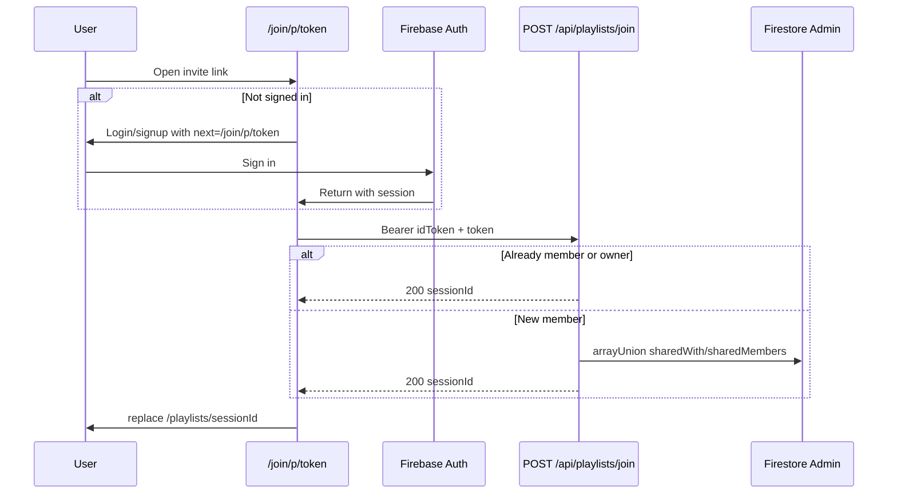

# Web MVP playlists & join parity report (Phase 5A)

**Purpose:** Ground-truth for Flutter Phase 5 — Firestore `sessions` / `sessionSongs`, invite tokens, HTTPS join API, and playlist UX.  
**Generated:** Phase A code read (no Phase 5 Flutter UI in this pass).  
**Cross-check:** [`flutter-phase-5-playlists.md`](flutter-phase-5-playlists.md), [`flutter-web-app-map.md`](flutter-web-app-map.md) §3.6 / §6.1, [`flutter-roadmap.md`](flutter-roadmap.md) Phase 5.

---

## 1. `listPlaylistsForUser`

**Source:** `webmvp/src/lib/firestore/sessions.ts:187-221`, `mergeSessionQueries` `45-69`.

### Four queries (failure-isolated)

| Label | Query | Lines |
|-------|--------|-------|
| `owned-by-ownerId` | `where('ownerId', '==', uid)` + `orderBy('date', 'desc')` | `196-198` |
| `owned-by-createdBy` | `where('createdBy', '==', uid)` + `orderBy('date', 'desc')` | `200-202` |
| `shared-with` | `where('sharedWith', 'array-contains', uid)` + `orderBy('date', 'desc')` | `204-210` |
| `published` | `where('status', '==', 'published')` + `orderBy('date', 'desc')` + `limit(publishedLimit)` | `213-219` |

- **`mergeSessionQueries`:** each query runs in `Promise.all`; on failure → `console.warn` + **empty array** for that batch (`53-55`). Other batches still return.
- **Dedupe:** `Map` keyed by `session.id`; later batches overwrite same id (`60-64`).
- **Sort:** merged values sorted by **`date` desc** via `b.date.toMillis() - a.date.toMillis()` (`67-69`).
- **`PUBLISHED_PLAYLIST_CAP`:** default **`100`** from `webmvp/src/lib/constants.ts:7-8`; passed as `options.publishedLimit ?? PUBLISHED_PLAYLIST_CAP` (`sessions.ts:192`).

### List page section grouping

**Source:** `webmvp/src/app/(app)/playlists/page.tsx:64-77`, `115-172`.

After client **title** filter (`filterPlaylists`, `16-24`):

| Section heading (exact) | Filter |
|-------------------------|--------|
| **My private playlists** | `isPlaylistOwner(session, uid) && status === 'draft'` (`68-70`) |
| **Shared with me** | `status === 'draft' && !owner && sharedWith.includes(uid)` (`71-76`) |
| **Public playlists** | `status === 'published'` (`77`) — includes band-wide published from 4th query; owned published playlists appear here, not under “My private” |

**Cap banner (exact copy)** when `published.length >= PUBLISHED_PLAYLIST_CAP` (`162-166`):

> Showing the 100 most recent public playlists. Use search to narrow the list.

---

## 2. `listOwnedPlaylists`

**Source:** `sessions.ts:224-239`.

Two queries only (`ownerId` + `createdBy`), same merge/dedupe/sort as §1.

**Used by:** `AddToPlaylistModal.tsx:51` — **not** the main playlists list page.

---

## 3. Permission matrix

### Domain helpers

**Source:** `sessions.ts:87-106`, `firestore.rules:141-168`.

| Helper | Rule |
|--------|------|
| `getPlaylistOwnerId` | `ownerId ?? createdBy` (`87-88`) |
| `isPlaylistOwner` | owner id === uid (`91-93`) |
| `canViewPlaylist(session, uid, isAdmin?)` | `published` OR owner OR `sharedWith` includes uid OR **`isAdmin`** (`95-106`) |

**Firestore read** (`canReadPlaylist`, rules `74-84`): auth AND (published OR owner OR sharedWith OR legacy `createdBy` OR group member OR admin).

**Firestore `sessions` update** (rules `154-157`): **owner OR admin only** — invitees cannot self-patch `sharedWith`.

**Firestore `sessionSongs` create/update** (rules `163-166`): **`isPlaylistOwner(sessionId) OR isAdmin`** — shared collaborators are read-only at rules layer.

### Web UI flags (playlist detail)

**Source:** `playlists/[id]/page.tsx:82-85`, `442-446`, `599-628`.

| Flag | Web expression | Who |
|------|----------------|-----|
| `canView` | `canViewPlaylist(session, uid, isAdmin)` | Owner, shared member, any signed-in user if **published**, admin |
| `canEdit` | `isOwner \|\| isAdmin` | Owner or admin — **not** shared member |
| `canDelete` | `canEdit` | Same |
| `showRowEdit` | `isOwner && editMode` | **Owner only** — admin does not get row reorder UI unless owner |
| Publish | `canEdit && status === 'draft'` (`599`) | Owner/admin |
| `+ Add songs` | `canEdit` toggles panel (`620-628`) | Owner/admin |
| Share / quick share / invite modal | `isOwner` only (`520-561`, `ensurePlaylistInviteToken` effect `168-197`) | Owner |
| Edit mode toggle | `isOwner` only (`586-597`) | Owner |

**Shared member (non-owner):** `canView` on draft if in `sharedWith`; song list read-only (key badge span, no edit chrome `740-743`); no add/publish/delete/share.

**Published viewer:** any signed-in user with `canView`; start set allowed; edits owner-only.

**Draft, no access:** copy (`442-445`):

> This private playlist is only visible to the owner and invited members.

**Flutter v1 (phase doc):** **`canEdit` / delete / publish / share = owner only**; **`canViewPlaylist(..., isAdmin: false)`**; no admin bypass in UI.

---

## 4. `createSession`

**Source:** `sessions.ts:141-184`, `playlists/new/page.tsx:32-40`.

### Fields written

| Field | Value |
|-------|--------|
| `title` | trim |
| `serviceType` | from input (form uses **`sunday_morning`**) |
| `date` | `Timestamp.fromDate(input.date)` |
| `songCount` | `0` |
| `status` | `input.status ?? 'draft'` |
| `createdBy` / `ownerId` | creator uid |
| `ownerUsername` | optional trim from profile |
| `sharedWith` | `[]` |
| `groupId` | optional |
| `createdAt` / `updatedAt` | `serverTimestamp()` |

### Invite token attach (best-effort)

After read-back (`167-170`), `attachPlaylistInviteToken` (`119-138`): batch set `playlistInviteTokens/{token}` + update `sessions.shareToken`.

On failure: `console.warn` and return session **without** token (`180-182`) — playlist still created.

---

## 5. `sessionSongs` lifecycle

**Source:** `sessionSongs.ts`, `sessionSongs.test.ts`.

| Constant | Value | Line |
|----------|-------|------|
| `ORDER_STEP` | **1000** | `18` |

### Add (`addSongToSession`, `45-87`)

- Pre-check duplicate `songId` → **`Error('Song is already in this playlist')`** (`54-57`).
- Transaction: `newOrder = (songCount + 1) * ORDER_STEP` (`67`); set entry with `keyOverride: null`, `notes: null`, `addedBy`, `addedAt`; increment `songCount` + `updatedAt`.

### Remove (`89-109`)

- Transaction: delete entry; `songCount = Math.max(0, count - 1)`.

### Reorder (`111-123`, `152-192`)

- **`reorderSessionSong`:** single `updateDoc` on entry — **`order = computeMidOrder(prev, next)`** only; **does not** change `songCount`.
- **`moveSessionSongUp` / `Down`:** compute neighbor orders + `beforePrev` / `afterNext` bounds (`152-192`).

### Key override (`125-135`)

- `updateSessionSongKeyOverride` — field only on entry.

### List / live ordering

- **`listSessionSongs`:** `orderBy('order', 'asc')` (`36-40`).
- **`useSessionSongsLive`:** same query on `onSnapshot` (`43-46`) — order matches Phase 3/4 performance nav index.

### Optimistic add

**Source:** `useSessionSongsLive.ts:78-114`.

- Temp id `optimistic-${entry.id}-${Date.now()}`; `order: maxOrder + 1000` (not `(songCount+1)*1000` — may differ until server txn completes).
- On success: filter out optimistic id (server snapshot replaces).
- On error: rollback previous list.

---

## 6. Invite tokens

**Source:** `playlistInviteToken.ts`, `playlistInvites.ts`, `sessions.ts:119-138`.

| Topic | Detail | Citation |
|-------|--------|----------|
| Generate | 16 chars from `TOKEN_ALPHABET` (no ambiguous chars) | `playlistInviteToken.ts:1-19` |
| Normalize | `raw.trim()` | `22-24` |
| Min length (join) | **12** (token gen is 16) | `playlistInvites.ts:114-116`, `route.ts:20-21` |
| `ensurePlaylistInviteToken` | If `shareToken` doc exists → reuse; else `createPlaylistInviteToken` | `55-74` |
| `regeneratePlaylistInviteToken` | Delete old token doc; new token + batch update session | `77-106` |
| `shareToken` on session | Updated on create/regenerate | `sessions.ts:133-135`, `playlistInvites.ts:46-48` |
| URL token | Path param `/join/p/[token]` — encode on login links | `join/p/[token]/page.tsx:17` |

**Rules:** `playlistInviteTokens` — create requires owner of target session (`firestore.rules:128-133`); **no client update** (`138`); delete owner or playlist delete helper (`134-137`).

---

## 7. Join flow end-to-end

### Why HTTPS join exists

Invitees **cannot** `arrayUnion` themselves onto `sharedWith` (rules `154-157`). Server uses Admin SDK (`route.ts:69-73`).

### Server contract

**Source:** `webmvp/src/app/api/playlists/join/route.ts`.

| Step | Behavior |
|------|----------|
| Auth | `Authorization: Bearer {idToken}` required; else **401** `{ error: "Unauthorized" }` (`13-16`) |
| Body | `{ token }` normalized; length **< 12** → **400** `{ error: "Invalid invite link" }` (`18-21`) |
| Token lookup | Missing invite doc → **404** `{ error: "This invite link is invalid or has expired" }` (`32-36`) |
| Session | Missing / bad `sessionId` on invite → **404** `{ error: "Invalid invite link" }` or `{ error: "Playlist not found" }` (`39-47`) |
| Idempotent | Owner or already in `sharedWith` → **200** `{ sessionId }` without write (`54-56`) |
| Join | `arrayUnion(uid)` on `sharedWith` + `sharedMembers` member object from `users/{uid}` (`58-73`) |
| Failure | **500** `{ error: "Could not join playlist" }` (`76-78`) |

### Client

**Source:** `playlistInvites.ts:110-139`, `join/p/[token]/page.tsx`.

1. Normalize token; length ≥ 12; require signed-in user (`118-122`).
2. `POST /api/playlists/join` with Bearer + JSON `{ token }` (`124-132`).
3. Success → return `sessionId`; join page **`router.replace(`/playlists/${sessionId}`)** (`28-30`).

### Diagram

### Join page error UX

- Invalid path token → “Invalid invite link.” (`38-42`)
- Join failure → error alert + link **Go to playlists** (`86-96`)
- Client throws map server `payload.error` or generic (`135-136`)

---

## 8. Share URLs

**Source:** `sharePlaylist.ts:12-21`, `SharePlaylistModal.tsx:46`.

| Function | Result |
|----------|--------|
| `playlistInvitePath(token)` | `/join/p/${encodeURIComponent(token)}` |
| `playlistInviteUrl(token, origin?)` | `{origin}/join/p/{token}` — default origin **`window.location.origin`** in browser (`16-20`) |
| `playlistShareMessage(title, url)` | `Check out "{title}" from the LF Chords app {url}` (`38-40`) |

**Web join fetch:** relative **`/api/playlists/join`** (same origin as app) — `playlistInvites.ts:125`.

**Flutter mapping (phase doc §2.10, §3):**

- Invite link host: **`JOIN_API_BASE_URL`** default `https://lfchords.vercel.app` (prod web origin).
- Join POST: **`{JOIN_API_BASE_URL}/api/playlists/join`** (absolute; not relative).
- Document in `mobile/README.md` when wired (currently noted at line 76 as future).

---

## 9. Playlist detail UX inventory

**Source:** `playlists/[id]/page.tsx`.

| Element | Behavior | Lines |
|---------|----------|-------|
| Hero gradient + initials | `sessionTileGradient`, `sessionInitials` | `351`, `453-456` |
| Visibility label | `playlistVisibilityLabel` → **Private** / **Public** | `459-460`, `playlistLabels.ts:4-6` |
| Title, date, count | `formatSessionDateLong`; live **`songs.length`** | `462-467` |
| Owner hint | `@{ownerUsername}` when `!isOwner` | `468-470` |
| Access | `playlistAccessLabel`, `MemberPills` max **8** | `472-478` |
| **Play CTA** | `startSetHref` → first song `playlist` + `index=0` | `350`, `484-496` |
| **Cache offline** | `handleCacheOffline` → `cacheSessionOffline` | `309-314`, `498-518` — **Phase 6 on Flutter** |
| Quick share | Owner, `sharePlaylistNative` when `inviteToken` | `225-244`, `520-528` |
| Invite by username | Opens `SharePlaylistModal` | `543-560` — **Flutter v1.1 defer** |
| Delete | Owner/`canDelete` confirm | `366-378`, `564-584` |
| Edit mode | Owner toggles `showRowEdit` | `586-597` |
| Publish | Draft + `canEdit`; confirm | `355-364`, `599-617` |
| Add panel | Search; **`addResults.slice(0, 8)`** | `632-657` |
| Song rows | Link `sessionSongHref(sessionId, entry, index)` | `692-698` |
| Not found | “Playlist not found.” | `754-756` |

---

## 10. Add to playlist from song

**Source:** `song/[id]/page.tsx:425-426`, `AddToPlaylistModal.tsx`.

- Shown when **`Boolean(user)`** (`showAddToPlaylist`).
- Loads **`listOwnedPlaylists(user.uid)`** only (`51`).
- Tap → **`addSongToSession(playlistId, songId, songTitle, uid)`** (`85`).
- Row subtitle: short date + **`playlistVisibilitySuffix`** (`133-136`).
- Empty: **“No playlists yet. Create one from the Playlists page.”** (`115-117`).

---

## 11. Join page vs `UsernameGate`

| Route | Layout | Gate |
|-------|--------|------|
| `/playlists/*`, rest of app shell | `(app)/layout.tsx` wraps **`UsernameGate`** | Signed-in users **without username** → `/onboarding/username?next={pathname}` (`UsernameGate.tsx:27-40`) |
| `/join/p/:token` | **Outside** `(app)` — only root `layout.tsx` | **No `UsernameGate`** — guest/sign-in prompt only (`join/p/[token]/page.tsx:55-83`) |

**After successful join:** navigation to **`/playlists/{id}`** enters `(app)` → **username onboarding may run next** with `next=/playlists/{id}` if profile lacks username (same as any deep link into app shell).

**Join while signed in:** auto-join in `useEffect` (`22-36`) — no username check on join route itself.

**Phase doc alignment:** §5 routing — join auth-only; playlists require username — **ALIGNED** with web structure.

---

## 12. Home previews (P1)

**Source:** `HomePage.tsx:304-357`, `522-541`.

| Topic | Web behavior |
|-------|----------------|
| **My playlists strip** | `listOwnedPlaylists(uid)` → **slice(0, 2)** (`313-314`) |
| **Preview songs** | For up to **4** sessions (`owned` + group sessions combined slice): `listSessionSongs(session.id)` → **first 3** titles + artist from index map (`339-355`) |
| **Group playlists** | Separate section via `listPlaylistsForGroup` — **Phase 7**; Flutter P1 may omit group strip per phase doc |

**Flutter P1 scope (phase doc):** up to **2 owned** playlists + **3** preview lines — match owned slice + preview pattern; skip group section in v1.

---

## 13. Test port list

| Web file | Cases | Flutter priority |
|----------|-------|------------------|
| **`sharePlaylist.test.ts`** | `playlistInvitePath/Url`, messages, `getSafeRedirectPath('/join/p/abc')`, token length 16, normalize trim | **P0** → `share_playlist_test.dart` |
| **`sessionSongs.test.ts`** | `computeMidOrder` midpoint + fractional | **P0** |
| **`playlistMembers.test.ts`** | access count/label, `buildPlaylistMemberList`, legacy sharedWith fallback | **P0** |
| **`deleteAccess.test.ts`** | `isPlaylistOwner` + legacy `createdBy` | **P0** domain |
| **`sessions.integration.test.ts`** | create → add songs → reorder → publish (emulator) | **P1** optional integration |
| **`playlistInviteToken` tests** | in `sharePlaylist.test.ts` | Port generate/normalize for parity tests only |

Hook/API: join client — mock `http` **401/404/200** (phase doc §7).

---

## 14. Worked scenarios

### A — Two-account join

1. Owner creates playlist → `ensurePlaylistInviteToken` → share URL `https://{origin}/join/p/{token}`.
2. Account B opens link → sign in → POST join → `sharedWith` contains B → lands on detail with `canView`, read-only list.
3. B must **not** call client `sharePlaylistByUsername` or self-update `sharedWith`.

### B — Reorder then Phase 4 index

1. Owner edit mode: move song 2 up → `order` midpoints only (`sessionSongs.ts:111-123`).
2. Live list order = performance **`index`** in `sessionSongHref` / swipe nav (Phase 3/4).
3. Reorder does not change `songCount`; indices follow sorted `order`.

### C — Published cap banner

1. When merged **published** section has **≥ 100** items after filter, show banner (exact copy §1).
2. Search narrows client-side only — does not increase Firestore limit.

---

## 15. Doc vs web (`flutter-phase-5-playlists.md`)

| Topic | Verdict | Evidence |
|-------|---------|----------|
| Four-query merge + cap **100** | **ALIGNED** | §1; `constants.ts:8` |
| Section headings + filters | **ALIGNED** | `playlists/page.tsx:68-77` |
| `canViewPlaylist` without admin in Flutter | **DOC WINS** (product) | Web passes `isAdmin` in detail `94` |
| `canEdit` owner-only Flutter | **DOC WINS** | Web `canEdit = isOwner \|\| isAdmin` `83` |
| Join API contract §2.9 / map §6.1 | **ALIGNED** | `route.ts` |
| Relative vs absolute join URL | **DOC WINS** | Web `fetch('/api/...')` `playlistInvites.ts:125` |
| Hide username share form v1 | **DOC WINS** | Web modal has form `SharePlaylistModal.tsx:156-193` |
| Hide offline cache v1 | **DOC WINS** | Web shows button `page.tsx:498-518` |
| Add panel max **8** | **ALIGNED** | `page.tsx:643` |
| `serviceType` default `sunday_morning` | **ALIGNED** | `new/page.tsx:35` |
| Shared member read-only | **ALIGNED** | `canEdit` false; rules deny writes |
| **`sharePlaylistByUsername`** defer v1.1 | **DOC WINS** | Web owner uses client `updateDoc` `sessions.ts:253-300` |
| Home 2 owned + 3 preview lines | **ALIGNED** (P1) | `HomePage.tsx:313-314`, `346` |
| Guest playlist access | **ALIGNED — never** | rules + `SignInRequired` |

---

## 16. Intentional mobile diffs (Flutter Phase 5)

| Topic | Flutter |
|-------|---------|
| Join API + invite URL host | Absolute **`JOIN_API_BASE_URL`** (`--dart-define`) |
| Share | **`share_plus`** vs `navigator.share` / clipboard |
| Home / back | **`/home`** previews vs web `/` |
| Username invite | **Hidden** in v1 (link share + regenerate only) |
| Admin | **No `isAdmin`** in `canEdit` / UI |
| Offline cache button | **Hidden** until Phase 6 |
| State | **Riverpod + snapshots()** — no TanStack Query |
| Deep links | App links to `/join/p/:token` (Phase 8 ops) |

---

## 17. Proposed mobile-only changes (Phase A — not implemented)

| Proposal | Rationale |
|----------|-----------|
| **`SessionRepository` + `SessionSongsRepository`** | Consolidate Phase 3 `SongRepository.getSession/listSessionSongs` (`song_repository.dart:55-73`) with playlist CRUD |
| **`JoinApiClient` + env define** | Single place for Bearer POST + error mapping |
| **Router: join without username redirect** | Match web `/join/p` outside gate; playlists tab enforces username |
| **Share sheet without username block** | Product v1; link + reset only |
| **Optional `SHARE_WEB_ORIGIN`** | Split if API host ≠ invite link host (default: same as `JOIN_API_BASE_URL`) |
| **Idempotent join UX** | Treat 200 + same `sessionId` as success (already server behavior) |
| **Published query failure UX** | Mirror `mergeSessionQueries` — empty batch + optional dev log, not hard fail |

---

## Phase 3 / 4 Flutter baseline (wiring targets)

| Web module | Current Flutter |
|------------|-----------------|
| `getSession` / `listSessionSongs` | `SongRepository` one-shot reads; `playlistContextProvider` on song screen |
| `sessionSongHref` / `startSetPath` | `session_navigation.dart` (Phase 4) |
| Performance set nav | Phase 4 `SongScreen` |
| Playlists UI | **Not shipped** — Phase 5B–5G |

---

---

## Phase B — Flutter implementation map (2025-09-23)

| Web | Flutter |
|-----|---------|
| `sessions.ts` | `data/repositories/session_repository.dart` |
| `sessionSongs.ts` | `data/repositories/session_songs_repository.dart` |
| `playlistInvites.ts` (Firestore) | `data/repositories/playlist_invites_repository.dart` |
| Join API | `core/network/join_api_client.dart` + `core/config/app_config.dart` |
| `sharePlaylist.ts` | `domain/share_playlist.dart` |
| `playlistMembers.ts` | `domain/playlist_members.dart` |
| `playlistLabels.ts` | `domain/playlist_labels.dart` |
| `sessionDisplay.ts` | `domain/session_display.dart` |
| `playlistInviteToken.ts` | `domain/playlist_invite_token.dart` |
| `canViewPlaylist` / owner helpers | `domain/playlist_access.dart` |
| Playlists list / new / detail | `features/playlists/*_screen.dart`, `playlist_card.dart` |
| Join page | `features/join/join_playlist_screen.dart` |
| Add to playlist | `widgets/add_to_playlist_sheet.dart` + song screen |
| Share link sheet | `widgets/share_playlist_sheet.dart` (no username form) |
| Home previews | `home_screen.dart` `_HomePlaylistsStrip` |
| Song session reads | `playlistContextProvider` → `SessionRepository` / `SessionSongsRepository` |

**Tests:** `share_playlist_test`, `session_songs_test`, `playlist_access_test`, `playlist_members_test`. **87** tests passing.

---

## Phase B — Verified intentional diffs

| Topic | Flutter |
|-------|---------|
| Join URL | Absolute `{JOIN_API_BASE_URL}/api/playlists/join` |
| Invite links | `{JOIN_API_BASE_URL}/join/p/{token}` |
| `canEdit` | Owner only (no admin) |
| Username share | Omitted v1 |
| Offline cache button | Hidden (Phase 6) |
| Optimistic add | Server snapshot replaces list (no TanStack-style temp rows yet) |

---

## Phase B — Open risks

| Risk | Notes |
|------|--------|
| `JOIN_API_BASE_URL` | Wrong define → join 404; smoke test on staging build |
| Firestore indexes | Same composite indexes as web; failed query → empty section |
| Manual QA §14 | Two-account share/join, reorder + Phase 4 set nav |
| Large set reorder | Mid-order + live stream; rare collision if orders exhaust |

---

## Phase B — Manual QA checklist

- [ ] Create playlist → add 5 songs → reorder → start set → Phase 4 swipe
- [ ] Publish with confirm copy; public section + cap banner at 100
- [ ] Share link → second account join → read-only draft view
- [ ] Re-join same link (no error)
- [ ] Add to playlist from song screen (owned only)

---

*Phase B landed 2025-09-23. `flutter analyze` no errors; `flutter test` 87 passed.*

*Phase A report — web MVP source read 2025-09-23.*
