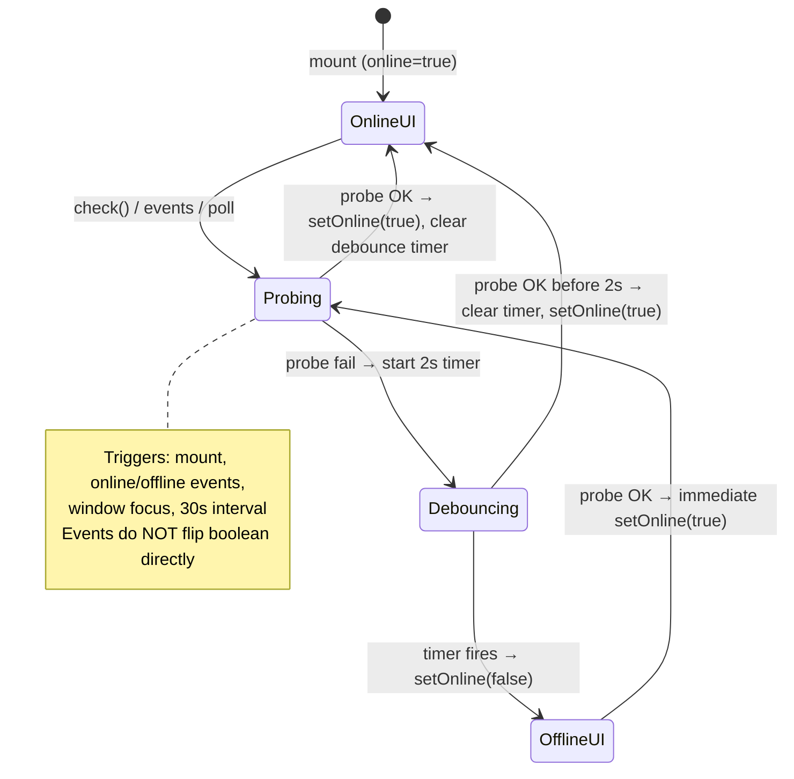

# Flutter Phase 6 — Web MVP offline & connectivity parity report

**Status:** Phase A complete (read-only web audit). **Phase B (Flutter)** starts only after user says **“go”.**

**Sources read:** `webmvp/src/lib/firestore/sessions.ts`, `sessionSongs.ts`, `songs.ts`, `songIndex.ts`, `webmvp/src/lib/hooks/useOnlineStatus.ts`, `useSongLive.ts`, `webmvp/src/components/OfflineBanner.tsx`, `ClientProviders.tsx`, `webmvp/public/sw.js`, `webmvp/public/connectivity.txt`, `webmvp/src/app/(app)/playlists/[id]/page.tsx`, `webmvp/src/app/layout.tsx`, `webmvp/src/lib/firebase.ts`, `webmvp/src/lib/__tests__/integration/sessions.integration.test.ts`.

**Cross-refs:** [`flutter-phase-6-offline.md`](flutter-phase-6-offline.md), [`flutter-web-app-map.md`](flutter-web-app-map.md) §3.6, §3.12, [`flutter-roadmap.md`](flutter-roadmap.md) Phase 6.

---

## 1. `cacheSessionOffline` algorithm (web)

Implementation: `webmvp/src/lib/firestore/sessions.ts:404-417`.

| Step | Action | Firestore API | Notes |
|------|--------|---------------|--------|
| 1 | Load session document | `getDocFromServer(doc(firestore, "sessions", sessionId))` | **Server-only**; populates persistence with latest session metadata. |
| 2 | Load ordered set list | `listSessionSongs(sessionId, firestore)` | See `webmvp/src/lib/firestore/sessionSongs.ts:32-42`: `getDocs(query(collection(..., "sessionSongs"), orderBy("order", "asc")))`. **Default `getDocs` while online** (not `getDocsFromServer`). Results + individual snapshot docs are written into **persistent local cache** as part of the query read. |
| 3 | Prefetch each chart body | `Promise.all(entries.map(e => getDocFromServer(doc(firestore, "songs", e.songId))))` | **Server-only** per song; parallel; one failure rejects entire step 3. |

**Does not:**

- Call join API, `songIndex` rebuild, or `getDocFromServer` on each `sessionSongs/{entryId}` doc individually.
- Prefetch invite tokens or playlist list merge queries.

**Why step 2 matters for offline set navigation**

Offline `?playlist=` and playlist detail depend on the **ordered `sessionSongs` query** having run at least once while online with persistence enabled. Step 3 alone only caches `songs/{id}` bodies; without step 2, `listSessionSongs` / live listeners may return **empty** offline even if song docs exist on disk. QA must verify the query ran during download (Flutter Phase 6B should prefer **`GetOptions(source: Source.server)`** on the ordered query when online to mirror web intent under SDK semantics).

---

## 2. Failure semantics

| Layer | Behavior | UI |
|-------|----------|-----|
| Step 1 | `getDocFromServer` throws → entire `cacheSessionOffline` rejects | `runAction` catch |
| Step 2 | `getDocs` throws → rejects before step 3 | Same |
| Step 3 | `Promise.all` — **any** failed `getDocFromServer` rejects all | Same |
| Partial success | **None** on web — no “3/5 songs cached” state | N/A |

Playlist detail wiring: `webmvp/src/app/(app)/playlists/[id]/page.tsx:278-297` (`runAction`), `309-314` (`handleCacheOffline`).

- Success: sets `actionMessage` to exact string (§3).
- Failure: `setError(err instanceof Error ? err.message : "Action failed.")` (`page.tsx:293-294`).

**No explicit “you are offline” guard** on the cache button — only `disabled={busy}` (`page.tsx:500`). Offline tap fails when server reads fail; user sees error message, not a dedicated offline copy.

---

## 3. UI contract (playlist detail cache control)

| Item | Web value | Citation |
|------|-----------|----------|
| Placement | Action row next to Start set (play link), inside `canView` header block | `page.tsx:448-517` |
| Visibility | **`canView`** (owner, shared member, or published per `canViewPlaylist`) — **not owner-only** | `page.tsx:90-94`, `448`, `498-517` |
| Control | `<button type="button">` with download-style SVG icon | `page.tsx:498-517` |
| `aria-label` | **`Cache for offline`** | `page.tsx:503` |
| `title` | **`Cache for offline`** | `page.tsx:504` |
| Disabled when | **`busy`** only (shared with publish/delete/reorder actions) | `page.tsx:500`, `278-297` |
| Success message (exact) | **`Playlist cached for offline use.`** | `page.tsx:311-312` |
| In-progress | Global `busy` — no per-song progress (no `3/12` on web) | `page.tsx:78`, `500` |

**Phase 5 → 6 Flutter handoff:** Mobile `playlist_detail_screen.dart` has play / share / link / delete actions but **no cache/download control** (Phase 5 v1 intentionally omitted offline). Phase 6 **adds** the control; same `canView` gate as web, not owner-only.

---

## 4. `probeConnectivity` (web)

`webmvp/src/lib/hooks/useOnlineStatus.ts:12-29`.

| Constant | Value |
|----------|--------|
| URL | `CONNECTIVITY_PROBE_URL = "/connectivity.txt"` (`useOnlineStatus.ts:6`) — same-origin on web |
| Flutter equivalent | `{JOIN_API_BASE_URL}/connectivity.txt` (static file `webmvp/public/connectivity.txt`, body **`ok`**, HTTP **200**) |
| Request | `fetch(url, { cache: "no-store", signal })` |
| Timeout | **`PROBE_TIMEOUT_MS = 5000`** — `AbortController` + `setTimeout` abort (`useOnlineStatus.ts:10`, `14-17`) |
| Success | **`return response.ok`** — body content not parsed; `ok` text sufficient (`useOnlineStatus.ts:26`) |
| Failure | `catch` → `return false` (`useOnlineStatus.ts:27-28`) |

**Service worker:** `webmvp/public/sw.js:31-33` — pathname `/connectivity.txt` uses **`fetch(event.request)` only** (network-only bypass). Other GETs may fall back to Cache API (`sw.js:36-39`). Flutter has **no SW** — probe must use **non-cached HTTP client** (fresh GET to Vercel host), same as uncached browser fetch.

---

## 5. `useOnlineStatus` state machine

Constants: `OFFLINE_DEBOUNCE_MS = 2000`, `POLL_MS = 30000`, `PROBE_TIMEOUT_MS = 5000` (`useOnlineStatus.ts:8-10`).

**Initial React state:** `online = true` (`useOnlineStatus.ts:33`) — banner hidden until debounced failure.

| Event | Behavior | Citation |
|-------|----------|----------|
| Mount | `void check()` | `useOnlineStatus.ts:72` |
| `window` `"online"` / `"offline"` | Calls `check()` → **probe**, not `navigator.onLine` as source of truth | `useOnlineStatus.ts:68-70`, `74-75` |
| `window` `"focus"` | Re-probe | `useOnlineStatus.ts:76` |
| Poll | `setInterval(check, 30000)` | `useOnlineStatus.ts:78-80` |
| Probe success | Immediate `setOnline(true)`; clear pending offline timer | `useOnlineStatus.ts:44-50` |
| Probe failure | Schedule `setOnline(false)` after **2s**; reset timer on repeated failures | `useOnlineStatus.ts:53-61` |
| Banner driver only | Does not block Firestore or cache reads | Product behavior (hook return used only in `OfflineBanner`) |

**Flutter port:** `connectivity_plus` + `WidgetsBindingObserver` (resume) re-trigger probe; **banner follows probe**, not radio alone (`flutter-phase-6-offline.md` §1).

---

## 6. Offline banner

Component: `webmvp/src/components/OfflineBanner.tsx`.

| Item | Value |
|------|--------|
| Show when | `!online` from `useOnlineStatus()` | `OfflineBanner.tsx:6-10` |
| Exact copy | **`You're offline. Cached songs and sessions may still be available.`** | `OfflineBanner.tsx:17` (JSX: `You&apos;re offline...`) |
| Dismiss | **None** — hides when probe succeeds | No close button |
| A11y | **`role="status"`** | `OfflineBanner.tsx:15` |
| Layout | **`sticky top-0 z-50`**, amber border/background, centered text | `OfflineBanner.tsx:14` |

**Mount scope:** `ClientProviders` renders `<OfflineBanner />` **above** `{children}` (`ClientProviders.tsx:29-30`), included from root `webmvp/src/app/layout.tsx:66` — **all routes** (login, join, app shell).

**Flutter target:** Root stack in `LfChordsApp` (`mobile/lib/app.dart`) — **Column** with banner + router, not only authenticated tabs (`flutter-phase-6-offline.md` §5.3).

---

## 7. `getSong` cache fallback (`songs.ts`)

`webmvp/src/lib/firestore/songs.ts:72-97`.

1. `getDoc(ref)` — with persistence, typical online path is cache-then-network; comment: “server when online, cache fallback when offline”.
2. If `getDoc` **throws**, try `getDocFromCache(ref)`; return mapped song if `exists()`.
3. If cache miss or second catch → `null`.

**Relation to `watchSong` / `useSongLive`**

- Live path: `onSnapshot(doc(..., "songs", songId))` (`useSongLive.ts:61-76`).
- With persistent cache, offline snapshots can emit **cached** doc; `mapSongDoc` returns empty payload if `!data || data.status !== "active"` (`useSongLive.ts:31-32`) — same active-only rule as Flutter `mapLiveSongPayload` (`mobile/lib/data/mappers/firestore_song_mapper.dart:15`).

**Flutter today (Phase 3/5):**

- `watchSong`: `snapshots()` + error → empty ready payload (`song_repository.dart:12-34`) — aligned with persistence offline after prefetch.
- `getSongRaw`: tries **`Source.cache` first**, then **`Source.server`** (`song_repository.dart:37-51`) — **order differs from web** (web: default `getDoc`, cache only on error). Phase 6C should align one-shot reads with web try-then-cache-on-error semantics.

---

## 8. Offline capability matrix (v1 product truth)

Reproduces [`flutter-phase-6-offline.md`](flutter-phase-6-offline.md) §2.8, validated against web architecture.

| Feature | Offline after prefetch / prior online session |
|---------|-----------------------------------------------|
| Open song chart (downloaded or previously opened) | **Yes** |
| Run set via `?playlist=` if session + `sessionSongs` query + song bodies cached | **Yes** |
| Search / browse home index | **Yes** if index chunks loaded once online (`songIndex.ts` cache-first) |
| List all playlists (`listPlaylistsForUser` merge) | **No** |
| Join playlist / share / edit set (writes) | **No** |
| Live admin chart updates | **Paused** until online |
| Recent songs / zoom / theme prefs | **Yes** (local prefs) |
| Open playlist detail for **downloaded** set | **Yes** — session + cached query |
| Refresh from network (TanStack / Riverpod) | Fails or stale cache |

---

## 9. What Phase 6 does **not** cache

| Item | Reason |
|------|--------|
| Full `songIndex` bulk download | Separate from set download; home needs prior online index load (`songIndex.ts:163-178`) |
| Join API | Network-only (`cacheSessionOffline` has no HTTP) |
| Playlist list merge (owned/shared/published queries) | Multi-query merge requires network |
| Guest / localStorage songs | Not used on web MVP |
| SW shell assets | Flutter N/A |

---

## 10. Phase 5 → 6 handoff (cache control)

| Platform | Cache control |
|----------|----------------|
| **Web** | Visible in playlist detail action row for **`canView`** users (`page.tsx:448`, `498-517`) |
| **Flutter Phase 5** | **Hidden** — no download icon in `playlist_detail_screen.dart` action row (play, share, link, delete only) |
| **Flutter Phase 6** | **Enable** control; match aria/title **“Cache for offline”** and success string §3 |

---

## 11. Flutter vs web (intentional)

| Topic | Web | Flutter Phase 6 |
|-------|-----|-----------------|
| Online detection | Same-origin `GET /connectivity.txt`, SW network-only bypass | `GET {JOIN_API_BASE_URL}/connectivity.txt`, **no HTTP cache** |
| Firestore cache | `persistentLocalCache` + multi-tab manager (`firebase.ts:63-69`) | `persistenceEnabled: true` (`mobile/lib/core/firebase/firebase_bootstrap.dart:12-14`); single process |
| Connectivity signal | `online`/`offline`/`focus` → re-probe | `connectivity_plus` + app resume → re-probe |
| Download progress | `busy` only | **P1:** optional `3/12 songs` (proposed §16) |
| Partial download | All-or-nothing | Match web |

---

## 12. Configuration

| Define | Purpose |
|--------|---------|
| `JOIN_API_BASE_URL` | Phase 5 join API **and** Phase 6 probe host (`mobile/lib/core/config/app_config.dart:3-6`, default `https://lfchords.vercel.app`) |
| Probe URL | `{joinApiBaseUrl}/connectivity.txt` — not a bundled Flutter asset |

Web uses relative `/connectivity.txt` on the **page origin** (Vercel deploy includes `public/connectivity.txt`).

---

## 13. Test spec (Flutter Phase 6)

| Layer | Cases |
|-------|--------|
| **Unit — probe debounce** | Initial `online=true`; mock probe fail → before 2s still true; after 2s false; success clears timer immediately true; repeated fail resets debounce timer |
| **Unit — probe** | 5s timeout → false; `response.ok` false → false; 200 → true |
| **Unit — `cacheSessionOffline`** | Mock: 1× server session get, 1× ordered `sessionSongs` query, N× server song gets; one song failure → entire method throws |
| **Widget — banner** | Provider `online=false` → exact copy §6 visible, `Semantics`/`role` equivalent |
| **Web mirror** | No dedicated `useOnlineStatus` unit test in repo — behavior spec is this report + hook source |

**Integration:** `sessions.integration.test.ts` covers create/add/reorder/status — **no `cacheSessionOffline` test** (`grep` empty).

---

## 14. Manual QA script (roadmap item 7)

1. **Online:** Sign in, open playlist detail (`canView`), tap **Cache for offline** → see **`Playlist cached for offline use.`**
2. Confirm set list shows expected songs (query ran during download).
3. **Airplane mode** (or block network): offline banner appears within **~2s** (debounce).
4. Re-open same playlist detail → metadata + song rows readable.
5. **Start set** → chart opens for each song; Phase 4 prev/next still works.
6. **Home:** After prior online index load, browse/search still works offline (Phase 2 regression).
7. **Login/join routes:** Banner visible when offline (root placement).
8. **Return online:** Banner clears after successful probe.

---

## 15. Doc vs web (`flutter-phase-6-offline.md` §2; map §3.12)

| Topic | Verdict | Notes |
|-------|---------|--------|
| `cacheSessionOffline` steps | **WEB WINS** (doc matches) | Doc §2.2 accurately quotes algorithm |
| Success string | **WEB WINS** | Exact match §3 |
| Banner copy | **WEB WINS** | Exact match §6 |
| Probe constants | **WEB WINS** | 2s / 30s / 5s match source |
| `sessionSongs` server query during prefetch | **DOC WINS (strengthen)** | Web uses default `getDocs` while online; doc recommends explicit server source on Flutter — acceptable hardening |
| Disable cache when offline | **DOC WINS (product)** | Doc §2.2 suggests disable or message; **web does not disable** — only fails in `runAction`. Flutter may fail fast with clearer copy (intentional UX+) |
| SW / probe | **WEB WINS for boundary** | Map §3.12 SW N/A on Flutter; **probe parity required** |
| `getSong` order | **WEB WINS** | Flutter `getSongRaw` cache-first differs — fix in 6C |
| Map §3.12 “getDoc falls back to cache” | **WEB WINS** | Implemented in `songs.ts:79-96 |

---

## 16. Proposed mobile-only changes (Phase B backlog)

| Item | Priority | Rationale |
|------|----------|-----------|
| Determinate download progress (`3/12 songs`) | **P1** | Web only has `busy`; large sets UX |
| `shared_preferences` set of downloaded `sessionId`s | **P1 optional** | Badge on playlist cards; web relies on implicit Firestore cache only |
| Fail-fast offline tap on cache button | **P1** | Clearer than web generic “Action failed.” when already offline |
| Concurrency limit on song prefetches | **P2** | Avoid ANR on 20+ songs (doc §6F) |

---

## Phase B preview (do not implement until **“go”**)

Sub-phases **6A–6F** per [`flutter-phase-6-offline.md`](flutter-phase-6-offline.md) §6:

| Sub-phase | Report § | Primary Flutter files |
|-----------|----------|------------------------|
| 6A Persistence audit | §11, §8 | `firebase_bootstrap.dart`, `mobile/README.md` |
| 6B `cacheSessionOffline` | §1–2, §3 | `session_repository.dart`, `session_songs_repository.dart`, `playlist_detail_screen.dart` |
| 6C `getSong` fallback | §7 | `song_repository.dart` |
| 6D Probe + provider | §4–5 | `connectivity_probe.dart`, `online_status_provider.dart` |
| 6E Banner | §6 | `offline_banner.dart`, `app.dart` |
| 6F QA | §14 | Manual + regressions Phase 2/4/5 |

**Dependencies to add:** `connectivity_plus` (Phase 6); `http` already direct in `mobile/pubspec.yaml` (Phase 5).

---

## Phase B — Flutter implementation map (shipped)

| Sub-phase | Delivered | Files |
|-----------|-----------|--------|
| **6A** | Persistence verified (`persistenceEnabled: true`); README offline section | `mobile/lib/core/firebase/firebase_bootstrap.dart`, `mobile/README.md` |
| **6B** | `cacheSessionOffline` + server `sessionSongs` query + parallel song server gets | `session_repository.dart`, `session_songs_repository.dart` (`listSessionSongsFromServer`), `playlist_detail_screen.dart` |
| **6C** | `getSongRaw` try default get → cache on error | `song_repository.dart` |
| **6D** | Probe constants + debounce helper + `onlineStatusProvider` | `connectivity_probe.dart`, `online_status_provider.dart` |
| **6E** | Root banner above router | `offline_banner.dart`, `app.dart` `MaterialApp.router` builder |
| **6F** | Unit/widget tests; manual QA §14 pending on device | `test/core/connectivity_probe_test.dart`, `offline_banner_test.dart` |

### Intentional diffs vs web

| Topic | Flutter choice |
|-------|----------------|
| Cache when offline | Button disabled + tooltip “Connect to download this set.” (report §15 DOC WINS) |
| Probe host | Absolute `{JOIN_API_BASE_URL}/connectivity.txt` (no SW) |
| Download progress | `busy` only — no `3/12` yet (P1 backlog §16) |
| Banner layout | `MaterialApp.builder` Column + `SafeArea` top on banner |

### Risks (unchanged from plan)

- Probe blocked by firewall → conservative offline banner; cached Firestore reads still work.
- Users may assume full playlist **list** works offline — banner copy limits expectation to cached sessions.
- Large sets: unbounded `Future.wait` on song docs — consider concurrency cap (P2).

---

*Phase A + Phase B complete in repo. Manual airplane QA recommended before marking roadmap demo done.*
