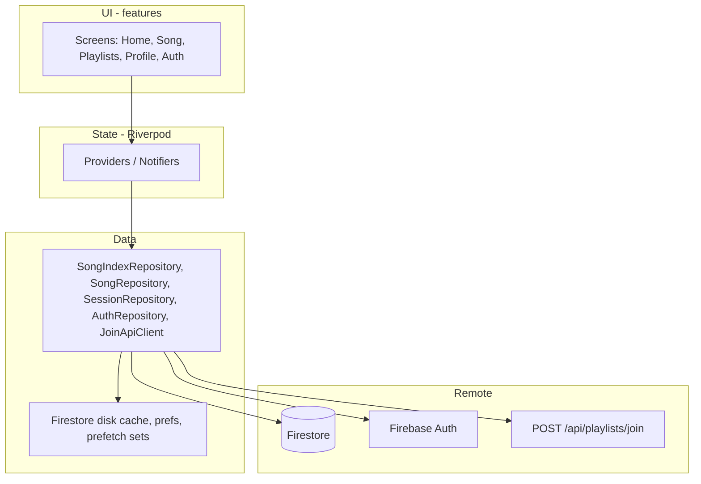

# LF Chords — Flutter mobile roadmap (musician client)

**Status:** Phase 0 complete · Phase 1 implemented (auth + routing shell) — manual device QA pending · **Phase 7 groups implemented in `mobile/`** (device QA pending)
**Team shape:** 1–2 developers, Windows-first (Android), iOS on Mac later  
**Backend:** Firebase project `song-db-5e4ed` (`.firebaserc`) — same Auth, Firestore, rules as web  
**Specs:** [`flutter-web-app-map.md`](flutter-web-app-map.md) · [`flutter-web-app-map-verification.md`](flutter-web-app-map-verification.md) (High/Medium errata override the map where they conflict)

### Implementation progress (tick as shipped)

| Phase | Focus | Status |
|-------|--------|--------|
| **0** | `mobile/`, Firebase init, shell UI, widget test | **Done** |
| **1** | Auth, onboarding, `go_router`, theme shell | **Done** (code + unit tests; Google SHA / device QA per phase doc §4) |
| **2** | Song index + home search (ported web logic) | Not started |
| **3** | Chart, transpose, numbers, live song stream | Not started |
| **4** | Performance mode | Not started |
| **5** | Playlists + join API | **Done** (code + unit tests; two-account join QA manual) |
| **6** | Offline prefetch set + connectivity UX | **Done** (code + unit tests; airplane QA manual) |
| **7** | Groups (v1.1) + polish | Not started |
| **8** | Store beta, iOS prep | Not started |
| **9** | v1.1 launch, iOS ship, production ops | Not started |

**Shipped in repo (`mobile/`):** Flutter app `lf_chords`, Android + iOS targets, Firebase Auth + Firestore (offline persistence), email/Google sign-in flow, username onboarding, `go_router` shell (Home / Playlists / Profile), theme + profile screens, join invite stub, ported domain tests. Phase 0 bootstrap retained as debug line on Profile in debug builds.

---

## 0. Document meta

### Vision

LF Chords on mobile is the **stage- and pew-ready companion** to the church’s shared web library: musicians browse the same Firestore song index, open charts with transpose and Nashville numbers, run set lists with autoscroll and wake lock, and join playlists via invite links—**without any admin authoring** (that remains on the Next.js web app).

### Local-first mobile, same logic as web

The Flutter app is built so **Sunday use works when the network does not**:

| Principle | What it means |
|-----------|----------------|
| **Local when needed** | Firestore **offline persistence** (default on mobile), explicit **playlist/song prefetch** (port `cacheSessionOffline`), and **on-device prefs** (`shared_preferences` for zoom, theme, recent songs — same roles as web `localStorage` / `performancePreferences.ts` / `recentSongs.ts`). UI reads **cache first**, then server; charts and search run **entirely on-device** once data is present. |
| **Dependencies in the app** | Fonts (`google_fonts`), chord/search/chart code in **`lib/domain/`** — no reliance on loading logic from the network at runtime. |
| **Web logic, not a rewrite** | Transpose, search rank, index merge, session navigation, validation, join API contract, and Firestore query shapes are **ported from** `webmvp/src/lib/**` (see map appendices). Behavior must match web + **verification doc** errata (browse pagination vs 100 search cap, `listPlaylistsForUser`, etc.). |
| **Web-only stays on web** | Song create/edit, import, admin, `songEdits`, and guest **`localStorage` song library** (`storage.ts`) are **not** replicated on mobile — mobile is **Firebase library + local cache/prefs**, not a second authoring store. |

Offline is not a late add-on: **Phase 2+** designs repositories assuming cached reads; **Phase 6** adds “download set” and connectivity UX on top of that foundation.

### In scope (Flutter v1 / v1.1)

| Area | In scope |
|------|----------|
| Auth | Email/password, Google Sign-In, signup with username, errors, safe redirects |
| Onboarding | Username claim for legacy/Google users (musician profile only) |
| Library | `songIndex` load, search/rank, filters, browse-all pagination, recent songs |
| Song chart | Read-only active `songs`, transpose, numbers mode, zoom, live doc updates |
| Performance | Immersive UI, autoscroll, wakelock, playlist prev/next query semantics |
| Playlists | `listPlaylistsForUser`, create, detail, session songs, publish **display**, reorder, key override, invite share + **join API** |
| Profile | Display name, username (read/claim) |
| Offline / local | Firestore persistence + in-memory index cache + prefetch set (port `cacheSessionOffline`); prefs on device |
| Connectivity | Banner when offline (probe strategy adapted for mobile; parity goal with web `useOnlineStatus`) |

### Out of scope (web-only / never in Flutter)

| Surface | Web reference | Reason |
|---------|---------------|--------|
| Admin dashboard | `/admin`, map §3.10 | Admin claim UI |
| Import / composer | `/import`, `AdminSongComposer`, map §3.11 | Song create |
| Song edit / publish | `/song/[id]/edit`, `songEdits`, map §3.9 | Drafts, reconcile, archive |
| `songEdits` collection reads | rules §7 | Admin-only read |
| `songs` / `songIndex` writes | rules §7 | Admin-only write |
| Admin ops scripts | `set-admin`, `rebuild-index`, seed | Ops |
| Guest `localStorage` song library | `storage.ts`, verification §3.3 | **Firebase-only on mobile** — no local song CRUD |
| PWA / service worker | map §3.12 | Native app replaces |
| TanStack Query | N/A on Flutter | Use Riverpod + Firestore streams (see §2) |
| Branching UI on `admin` custom claim | `AuthProvider` | **Ignore claim** — no admin entry points |

**Admin exclusion is repeated in:** constraints above, scope matrix (§3), screen map (§5).

### Links

- Feature parity reference: [`docs/flutter-web-app-map.md`](flutter-web-app-map.md)  
- Verified errata (truth for browse cap, playlists, share, offline): [`docs/flutter-web-app-map-verification.md`](flutter-web-app-map-verification.md)

---

## 1. Phase 0 — Environment & project setup

**Goal:** Runnable Flutter app in monorepo, Firebase wired, team can iterate on Android. (Initial setup and Phase 0 shell are complete in `mobile/`.)

### Checklist

| Done | Step | Action |
|:----:|------|--------|
| [x] | 1 | Install Flutter SDK (stable channel, 3.24+ recommended). Run `flutter doctor`; fix Android SDK, cmdline-tools, accept licenses. |
| [x] | 2 | IDE: VS Code/Cursor with **Dart** + **Flutter** extensions; enable format on save. |
| [x] | 3 | **Repo layout:** create **`mobile/`** at repo root (monorepo with `webmvp/`). Keeps one PR for API/rules + app; shared docs in `docs/`. Alternative rejected: separate repo (harder to keep join API + rules in sync). |
| [x] | 4 | `cd mobile && flutter create . --org com.lfchords --project-name lf_chords --platforms=android,ios` (if folder empty) or `flutter create lf_chords` then move. |
| [x] | 5 | **Android:** `minSdkVersion` **23** (Firebase common baseline); `compileSdk` latest stable. **iOS:** deployment target **13.0+** (Firebase 11.x). |
| [x] | 6 | **Package IDs:** Android `com.lfchords.lf_chords` (registered in Firebase); iOS `com.lfchords.lfChords`. Display name: **LF Chords**. |
| [x] | 7 | Install FlutterFire CLI; run `flutterfire configure` from `mobile/`, select project **`song-db-5e4ed`**, register Android + iOS apps. Generates `lib/firebase_options.dart`. |
| [~] | 8 | Add dependencies (see Appendix A); run `flutter pub get`. **Phase 0:** `firebase_core` only; rest land in Phases 1–6. |
| [~] | 9 | Initialize Firebase in `main.dart`; enable Firestore **offline persistence** when `cloud_firestore` is added (Phase 1–2). |
| [ ] | 10 | **App Check (plan only):** register Android Play Integrity + iOS App Attest in console; do not enforce until web + mobile both send tokens. Env names mirror web: `NEXT_PUBLIC_FIREBASE_APP_CHECK_KEY` (web) — mobile uses platform providers via `firebase_app_check`. |
| [ ] | 11 | **Environments:** use `--dart-define` or flavors: `JOIN_API_BASE_URL` (default prod Vercel, e.g. `https://lfchords.vercel.app`), `FLAVOR=dev|prod`. Document in `mobile/README.md`. |
| [x] | 12 | **`.gitignore`:** repo tracks `firebase_options.dart` + `google-services.json`; never commit service account JSON. |
| [ ] | 13 | Optional **Phase 0 CI:** `.github/workflows/flutter.yml` — `flutter analyze`, `flutter test`, `flutter build apk --debug` on `mobile/`. iOS job on `macos-latest` later. |
| [x] | 14 | **Debug screen:** home shell shows `Firebase.app().options.projectId` (expect `song-db-5e4ed`). |
| [x] | 15 | One **widget test:** `MaterialApp` smoke (`HomeShell`). |

### Definition of done (Phase 0)

- [x] `flutter run` on Android emulator or device shows shell UI  
- [x] Firebase initializes without error  
- [x] Debug UI shows project id `song-db-5e4ed`  
- [x] `flutter test` passes (≥1 test)  
- [ ] `mobile/README.md` documents defines and clone steps  

**Estimate:** 0.5–1 person-week  

---

## 2. Architecture decisions (decision log)

| Topic | Decision | Rationale | Alternatives rejected |
|--------|-----------|-----------|------------------------|
| State management | **Riverpod 2.x** (`flutter_riverpod`, `riverpod_annotation` optional) | Async Firestore streams, testable overrides, scales for 1–2 devs | Bloc (more boilerplate); Provider alone (less ergonomic for async) |
| Navigation | **go_router** | Declarative routes, deep links (`/join/p/:token`, query params on song) | Navigator 2.0 manual; auto_route |
| Layering | **Feature-first** under `lib/features/*` + **`lib/core/*`** shared | Matches product areas; avoids over-layering early | Strict clean architecture (too heavy for v1) |
| Data | **Repository classes** per feature; **cloud_firestore** + **firebase_auth**; reads **cache-first** where web does | Same as web modules in `lib/firestore/*` | drift/sqflite primary (optional later if index memory needs disk) |
| Local layer | **Firestore persistence** + **Riverpod** in-memory index + **`shared_preferences`** (zoom, theme, recent) + **prefetch** (`cacheSessionOffline`) | Matches web: persistent Firestore cache + localStorage prefs; mobile adds explicit set download | Guest `localStorage` songs (`storage.ts`) |
| Song index | Port **`songIndex.ts`** + **`songIndexCache.ts`** behavior: load chunks 0–4, merge, optional progressive chunk0-first; **in-memory + Riverpod** cache on device | Public read; 10k cap; search/rank runs locally | Full collection scan of `songs` |
| Web parity rule | **Port TypeScript modules to Dart** under `lib/domain/` and mirror Firestore calls from `webmvp/src/lib/firestore/*` | Single source of behavior spec is web + verification doc | Reimplementing search/chart rules ad hoc in widgets |
| Search | Port **`songSearchText.dart`** (build blob) + **`songSearchRank.dart`** (`rankSongIndexResults`, filters) | Verification: 100 cap **only when searching/filtering**; browse-all paginates page size 10 | Algolia / server search (out of scope) |
| Live song | **`snapshots()`** on `songs/{id}` via repository; expose `Stream<Song?>` to UI — **equivalent to `useSongLive`**, not TanStack | Simple parity with web live updates | Polling |
| Chord UI | **Custom widgets:** `ChordChartLine`, `ChordRow`, layout from port of **`chordLayout.ts`**, **`wrapLyricLine.ts`**, **`graphemeUtils.dart`** (`characters` package) | Web uses DOM measurement; Flutter uses `TextPainter` / fixed column grid | WebView chart (bad UX offline) |
| Auth | **firebase_auth** email + **google_sign_in**; profile in **`users`**, username in **`usernames`** | Parity with web `AuthProvider` / `users.ts` | Anonymous auth (not on web) |
| Admin claim | **Never read for navigation** | Product constraint | N/A |
| Join API | **`http` package** POST with `Authorization: Bearer {idToken}` | Rules block self-join on `sharedWith` | Callable function (phase 2 ops) |
| Theming | **Material 3**, light/dark/**stage** (high contrast dark for performance) | Port `performancePreferences` / `theme.ts` concepts | Cupertino-only |
| Logging / crashes | **Firebase Crashlytics: v1.1** (not v1) | Ship faster; add after beta | Sentry (extra vendor) |

### Layer diagram



### Folder convention

```
mobile/lib/
  main.dart
  app.dart                 # MaterialApp.router, theme
  core/
    firebase/              # init, providers
    routing/               # go_router
    theme/
    network/               # join API client
    utils/
  domain/                  # pure Dart: engine, search, chord_layout (ports from web)
  features/
    auth/
    onboarding/
    library/
    song/
    performance/
    playlists/
    profile/
    groups/                # v1.1
```

---

## 3. Feature scope matrix

| Feature | Web (map §) | Flutter v1 | v1.1 | Never (web only) | Priority |
|---------|-------------|------------|------|------------------|----------|
| Email login / signup | §3.1 | Yes | | | P0 |
| Google Sign-In | §3.1 | Yes | | | P0 |
| Auth errors / loading | §3.1 | Yes | | | P0 |
| Post-login redirect / safe `next` | §3.1, `safeRedirect.ts` | Yes | | | P0 |
| Username onboarding | §3.2 | Yes | | | P0 |
| Profile (display name, username claim) | §3.8 | Yes | | | P0 |
| Guest library browse (index + active songs) | §3.3, §1 guest | Optional v1: **require login for v1** product choice — **default: allow guest read** same as web | | | P0 guest / P1 if login-gated |
| Index load + progressive chunk0 | §3.3, `songIndexCache` | Yes | | | P0 |
| Search + rank + filters | §3.3, verification browse cap | Yes | | | P0 |
| Browse-all pagination (10/page, no 100 cap) | verification #1 | Yes | | | P0 |
| Search results cap 100 | verification #1 | Yes | | | P0 |
| Recent songs (local, max 10) | `recentSongs.ts` | Yes | | | P1 |
| Song chart read-only | §3.4 | Yes | | | P0 |
| Transpose + numbers | §3.4, `engine.ts` | Yes | | | P0 |
| Zoom + chart theme | §3.4–3.5 | Yes | | | P0 |
| Live song snapshot | §3.4, `useSongLive` | Yes | | | P0 |
| Performance / autoscroll / wakelock | §3.5 | Yes | | | P0 |
| Playlist nav query (`playlist`, `index`, `key`) | `sessionNavigation.ts` | Yes | | | P0 |
| Playlist list `listPlaylistsForUser` | §3.6, verification #3 | Yes | | | P0 |
| Create playlist + session songs | §3.6 | Yes | | | P0 |
| Reorder / key override / notes | §3.6 | Yes | | | P0 |
| Publish status display (not admin) | §3.6 | Yes | | | P1 |
| Invite link share + join deep link | §3.6, API §6 | Yes | | | P0 |
| Share by @username (owner Firestore) | verification #4 | Defer | Yes | | P1 |
| Offline prefetch set | `cacheSessionOffline` | Yes | | | P0 |
| Connectivity banner | verification #8 | Yes (adapt probe) | | | P1 |
| Groups list / join / group playlists | §3.7 | Defer | Yes | | P1 |
| Song share URL | §3.4 | Yes | | | P1 |
| Admin / import / edit / songEdits | §3.9–3.11 | | | **Yes** | Never |
| localStorage songs | verification #5 | | | **Yes** | Never |

**Default product stance:** **Guest read** for library + song (rules allow); playlists/groups/join require auth (matches web).

---

## 4. Phased roadmap

### Phase 0 — Setup & skeleton ✅

| | |
|--|--|
| **Status** | **Complete** (README defines + optional CI remain) |
| **Goal** | Tooling, `mobile/` app, Firebase init |
| **Duration** | 0.5–1 pw |
| **Epics** | Repo folder, FlutterFire, debug screen, widget test |
| **User stories** | Dev clones repo and runs app on Android; sees Firebase project id — **done** |
| **Technical tasks** | `mobile/`, `pubspec.yaml` (`firebase_core`), `main.dart`, `firebase_options.dart`, `HomeShell`, widget test — **done** |
| **Domain ports** | None |
| **Dependencies** | None |
| **Demo** | Themed home + **Firebase: song-db-5e4ed** — **done** |
| **Risks** | Windows Android emulator performance; FlutterFire misconfigured package name |

---

### Phase 1 — Core: Firebase, auth, routing shell, theme

**Implementation plan:** [`flutter-phase-1-auth.md`](flutter-phase-1-auth.md) (sub-phases 1A–1G, manual Google SHA setup, web parity checklist).

| | |
|--|--|
| **Goal** | Musicians can sign up, sign in, land in shell with bottom/side nav |
| **Duration** | 1.5–2 pw |
| **Epics** | Auth repository, go_router guards, theme, profile stub |
| **User stories** | (1) Given logged out, when email login succeeds, then home route. (2) Given new user, when signup with username, then profile doc + username doc. (3) Given Google sign-in, when first time, then onboarding route. (4) Given no username, when entering shell, then forced onboarding. (5) Given invalid credentials, when login, then message from mapped Firebase codes. |
| **Technical tasks** | `features/auth/*`, `features/onboarding/*`, `core/routing/app_router.dart`, `AuthGate` redirect, port `safeRedirect` + `validation` username rules |
| **Domain ports** | `validation.ts` (username), `authErrors.ts`, `safeRedirect.ts` |
| **Dependencies** | Phase 0 |
| **Demo** | Login → onboarding → empty home tabs |
| **Risks** | Google Sign-In SHA-1 / iOS URL schemes (document for Mac week) |

---

### Phase 2 — Song index + home search (no chart yet)

**Status:** Implemented in `mobile/` (Phase 2A–2G per [`flutter-phase-2-library.md`](flutter-phase-2-library.md); manual device QA pending — see [`flutter-phase-2-web-library-report.md`](flutter-phase-2-web-library-report.md)).

**Implementation plan:** [`flutter-phase-2-library.md`](flutter-phase-2-library.md) (sub-phases 2A–2G, browse vs 100-cap rules, progressive index).

| | |
|--|--|
| **Goal** | Library list with search, filters, pagination — **index cached on device**; same rank/filter rules as web |
| **Duration** | 2 pw |
| **Epics** | Index repository, home UI, search providers |
| **User stories** | (1) When app opens, load index chunks with chunk0-first paint. (2) When typing search, rank results and cap at 100. (3) When no search, paginate 10 per page sorted by `updatedAtMs`. (4) Filter by key/tag/artist. (5) Tap row opens song route placeholder. |
| **Technical tasks** | `SongIndexRepository`, `features/library/home_screen.dart`, port `songIndex.ts`, `songSearchRank.ts`, `songSearchText.ts`, `libraryArtists.ts`, `languageTags.ts` |
| **Domain ports** | `firestore/songIndex.ts`, `songSearchRank.ts`, `songSearchText.ts`, `constants.ts` |
| **Dependencies** | Phase 1 (guest or auth both can read index) |
| **Demo** | Search “amazing”, filter key, paginate browse |
| **Risks** | 10k entries memory; mitigate with single merged list + isolate search later |

---

### Phase 3 — Song chart + transpose + numbers (read-only)

**Status:** Implemented in `mobile/` (read-only chart, live stream, zoom, playlist query context). Goldens / full manual QA per [`flutter-phase-3-song-chart.md`](flutter-phase-3-song-chart.md) §3H optional. Parity report: [`flutter-phase-3-web-song-chart-report.md`](flutter-phase-3-web-song-chart-report.md) Phase B appendix.

**Implementation plan:** [`flutter-phase-3-song-chart.md`](flutter-phase-3-song-chart.md) (sub-phases 3A–3H, engine + layout ports, live `songs` stream).

| | |
|--|--|
| **Goal** | Production-quality chart screen |
| **Duration** | 3–4 pw |
| **Epics** | Engine port, chord layout widgets, song repository stream |
| **User stories** | (1) Open song by id, show sections. (2) Change key, chords transpose. (3) Toggle Nashville numbers. (4) Pinch/zoom chart. (5) Live update when song doc changes on server. |
| **Technical tasks** | `domain/engine.dart`, `chord_layout.dart`, `wrap_lyric_line.dart`, `features/song/song_screen.dart`, `SongRepository.watchSong(id)` |
| **Domain ports** | `engine.ts`, `keyUtils.ts`, `chordLayout.ts`, `wrapLyricLine.ts`, `graphemeUtils.ts`, `lyricChords.ts`, `chordMarks.ts` (read normalize only) |
| **Dependencies** | Phase 2 |
| **Demo** | Full chart for real Firestore song |
| **Risks** | **Highest technical risk** — layout parity, Indic fonts (Noto on web → `google_fonts` package) |

---

### Phase 4 — Performance mode + playlist navigation

**Status:** Implemented on `SongScreen` (autoscroll, wakelock, fullscreen, bottom bar, chart theme, set prev/next + swipe). Report: [`flutter-phase-4-web-performance-report.md`](flutter-phase-4-web-performance-report.md).

**Implementation plan:** [`flutter-phase-4-performance.md`](flutter-phase-4-performance.md) (autoscroll, wakelock, bottom bar, set navigation).

| | |
|--|--|
| **Goal** | Stage-ready UX |
| **Duration** | 2 pw |
| **Epics** | Immersive UI, autoscroll, wakelock, swipe/button next-prev |
| **User stories** | (1) From playlist context, show bottom bar next/prev. (2) Autoscroll with speed curve. (3) Screen stays on during performance. (4) System UI hidden in performance. (5) Persist zoom per session in local prefs. |
| **Technical tasks** | `features/performance/*`, port `sessionNavigation.ts`, `autoscrollSpeed.ts`, `performancePreferences.ts`, `wakelock_plus` |
| **Domain ports** | `sessionNavigation.ts`, `autoscrollSpeed.ts`, `performancePreferences.ts` |
| **Dependencies** | Phase 3 |
| **Demo** | Run through 3-song set in performance mode |
| **Risks** | Autoscroll jank on low-end Android; tune frame scheduling |

---

### Phase 5 — Playlists CRUD + session songs + share/join API

**Implementation plan:** [`flutter-phase-5-playlists.md`](flutter-phase-5-playlists.md) (sessions repo, join API client, list/detail/share, add-to-playlist).

| | |
|--|--|
| **Goal** | Parity with web musician playlist flows (no admin) |
| **Duration** | 2.5–3 pw |
| **Epics** | Sessions repo, playlist UI, invite tokens, join client |
| **User stories** | (1) List playlists via merged queries like `listPlaylistsForUser`. (2) Create playlist (service type + date). (3) Add/remove/reorder songs. (4) Owner copies/shares invite link. (5) Recipient opens `/join/p/token`, API join, lands on playlist. (6) Idempotent join if already member. |
| **Technical tasks** | `SessionRepository`, `session_songs` subcollection, `playlistInviteToken` port, `JoinApiClient`, deep link route, `ensurePlaylistInviteToken` / create token flows from `playlistInvites.ts` |
| **Domain ports** | `firestore/sessions.ts`, `sessionSongs.ts`, `playlistInvites.ts`, `playlistInviteToken.ts`, `sharePlaylist.ts` (URL builders) |
| **Dependencies** | Phase 1 auth, Phase 3 song ids |
| **Demo** | Two accounts: share link → join → view set |
| **Risks** | **JOIN_API_BASE_URL** wrong in prod; document Vercel URL; token length ≥12 |

---

### Phase 6 — Offline download set + connectivity UX

**Implementation plan:** [`flutter-phase-6-offline.md`](flutter-phase-6-offline.md) (cacheSessionOffline, connectivity probe, offline banner).

| | |
|--|--|
| **Goal** | Explicit “download set” + user-visible offline state (builds on Firestore persistence from Phase 2+) |
| **Duration** | 1.5–2 pw |
| **Epics** | Prefetch, offline banner, read cache |
| **User stories** | (1) Tap “Download set” on playlist → server fetch session + songs into cache (port `getDocFromServer` prefetch like web). (2) When offline, show banner; cached songs still open. (3) Playlist doc readable from cache if prefetched. |
| **Technical tasks** | Port `cacheSessionOffline`, `connectivity_plus` + probe aligned with web `useOnlineStatus` (adapt `/connectivity.txt` or equivalent), offline banner widget |
| **Domain ports** | `sessions.cacheSessionOffline`, `songs.getSong` cache behavior |
| **Dependencies** | Phase 5 |
| **Demo** | Airplane mode after download → set still works |
| **Risks** | Firestore cache size; large sets |

---

### Phase 7 — Groups (v1.1) + polish buffer ✅ (mobile code)

**Implementation plan:** [`flutter-phase-7-groups.md`](flutter-phase-7-groups.md) (groups CRUD, join code, group playlists, home previews, optional polish). **Web parity report:** [`flutter-phase-7-web-groups-report.md`](flutter-phase-7-web-groups-report.md).

| | |
|--|--|
| **Goal** | Team collaboration parity (deferred from v1) |
| **Duration** | 2 pw |
| **Epics** | Groups CRUD UI, join by code, group playlists on home |
| **User stories** | Create group, join via code, list group playlists via `listPlaylistsForGroup`, member list |
| **Technical tasks** | `features/groups/*`, port `groups.ts` |
| **Domain ports** | `firestore/groups.ts` |
| **Dependencies** | Phase 5 |
| **Demo** | Band group with shared playlists |
| **Risks** | `isGroupJoinUpdate` rule — client must match exact field constraints |

**Also in Phase 7 / polish:** share-by-username, recent songs polish, Crashlytics, golden tests hardening.

---

### Phase 8 — Beta hardening, Play Store, iOS prep

**Implementation plan:** [`flutter-phase-8-release.md`](flutter-phase-8-release.md) (QA, signing, deep links, Play internal track, App Check prep, `IOS_BUILD.md`).

| | |
|--|--|
| **Goal** | Internal beta + store-ready Android; iOS doc for Mac |
| **Duration** | 2 pw (+ Mac calendar for iOS) |
| **Epics** | QA scripts, signing, store listing, iOS checklist |
| **User stories** | Internal track APK; TestFlight doc; App Check enforcement coordinated |
| **Technical tasks** | Play App Signing, privacy policy URL, deep link asset links, `IOS_BUILD.md` |
| **Dependencies** | Phases 1–6 for v1; 7 optional |
| **Demo** | Play internal testing release |
| **Risks** | iOS blocked without Mac; plan 1-week Mac access before public iOS |

---

### Phase 9 — v1.1 launch, iOS ship & production ops

**Implementation plan:** [`flutter-phase-9-production.md`](flutter-phase-9-production.md) (store production, TestFlight/App Store, Phase 7 v1.1 ship, Crashlytics, App Check enforce, polish).

| | |
|--|--|
| **Goal** | Public musician app on Play + App Store with v1.1 collaboration & monitoring |
| **Duration** | 2–3 pw (+ Mac week for iOS submission) |
| **Epics** | Production tracks, iOS GA, Crashlytics, App Check enforcement, v1.1 features |
| **User stories** | Church installs from stores; bands use groups; crashes visible; Firestore protected |
| **Technical tasks** | Promote Play tracks; TestFlight → review; `firebase_crashlytics`; enforce App Check with web; Phase 7/ polish if not in v1.0 |
| **Dependencies** | Phase 8 beta; Phase 7 for default v1.1 scope |
| **Demo** | Production listing + iOS App Store or external TestFlight |
| **Risks** | App Check lockout; iOS review; scope creep into admin |

---

### Timeline summary (1 FTE)

| Milestone | Cumulative (rough) |
|-----------|-------------------|
| Phase 0–1 | Week 2 |
| Phase 2–3 | Week 6–7 |
| Phase 4–5 | Week 10–11 |
| Phase 6 | Week 12 |
| Phase 8 (v1 Android beta) | **Week 14–16** |
| Phase 7 groups (v1.1) | +2 weeks (may overlap Phase 9) |
| Phase 9 (production + iOS) | **Week 18–21** |

**2 FTE:** compress chart + playlists parallel → **v1 beta ~10–12 weeks**.

---

## 5. Screen & route map (Flutter-only)

**No admin routes** (`/admin`, `/import`, `/song/.../edit` are web-only).

| Screen | Route | Auth | Params | Web equivalent |
|--------|-------|------|--------|----------------|
| Splash / bootstrap | `/` | Optional | | `/` (home) |
| Login | `/login` | No | `next` | `/login` |
| Signup | `/signup` | No | `next` | `/signup` |
| Username onboarding | `/onboarding/username` | Yes | `next` | `/onboarding/username` |
| Home / library | `/home` or `/` | Optional* | | `/` |
| Song chart | `/song/:id` | Optional* | `playlist`, `index`, `key` | `/song/[id]` |
| Performance (may be same route flag) | `/song/:id` | Optional* | `performance=1` internal | song page |
| Playlists list | `/playlists` | Yes | | `/playlists` |
| Create playlist | `/playlists/new` | Yes | | `/playlists/new` |
| Playlist detail | `/playlists/:id` | Yes | | `/playlists/[id]` |
| Join playlist | `/join/p/:token` | Yes to complete | token | `/join/p/[token]` |
| Profile | `/profile` | Yes | | `/profile` |
| Groups list | `/groups` | Yes | v1.1 | `/groups` |
| Group detail | `/groups/:id` | Yes | v1.1 | `/groups/[id]` |

\*Default: same as web — guest can read library/song; playlists require auth (redirect to login).

### Deep links (plan)

| Link | Android | iOS |
|------|---------|-----|
| `https://lfchords.vercel.app/join/p/{token}` | App Link intent-filter | Universal Link |
| `https://lfchords.vercel.app/song/{id}` | App Link | Universal Link |
| Custom scheme `lfchords://join/p/{token}` | Fallback | Fallback |

Configure `assetlinks.json` / Apple association on **web host** (ops task with Vercel).

---

## 6. Data & Firestore client guide

### Collections — musician app

| Collection | Read | Write (musician) |
|------------|------|------------------|
| `songIndex/*` | Yes (public) | **Never** |
| `songs/*` | Active only | **Never** |
| `songEdits/*` | **Never** (admin) | **Never** |
| `sessions/*` | If published / owner / createdBy / shared / group member | Create; update if owner; delete if owner/group owner |
| `sessions/{id}/sessionSongs/*` | If can read playlist | Owner writes entries |
| `playlistInviteTokens/*` | get own invite flow | Owner create/delete per rules |
| `groups/*`, `groupInviteCodes/*` | Member / join | v1.1: create, join update |
| `users/{uid}` | Self | Create/update profile rules |
| `usernames/*` | get availability | Create on claim |
| `meta/*` | Auth only | **Never** |

### Index loading

1. Fetch `songIndex/chunk0` … `chunk4` (parallel after chunk0 paint optional).  
2. Merge `entries` arrays; dedupe by id.  
3. Subscribe to chunk doc snapshots for refresh (port `subscribeSongIndexUpdates`).  
4. Do **not** query `songs` collection for library browse.

### Join API (must match web)

Source: `webmvp/src/app/api/playlists/join/route.ts`

```http
POST {JOIN_API_BASE_URL}/api/playlists/join
Authorization: Bearer <Firebase ID token>
Content-Type: application/json

{ "token": "<invite token>" }
```

| Status | Body | Client action |
|--------|------|----------------|
| 200 | `{ "sessionId": "..." }` | Navigate to playlist |
| 400 | invalid token | Show error |
| 401 | Unauthorized | Re-auth |
| 404 | invalid/expired | Show error |
| 500 | generic | Retry / support |

Idempotent: already owner or in `sharedWith` → 200 with `sessionId`.

### Config strategy

| Define | Purpose |
|--------|---------|
| `JOIN_API_BASE_URL` | Vercel prod default; override for staging |
| `FLAVOR` | dev/prod Firebase options if split |

---

## 7. Testing strategy

### Unit tests (Dart `test/`)

| Port source (web) | Dart module |
|-------------------|-------------|
| `engine.test.ts` | `domain/engine_test.dart` |
| `songSearchRank.test.ts` | `domain/song_search_rank_test.dart` |
| `chordLayout.test.ts` | `domain/chord_layout_test.dart` |
| `wrapLyricLine.test.ts` | `domain/wrap_lyric_line_test.dart` |
| `validation.test.ts` | `domain/validation_test.dart` |
| `sessionNavigation.test.ts` | `domain/session_navigation_test.dart` |

### Widget / golden

- `ChordChartLine` golden files for sample song section (C, Am, mixed sharps/flats).  
- Font loading: test with `google_fonts` disabled fallback for CI.

### Integration

- **Optional Phase 6+:** Firestore emulator + `fake_cloud_firestore` for repository tests.  
- Not required for v1 if unit coverage strong.

### Manual QA (Android) — per release candidate

1. Auth: signup, login, Google, wrong password.  
2. Onboarding: force username, duplicate username.  
3. Home: search cap 100, browse pagination, filters.  
4. Song: transpose, numbers, rotation.  
5. Performance: autoscroll 5 min, wakelock.  
6. Playlist: create, add 5 songs, reorder, join via link second device.  
7. Offline: download set, airplane mode.  

### iOS checklist (Mac week)

Sign in Google iOS client, universal links, TestFlight smoke, safe area, wakelock.

---

## 8. Release & operations

| Topic | Plan |
|--------|------|
| Android | Play App Signing, internal testing → closed beta; `versionCode` monotonic |
| iOS | Requires Mac + Xcode; TestFlight after v1 Android beta; 1–2 pw on Mac |
| App Check | Coordinate with web before Firestore enforce; register mobile providers |
| Versioning | **Independent** semver (`1.0.0`) decoupled from web `0.1.0`; changelog in repo |
| Admin | Content updates via **web only**; mobile is read-only for songs |

---

## 9. Open questions & decision deadlines

| Question | Default (senior dev) | Deadline suggestion |
|----------|----------------------|---------------------|
| Guest vs login-required library | **Guest read** (rules-aligned) | Before Phase 2 |
| Groups in v1? | **v1.1** (Phase 7) | Sprint planning |
| Share-by-username on mobile | **v1.1**; invite link in v1 | Before Phase 5 |
| Malayalam / Devanagari v1 | **Yes** if songs use tags; bundle Noto via `google_fonts` | Before Phase 3 |
| Join API host | Prod: `https://lfchords.vercel.app` (confirm with team) | Phase 0 |
| Commit `firebase_options.dart`? | **Yes** in private repo | Phase 0 |
| Crashlytics v1? | **No** → v1.1 | Phase 8 |

---

## 10. Appendix

### A. `pubspec.yaml` dependencies (draft)

```yaml
dependencies:
  flutter:
    sdk: flutter
  firebase_core: ^3.8.0          # Firebase init
  firebase_auth: ^5.3.0          # Email + Google
  cloud_firestore: ^5.5.0        # Data + offline
  google_sign_in: ^6.2.0           # Google auth
  flutter_riverpod: ^2.6.0         # State
  go_router: ^14.6.0               # Navigation + deep links
  http: ^1.2.0                     # Join API
  shared_preferences: ^2.3.0       # Zoom/theme/recent
  wakelock_plus: ^1.2.0            # Performance screen on
  connectivity_plus: ^6.0.0        # Offline UX
  google_fonts: ^6.2.0             # Lyric scripts
  characters: ^1.3.0               # Grapheme-safe (port graphemeUtils)
  url_launcher: ^6.3.0             # Share URLs
  share_plus: ^10.0.0              # Native share sheet

dev_dependencies:
  flutter_test:
    sdk: flutter
  flutter_lints: ^5.0.0
  mockito: ^5.4.0                  # Repository mocks
  # firebase_app_check when enabling App Check
  # firebase_crashlytics v1.1
```

### B. Example `lib/` tree (post Phase 5)

```
lib/
  main.dart
  app.dart
  core/
    firebase/firebase_init.dart
    routing/app_router.dart
    theme/app_theme.dart
    network/join_api_client.dart
  domain/
    engine.dart
    chord_layout.dart
    song_search_rank.dart
    session_navigation.dart
    validation.dart
  features/
    auth/
    onboarding/
    library/
    song/
    performance/
    playlists/
    profile/
```

### C. GitHub issue titles (epics)

1. ~~`[mobile] Phase 0: Flutter project + Firebase init in mobile/`~~ **Done**  
2. `[mobile] Auth: email, Google, signup with username`  
3. `[mobile] Onboarding: username claim + gate`  
4. `[mobile] Song index repository + chunk loader`  
5. `[mobile] Home: search, filters, browse pagination (100 cap on search only)`  
6. `[mobile] Port transposition engine + unit tests`  
7. `[mobile] Chord chart UI + golden tests`  
8. `[mobile] Song live snapshot stream`  
9. `[mobile] Performance mode: autoscroll, wakelock, immersive`  
10. `[mobile] Playlist list + create + detail`  
11. `[mobile] Session songs CRUD + reorder`  
12. `[mobile] Playlist invite link + join API client + deep link`  
13. `[mobile] Offline: download set prefetch`  
14. `[mobile] Connectivity banner`  
15. `[mobile] Profile: display name`  
16. `[mobile] v1.1: Groups + share by username`  
17. `[mobile] Play Store internal testing`  
18. `[mobile] iOS build guide + TestFlight`  
19. `[mobile] v1.1 production: Play + App Store, Crashlytics, App Check enforce`  
20. `[mobile] Post-launch hotfix playbook`  

---

*End of roadmap.*
