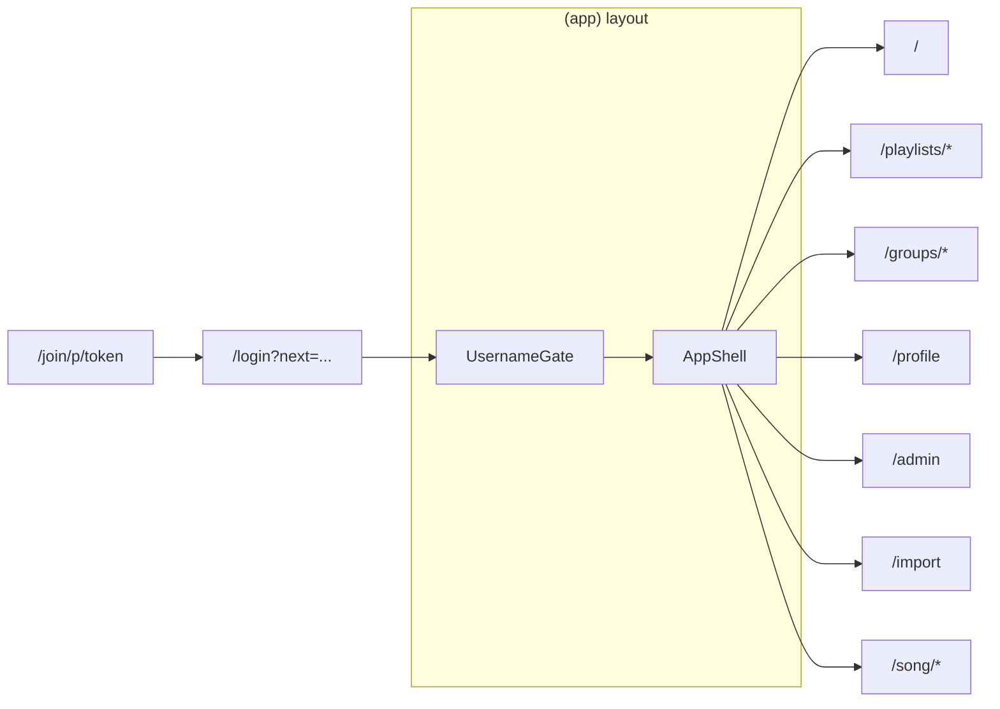

# LF ChordApp — Web MVP → Flutter Migration Map

**Audience:** Flutter engineers planning v1/v2 against the existing Firebase backend.  
**Source of truth audited:** `webmvp/` (Next.js 15), repo-root `firestore.rules`, `firestore.indexes.json`, `firebase.json`.  
**Last updated:** 2026-09-20 (verified against `5bfc9903eb0c07cca1a91ea1512907b86d903f2f`).

### Verification

Independent audit: [`docs/flutter-web-app-map-verification.md`](flutter-web-app-map-verification.md) (2026-09-20). High-severity factual corrections from that pass are applied below.

---

## 1. Executive summary

**Product:** LF Chords is a worship-music chord chart app: browse a shared song library, transpose and view charts in chord or Nashville-number form, run set lists (“playlists” in UI; `sessions` in Firestore), collaborate via groups and invite links, and (for admins) import/edit/publish songs. Mobile-first performance mode targets on-stage use (fullscreen, autoscroll, wake lock, playlist navigation).

**Stack**

| Layer | Technology |
|--------|------------|
| Web app | Next.js 15 App Router, React 19, Tailwind v4, TanStack Query (`ClientProviders` + `useSongLive` / `useSessionSongsLive`) |
| Auth | Firebase Auth (email/password, Google redirect) |
| Data | Cloud Firestore (persistent multi-tab local cache on web) |
| App Check | reCAPTCHA Enterprise (optional via `NEXT_PUBLIC_FIREBASE_APP_CHECK_KEY`) |
| Hosting | Vercel (`vercel.json`); Firebase auth handler rewrite in `next.config.ts` |
| PWA | `public/manifest.webmanifest`, `public/sw.js`, `ServiceWorkerRegistrar` |
| Server | One Next.js API route (`api/playlists/join`) + Admin SDK scripts in `webmvp/scripts/` |

**Approximate scale limits (cite when porting)**

| Limit | Value | Reference |
|--------|--------|-----------|
| Song index capacity | **10,000** songs (5 chunks × 2000) | `SONG_INDEX_CAPACITY` in `webmvp/src/lib/firestore/songIndex.ts` |
| Index chunk max size | **~900 KiB** per `songIndex/{chunkId}` doc | `SONG_INDEX_CHUNK_MAX_BYTES` |
| Denormalized `searchText` per entry | **512** chars max | `SONG_INDEX_SEARCH_TEXT_MAX` in `webmvp/src/lib/songSearchText.ts` |
| Home browse (no search/filters) | Full index, **10** per page (pagination) | `HOME_LIBRARY_PAGE_SIZE`, `HomePage.tsx` (`isBrowsingAll`) |
| Home search/filter results | **100** songs max shown | `LIBRARY_BROWSE_CAP`, `HomePage.tsx` |
| Published playlists list | **100** most recent | `PUBLISHED_PLAYLIST_CAP` |
| Archived song edit versions | **10** per song | `MAX_ARCHIVED_VERSIONS` in `webmvp/src/lib/firestore/songEdits.ts` |
| Username | 3–20 chars, `[a-z0-9_]` | `validation.ts`, `firestore.rules` |
| Playlist invite token | min **12** chars after normalize | `playlistInvites.ts`, join API |
| Load-test seed script | 1–**10,000** songs | `webmvp/scripts/seed-load-test.ts` |

**Admin vs musician:** Firestore security uses **`request.auth.token.admin == true`** (custom claim). `users.role` is stored as `"musician"` on create and **cannot be changed** by the user (`firestore.rules`). Client `isAdmin` comes from ID token claims (`AuthProvider.readIsAdmin`), not from `profile.role`.

**Guest vs signed-in:** Song library and song view work **without sign-in** when Firebase is configured (Firestore rules allow reading `songs` with `status == 'active'` and public `songIndex` reads). Playlists, groups, profile editing, and invite join require auth. Sidebar shows “Sign in” for guests (`AppShell.UserFooter`).

---

## 2. Route & navigation map

### 2.1 Routes table

| Path | Page file | Auth | Admin | Purpose | Key components / lib |
|------|-----------|------|-------|---------|----------------------|
| `/` | `app/(app)/page.tsx` → `HomePage` | Optional | — | Library search, recent songs, playlist previews | `HomePage`, `useSongSearch`, `songIndexCache` |
| `/login` | `app/login/page.tsx` | — | — | Email + Google sign-in, `?next=` redirect | `LoginForm`, `AuthProvider`, `safeRedirect` |
| `/signup` | `app/signup/page.tsx` | — | — | Register with username | `SignupForm`, `createUserProfile` |
| `/onboarding/username` | `app/onboarding/username/page.tsx` | Required | — | Claim username for legacy/Google users | `claimUsername` (outside `(app)` shell; not `UsernameGate`) |
| `/song/[id]` | `app/(app)/song/[id]/page.tsx` | Optional* | — | Chart view, transpose, performance UI | `ChordLine`, `useSongLive`, `sessionNavigation` |
| `/song/[id]/edit` | `app/(app)/song/[id]/edit/page.tsx` | Required | **Yes** | Draft edit, publish, conflict handling | `AdminSongComposer`, `songEdits` |
| `/playlists` | `app/(app)/playlists/page.tsx` | Required | — | List owned/shared/published playlists | `PlaylistCard`, `sessions.ts` |
| `/playlists/new` | `app/(app)/playlists/new/page.tsx` | Required | — | Create playlist | `CreateSessionInput` |
| `/playlists/[id]` | `app/(app)/playlists/[id]/page.tsx` | Required | — | Set list detail, reorder, share, offline cache | `SharePlaylistModal`, `cacheSessionOffline` |
| `/groups` | `app/(app)/groups/page.tsx` | Required | — | List groups, create/join | `CreateGroupModal`, `JoinGroupModal` |
| `/groups/[id]` | `app/(app)/groups/[id]/page.tsx` | Required | — | Group detail, playlists, invite code | `groups.ts` |
| `/profile` | `app/(app)/profile/page.tsx` | Optional UI | — | Display name, username claim | `users.ts` |
| `/admin` | `app/(app)/admin/page.tsx` | Optional (guest/non-admin → `/`) | **Yes** (client redirect) | Stats, search library, archive songs | `AdminStatsCards`, `archiveSong` |
| `/import` | `app/(app)/import/page.tsx` | Required | **Yes** | New song via composer/ChordPro | `AdminSongComposer`, `createSong` |
| `/join/p/[token]` | `app/join/p/[token]/page.tsx` | Required to join | — | Accept playlist invite | `joinPlaylistByInviteToken` → API |
| `POST /api/playlists/join` | `app/api/playlists/join/route.ts` | Bearer token | — | Server-side `sharedWith` update | Firebase Admin SDK |

\*Song page: guests can view Firestore active songs. With Firebase enabled, `localStorage` fallback runs only when **guest** and Firestore song is missing (`song/[id]/page.tsx`). Without Firebase, local songs only (`storage.ts`).

**Redirects** (`next.config.ts`): `/sessions` → `/playlists`; `/admin/songs` → `/admin`.

**Outside `(app)` shell:** `login`, `signup`, `onboarding/username`, `join/p/[token]` — no `AppShell` / `UsernameGate` on join/login (join has own layout).

### 2.2 Sidebar & mobile nav

Defined in `webmvp/src/lib/sidebarNav.ts`, rendered in `AppShell.tsx`.

| Order (musician) | id | href | Notes |
|------------------|-----|------|--------|
| 1 | home | `/` | Logo links home |
| 2 | playlists | `/playlists` | `matchPrefix` |
| 3 | groups | `/groups` | `matchPrefix` |
| 4 | profile | `/profile` | |

**Admin:** `buildSidebarNav(true)` prepends **Admin** → `/admin` (`ADMIN_NAV_ENTRY`). Logo `homeHref` for admins is `/admin` (`ADMIN_HOME_PATH` in `safeRedirect.ts`).

**Mobile:** `MobileTopBar` + drawer; `resolveMobilePageTitle` — home shows logo only; `/import` titled “Add song”.



### 2.3 Deep links

| Link | Behavior |
|------|----------|
| `/join/p/{token}` | If signed in → `POST /api/playlists/join` → `/playlists/{sessionId}` |
| `/song/{id}?playlist={sessionId}&index={n}&key={Key}` | Playlist performance context; legacy `session=` param rewritten to `playlist=` (`sessionNavigation.ts`) |
| `/login?next=/path` | Open redirect only same-origin paths (`getSafeRedirectPath`) |

---

## 3. Feature catalog

Each section: **behavior** → **web** → **Firestore** → **client state** → **rules/validation** → **tests** → **Flutter notes**.

---

### 3.1 Auth (login, signup, Google, errors, loading, post-login redirect)

**Behavior**

- Email/password sign-in and sign-up (sign-up requires unique username).
- Google via `signInWithRedirect` (not popup); pending state in `authRedirect.ts` + loading overlay.
- On auth: ensure `users/{uid}` (legacy create if missing), `touchLastLogin`, load profile, set `needsUsernameOnboarding` if no `username`.
- Sign-out → `/login`.
- Post-auth: admins default to `/admin` unless `?next=`; users without username → `/onboarding/username?next=`.
- Demo accounts when `NEXT_PUBLIC_DEMO_LOGIN=true`.

**Web:** `AuthProvider.tsx`, `LoginForm`, `SignupForm`, `GoogleSignInButton`, `AuthLoadingOverlay`, `login/page.tsx`, `signup/page.tsx`, `authErrors.ts`, `googleAuth.ts`, `firebaseAuthDomain.ts`.

**Firestore / Auth:** `users/{uid}`, `usernames/{lower}` on signup; Auth custom claim `admin` (ops script only).

**Client-only:** `authRedirect` sessionStorage for Google redirect pending.

**Validation:** `validateUsername`; signup rolls back Auth user if profile write fails (`deleteUser`).

**Tests:** `authErrors.test.ts`, `authRedirect.test.ts`, `safeRedirect.test.ts`, `e2e/auth.spec.ts` (optional env credentials).

**Flutter:** **P0** — Firebase Auth Flutter (email, Google sign-in flow differs on mobile). **P0** — mirror `safeRedirect` / onboarding gating. **Hard:** Google redirect vs native Google Sign-In; App Check on mobile.

---

### 3.2 Onboarding / username

**Behavior**

- `(app)/layout` wraps `UsernameGate`: signed-in users without `username` cannot use app shell until `/onboarding/username`.
- `claimUsername` writes `users` + `usernames` atomically (batch).
- Google/legacy users get profile without username → forced onboarding.

**Web:** `UsernameGate.tsx`, `onboarding/username/page.tsx`, `users.claimUsername`.

**Firestore:** `usernames` create-only; profile update `validUsernameClaim` in rules.

**Tests:** Integration via rules tests; `usernameSuggestions.test.ts`.

**Flutter:** **P0** — block main navigator until username set; same validation regex.

---

### 3.3 Home / library search & filters

**Behavior**

- Loads denormalized `songIndex` (all chunks); progressive load shows `chunk0` first (`loadSongIndexCachedProgressive`).
- Real-time index refresh via `subscribeSongIndexUpdates` (listeners on chunk docs).
- Search: token scoring (`songSearchRank.ts`); filters: key, language tag, artist (`LibraryFilterSheet`, `languageTags.ts`, `libraryArtists.ts`).
- Browse without query/filters: sort by `updatedAtMs` (`sortLibraryEntries`), paginate `HOME_LIBRARY_PAGE_SIZE` over the full index (no 100 cap).
- With search or filters: rank/filter then show at most `LIBRARY_BROWSE_CAP` (100) results.
- Sections: recent songs (`recentSongs.ts`), user’s playlists preview, group playlists (if signed in).
- Legacy: `getSongs()` / `deleteSong()` from `localStorage` when no Firebase — **dev/demo path**; primary path is Firestore index.

**Web:** `HomePage.tsx`, `useSongSearch`, `SearchSuggestions`, `SongRow`, `songIndexCache.ts`, `filterSongIndex` → `rankSongIndexResults`.

**Firestore:** `songIndex/chunk0..chunk4` public read; entries built from `songs` on admin write/rebuild.

**Client:** In-memory index cache; recent songs in `localStorage` (`lf-recent-songs`).

**Tests:** `songSearchRank.test.ts`, `songSearchText.test.ts`, `songIndex.test.ts`, `libraryArtists.test.ts`.

**Flutter:** **P0** — port index load + cache strategy (single download, local DB). **P1** — live index listeners. **Hard:** 10k entry client search performance (use same ranking spec).

---

### 3.4 Song view (transpose, numbers, zoom, sections, live updates)

**Behavior**

- Load song: `useSongLive` (Firestore snapshot via TanStack Query) or `getSong` with cache fallback; `getLocalSong` only if Firebase off, or Firebase on + **guest** + no Firestore doc.
- Transpose display key vs `originalKey` (`keyUtils.transposeKeyBy`, `engine.transposeChord`).
- Toggle chords vs Nashville numbers (`SongViewMode`, `chordToDegree`).
- Section headers, chart zoom (`useChartZoom`, `performancePreferences`), layout (`useChartLayout`, `chordLayout`, `wrapLyricLine`, `graphemeUtils`).
- Admin banner if draft exists (`getDraftForSong`).
- Playlist context: prev/next song, key override from `sessionSongs.keyOverride`.
- Swipe navigation on mobile between set songs.
- Share song link (`SongShareButton`, `sharePlaylist.ts`).

**Web:** `song/[id]/page.tsx`, `ChordLine`, `ChordRow`, `ChordChartViewport`, `SongHeader`, `SongControlBar`, `useSongLive.ts`, `firestore/songs.getSong`, `toSong.ts`.

**Firestore:** `songs/{id}` read if `status == 'active'`; live listener on same doc.

**Client:** Chart zoom/theme in `localStorage` (`performancePreferences.ts`); recent song recording.

**Validation:** Chords validated on write paths; display uses parsed transpose.

**Tests:** `engine.test.ts`, `chordLayout.test.ts`, `wrapLyricLine.test.ts`, `keyUtils.test.ts`, `SongHeader.test.ts`.

**Flutter:** **P0** — chart rendering + transpose engine. **P0** — playlist query params. **Hard:** chord-over-lyric layout parity (skyline/collision), Indic scripts (fonts in `layout.tsx`: Noto Malayalam/Devanagari).

---

### 3.5 Performance mode (fullscreen, autoscroll, wake lock, preferences)

**Behavior**

- `usePerformanceMode`: active on viewport &lt; 768px **or** when `?playlist=` present.
- Fullscreen API (`usePerformanceFullscreen`), wake lock while fullscreen or autoscroll (`useWakeLock`).
- Autoscroll with speed curve (`autoscrollSpeed.ts`, `useAutoscroll`), `AutoscrollBar` / bottom bar controls.
- Chart themes: system / dark / stage (`ChartTheme` cycle).
- Body classes `song-performance-page`, `song-autoscroll-active`.

**Web:** `PerformanceFullscreen`, `PerformanceBottomBar`, `AutoscrollBar`, hooks above.

**Firestore:** None (preferences local).

**Client:** `lf-chart-zoom`, `lf-chart-theme`, per-session zoom and last index keys.

**Tests:** `useAutoscroll.test.ts`, `useWakeLock.test.ts`, `usePerformanceFullscreen.test.ts`, `performancePreferences.test.ts`, `performanceControls.test.ts`.

**Flutter:** **P0** — autoscroll + keep screen on (`wakelock_plus`). **P1** — immersive mode vs web Fullscreen API. **Hard:** matched scroll speed feel.

---

### 3.6 Playlists / sessions (create, publish, share, join, offline cache)

**UI name:** Playlist. **Firestore collection:** `sessions` with subcollection `sessionSongs`.

**Behavior**

- Create with `title`, `serviceType` (`friday` \| `sunday_morning` \| `sunday_evening`), `date`, `status` draft/published, optional `groupId`.
- List for user: `listPlaylistsForUser` — owned (`ownerId` / `createdBy`), `sharedWith`, and recent **published** (cap `PUBLISHED_PLAYLIST_CAP`). Group playlists: `listPlaylistsForGroup` (home/groups), not in that merge.
- `createSession` best-effort creates `playlistInviteTokens` + `shareToken` via `attachPlaylistInviteToken`.
- Owner can add/remove/reorder songs (`sessionSongs`), publish, delete.
- Share: invite link (`playlistInvites.ts` + join API for invitees); owner can also **`sharePlaylistByUsername`** (client `updateDoc` on `sharedWith` / `sharedMembers`). Non-owners joining via link use **`POST /api/playlists/join`** (cannot self-add to `sharedWith`).
- Offline: `cacheSessionOffline` prefetches session doc + all songs via `getDocFromServer`.
- Delete cascades session songs, invite token, optional group playlist count.

**Web:** `playlists/*.tsx`, `SharePlaylistModal`, `AddToPlaylistModal`, `sessionSongs.ts`, `playlistInvites.ts`, `playlistMembers.ts`, `sessionDisplay.ts`, `playlistLabels.ts`.

**Firestore:** See §4. Indexes on `sessions` in `firestore.indexes.json`.

**Client:** TanStack Query for `useSongLive` and `useSessionSongsLive`; other playlist ops use direct Firestore calls.

**Tests:** `sessions.integration.test.ts`, `sessionSongs.test.ts`, `sharePlaylist.test.ts`, `sessionNavigation.test.ts`, `deleteAccess.test.ts`.

**Flutter:** **P0** — playlist CRUD (musician), join via HTTPS callable or same Next API URL. **P1** — offline prefetch pattern. **Hard:** join API must stay server-side (or Cloud Function duplicate).

---

### 3.7 Groups (create, join, invite code, shared playlists)

**Behavior**

- Create group: owner in `memberIds`, generated `inviteCode`, `groupInviteCodes/{code}` lookup doc.
- Join via code: read `groupInviteCodes`, append uid to `memberIds` / `members` (`isGroupJoinUpdate` rule).
- List groups: `memberIds array-contains`.
- Group detail: members, playlists for `groupId`, owner can delete group (cascades playlists).
- Resolve username to uid for invites (`resolveUsernameToUid`).

**Web:** `groups/page.tsx`, `groups/[id]/page.tsx`, `CreateGroupModal`, `JoinGroupModal`, `firestore/groups.ts`.

**Firestore:** `groups`, `groupInviteCodes`.

**Tests:** Covered in integration/rules tests; `playlistMembers.test.ts`.

**Flutter:** **P1** — groups for team workflows. **P0** if church rollout needs shared libraries.

---

### 3.8 Profile

**Behavior**

- View/edit display name (Auth profile + Firestore).
- Claim username if missing (also on onboarding route).
- Shows email, role label (Administrator vs Musician from `isAdmin` claim).

**Web:** `profile/page.tsx`, `users.updateUserDisplayName`.

**Firestore:** `users` update limited fields; role immutable.

**Flutter:** **P1** — profile screen.

---

### 3.9 Song edit / drafts / publish / version conflict

**Behavior**

- Admin-only `songEdits` collection: draft per song, `baseVersion` vs live `songs.version`.
- Publish runs transaction: bump song version, merge sections, update `songIndex`, archive old draft (max 10 archived).
- `DraftVersionConflictError` if base version stale on publish.
- **`reconcileDraftWithSong`**: if live `songs.version` advanced, updates draft `baseVersion` / `version` before edit or publish (`songEdits.ts`, `edit/page.tsx`).
- Reconcile/normalize chord marks (`chordMarks.ts`, `serializeSectionsForPublish`).

**Web:** `song/[id]/edit/page.tsx`, `songEdits.ts`, `AdminSongComposer`.

**Firestore:** `songEdits` admin-only read/write; `songs` admin write.

**Tests:** `songEdits.integration.test.ts`, `chordMarks.test.ts`.

**Flutter:** **Defer** v1 (web-only admin). **P2** if mobile admin.

---

### 3.10 Admin dashboard & stats

**Behavior**

- Non-admin redirected to `/`.
- Stats: song count from index length, playlist/group `getCountFromServer`.
- Search index, archive song (status → archived, index removal).

**Web:** `admin/page.tsx`, `AdminStatsCards` (`AdminStats.tsx`), `AdminSongRow.tsx`, `adminStats.ts`, `archiveSong`.

**Flutter:** **Defer** — web/ops.

---

### 3.11 Import / ChordPro / composer

**Behavior**

- `/import` admin-only: `AdminSongComposer` — paste ChordPro (`chordProParser`), touch editor (`useTouchEditor`, `InteractiveEditor`, `LyricLineEditor`), language tags.
- `parseImportText`, `editorParser` for structured edits.
- Save → `createSong` + `invalidateSongIndexCache`.

**Web:** `import/page.tsx`, `AdminSongComposer.tsx`, `ChordProSourcePanel.tsx`, parsers in `lib/`.

**Flutter:** **Defer** v1. Port parsers **P2** for future mobile authoring.

---

### 3.12 PWA / offline / online banner

**Behavior**

- Firestore **persistent local cache** (multi-tab) in `firebase.ts`.
- SW caches shell URLs; network-first fetch with cache fallback (`sw.js`); `connectivity.txt` for online checks.
- `OfflineBanner` uses `useOnlineStatus`: periodic **`GET /connectivity.txt`** probe (not cached by SW), plus `online`/`offline`/`focus` events and 2s offline debounce (`useOnlineStatus.ts`).
- Song `getDoc` falls back to cache on network error.

**Web:** `ServiceWorkerRegistrar`, `OfflineBanner` in `ClientProviders`, `public/sw.js`.

**Flutter:** Use Firestore offline persistence (default on mobile). **P0** — offline read cached songs/playlists user prefetched.

---

### 3.13 Theming / responsive / accessibility

**Behavior**

- Light/dark via `theme.ts` + `ThemeProvider`; flash prevention script in root layout.
- Design tokens in `lf-theme.css`, `globals.css`.
- Safe area insets on sidebar (`env(safe-area-inset-top)`).
- ARIA on mobile menu dialog, offline banner `role="status"`.
- Responsive sidebar breakpoints (`md`/`lg`), performance breakpoint 768px.

**Web:** `ThemeProvider`, `AppShell`, font variables for multilingual lyrics.

**Flutter:** **P1** — Material theme matching brand; **P1** — accessibility labels on performance controls.

---

## 4. Data model reference

### 4.1 Collections overview

| Collection | Document ID | Primary consumers |
|------------|-------------|-------------------|
| `songs` | song slug/id | Song view, playlist entries |
| `songIndex` | `chunk0`…`chunk4` | Home, admin search |
| `songEdits` | auto | Admin edit flow |
| `sessions` | auto | Playlists |
| `sessions/{id}/sessionSongs` | auto | Set list lines |
| `playlistInviteTokens` | token string | Share/join |
| `groups` | auto | Groups |
| `groupInviteCodes` | invite code | Join group |
| `users` | Firebase uid | Profile |
| `usernames` | lowercase username | Uniqueness |
| `meta` | docId | Read auth only; writes denied |

### 4.2 `songs/{songId}`

| Field | Type | Notes |
|-------|------|--------|
| title, artist | string | |
| originalKey | Key | Must be in rules whitelist |
| status | `active` \| `archived` | Non-active not readable |
| sections | Section[] | LyricLine + ChordMark |
| tags | string[] | Language/service tags |
| tempo, ccli, copyright, notes | nullable | |
| version | number | Incremented on publish |
| createdBy, createdAt, updatedAt | | |

Types: `FirestoreSongData` in `types.ts`. Create: `createSong` in `songs.ts` updates index via `upsertSongIndexEntry`.

### 4.3 `songIndex/{chunkId}`

```ts
{ entries: SongIndexEntry[], updatedAt: Timestamp }
```

`SongIndexEntry`: `id`, `title`, `artist`, `key`, `tags`, `searchText?`, `updatedAtMs?`.

**Chunking:** Sort all entries by `title` (localeCompare), slice 2000 per chunk ID order (`buildIndexChunks`). Rebuild: `scripts/rebuild-index.ts` (admin SDK). Client cache: `songIndexCache.ts`.

### 4.4 `songEdits/{editId}`

`songId`, `status` draft\|archived, `baseVersion`, `sections`, `originalKey`, `title`, `notes`, `version`, `editedBy`, timestamps, `publishedAt`.

### 4.5 `sessions/{sessionId}` (playlist)

| Field | Type | Notes |
|-------|------|--------|
| title | string | |
| serviceType | ServiceType | |
| date | Timestamp | |
| songCount | number | Denormalized |
| status | draft \| published | Published visible band-wide |
| ownerId, createdBy | string | `playlistOwnerId()` prefers ownerId |
| sharedWith | string[] | Uids via invite API |
| sharedMembers | GroupMemberInfo[] | Denormalized display |
| shareToken | string? | Invite token doc id |
| groupId | string? | |
| ownerUsername | string? | |

### 4.6 `sessions/.../sessionSongs/{entryId}`

`songId`, `songTitle`, `order`, `keyOverride`, `notes`, `addedBy`, `addedAt`.

### 4.7 `playlistInviteTokens/{token}`

`sessionId`, `ownerId`, `title`, `createdAt` — get allowed for auth users; list denied.

### 4.8 `groups/{groupId}`

`name`, `ownerId`, `memberIds[]`, `members[]`, `inviteCode`, `playlistCount`, timestamps.

### 4.9 `groupInviteCodes/{code}`

`groupId`, `ownerId`, `name`, `createdAt`.

### 4.10 `users/{uid}`

`email`, `displayName`, `username`, `usernameLower`, `role` (`musician`), `avatarInitials`, `createdAt`, `lastLoginAt`.

### 4.11 Auth claims vs profile

| Mechanism | Purpose |
|-----------|---------|
| `token.admin == true` | Firestore write access to songs, songEdits, songIndex; read all playlists |
| `users.role` | Informational; rules enforce `role` unchanged on update |
| `profile.username` | Gating onboarding; not used in security rules for songs |

---

## 5. Domain logic port list (Flutter checklist)

| Module (web) | Responsibility | Complexity | v1? | Spec tests |
|--------------|----------------|------------|-----|------------|
| `engine.ts` | Transpose, parse chords, degrees, diatonic | Medium | **Yes** | `engine.test.ts` |
| `keyUtils.ts` | Key parsing, transpose by semitones | Low | **Yes** | `keyUtils.test.ts` |
| `chordMarks.ts` | Normalize start/end vs legacy position | Medium | **Yes** | `chordMarks.test.ts` |
| `chordLayout.ts` | Skyline / collision for chord row | High | **Yes** | `chordLayout.test.ts` |
| `wrapLyricLine.ts` | Word wrap with chord alignment | Medium | **Yes** | `wrapLyricLine.test.ts` |
| `graphemeUtils.ts` | Grapheme-safe string ops | Medium | **Yes** | `graphemeUtils.test.ts` |
| `lyricChords.ts` | Apply transposed chords to lines | Medium | **Yes** | `lyricChords.test.ts` |
| `chordProParser.ts` | ChordPro → Section[] | Medium | Defer UI | `chordProParser.test.ts` |
| `parseImportText.ts` | Plain text import | Low | Defer | `parseImportText.test.ts` |
| `editorParser.ts` | Editor clipboard formats | Medium | Defer | `editorParser.test.ts` |
| `songSearchText.ts` | Build normalized search blob (512 cap) | Low | **Yes** | `songSearchText.test.ts` |
| `songSearchRank.ts` | Filter + rank index entries | Medium | **Yes** | `songSearchRank.test.ts` |
| `songIndex.ts` | Chunk merge, filterSongIndex | Medium | **Yes** | `songIndex.test.ts` |
| `songIndexCache.ts` | Progressive load, listeners | Medium | **Yes** | integration + manual |
| `sessionNavigation.ts` | Playlist deep links, adjacent songs | Low | **Yes** | `sessionNavigation.test.ts` |
| `sharePlaylist.ts` | URL builders, share copy text | Low | **Yes** | `sharePlaylist.test.ts` |
| `playlistInviteToken.ts` | Token normalize/generate | Low | **Yes** | join flow |
| `validation.ts` | Song + username validation | Medium | **Yes** | `validation.test.ts` |
| `songEdits.ts` | Draft lifecycle | High | Defer | `songEdits.integration.test.ts` |
| `autoscrollSpeed.ts` | Scroll speed mapping | Low | **Yes** | `autoscrollSpeed.test.ts` |
| `performancePreferences.ts` | Zoom/theme persistence | Low | **Yes** | `performancePreferences.test.ts` |
| `libraryArtists.ts` | Artist filter helpers | Low | **Yes** | `libraryArtists.test.ts` |
| `languageTags.ts` | Tag constants / filter | Low | **P1** | `languageTags.test.ts` |
| `songId.ts` | Slug from title | Low | Defer | `songId.test.ts` |
| `recentSongs.ts` | Recent list persistence | Low | **P1** | `recentSongs.test.ts` |
| `storage.ts` | Legacy local songs | Low | **No** | only if offline demo |

---

## 6. API & server-only surfaces

### 6.1 `POST /api/playlists/join`

| Item | Detail |
|------|--------|
| Auth | `Authorization: Bearer {Firebase ID token}` |
| Body | `{ "token": string }` — normalized, length ≥ 12 |
| Success | `{ "sessionId": string }` |
| Errors | 401, 400 invalid, 404 invite/session, 500 |
| Env | Firebase Admin credentials (service account) via `firebaseAdmin.ts` — **not** in client |
| Why | Firestore rules do not allow users to add themselves to `sharedWith`; server uses Admin SDK |

Client: `joinPlaylistByInviteToken` in `playlistInvites.ts`.

**Flutter:** Call same HTTPS endpoint on your API host (Vercel deployment URL) with ID token, or add a Cloud Function equivalent later.

### 6.2 npm scripts (`webmvp/package.json`)

| Script | Implies |
|--------|---------|
| `dev` / `build` / `start` | Standard Next.js |
| `lint` / `typecheck` | Quality gates |
| `test` | Vitest unit tests |
| `test:integration` | Firestore+Auth emulators, integration specs |
| `test:e2e` | Playwright smoke |
| `seed` | Seed songs from `presets.ts` via Admin SDK |
| `rebuild-index` | Full `songIndex` rebuild from active songs |
| `measure-index` | Chunk byte sizes |
| `set-admin` | Set custom claim `admin` on a user |
| `export-songs` | Export library |
| `seed-load-test` | Up to 10k songs for perf testing |
| `generate-pwa-icons` | PWA assets from SVG |
| `emulators` | Local Firestore+Auth |

**Ops only (not in Flutter app):** `set-admin`, `seed`, `rebuild-index`, `export-songs`, `seed-load-test`.

---

## 7. Security & permissions matrix

Legend: **M** = musician (authenticated, non-admin), **A** = admin claim, **—** = public/no auth.

| Collection | Read | Create | Update | Delete |
|------------|------|--------|--------|--------|
| `songs` | — active only | A | A | A |
| `songIndex` | **Public** | A | A | A |
| `songEdits` | A | A | A | A |
| `sessions` | M if published/owner/`createdBy`/shared/group member/A | M (valid shape) | Owner or A | Owner, group owner, or A |
| `sessionSongs` | canReadPlaylist | Owner or A | Owner or A | canDeletePlaylist |
| `playlistInviteTokens` | M get only | Owner + isPlaylistOwner | — | Owner or delegated |
| `groups` | Member or A | M (owner in members) | Owner, join update, or A | Owner or A |
| `groupInviteCodes` | M get only | M (owner) | Owner or A | Owner or A |
| `users` | Self | Self (valid create) | Self (profile/username claim) | Denied |
| `usernames` | Public get | M (own uid) | Denied | Denied |
| `meta` | M | Denied | Denied | Denied |

**Flutter musician app can:** read library + index, read/write own playlists, join groups, join playlists via API, read shared published playlists, cache offline reads.

**Flutter cannot (without admin claim):** create/update/delete songs, song index, song edits, or bypass invite API for `sharedWith`.

---

## 8. Non-functional / platform

| Topic | Current behavior | Files |
|--------|------------------|--------|
| Offline | Firestore persistent cache; playlist prefetch; SW shell cache | `firebase.ts`, `cacheSessionOffline`, `sw.js` |
| App Check | Optional Enterprise reCAPTCHA on web | `firebase.ts`, `.env.example` |
| Auth domain | Dynamic: Vercel host vs `firebaseapp.com` | `firebaseAuthDomain.ts` |
| COOP | `same-origin-allow-popups` for Google auth | `next.config.ts` |
| Read debugging | `NEXT_PUBLIC_READ_COUNTER` | `readCounter.ts` |
| CI | typecheck, lint, unit test, build; integration job with emulators; e2e Playwright | `.github/workflows/ci.yml` |

---

## 9. Flutter migration proposal

### 9.1 Suggested v1 scope (musician consumption)

- Auth + username onboarding
- Home library (index load, search, filters)
- Song view + transpose + numbers mode + performance mode (autoscroll, wakelock)
- Playlists: list, detail, create, add songs, navigate set with `playlist` + `index` params
- Join playlist via deep link + backend join API
- Share song/playlist links (platform share sheet)
- Offline: Firestore persistence + explicit “download set” prefetch

### 9.2 Defer v1

- Admin dashboard, import, composer, song edit/publish
- Group management (unless required day one)
- PWA/service worker (native app replaces)

### 9.3 Screen map (web → Flutter)

| Web route | Flutter screen |
|-----------|----------------|
| `/login`, `/signup` | Auth flow |
| `/onboarding/username` | Username onboarding |
| `/` | Library home |
| `/song/[id]` | Song chart |
| `/playlists` | Playlists list |
| `/playlists/new` | Create playlist |
| `/playlists/[id]` | Playlist detail |
| `/join/p/[token]` | Deep link handler → join |
| `/groups`, `/groups/[id]` | Groups (v1.1) |
| `/profile` | Profile |
| `/admin`, `/import`, `/song/.../edit` | Web only / v2 |

### 9.4 Shared backend

- **No changes required** for v1 if Flutter uses same Firestore rules and join API.
- **Optional future:** Cloud Function for `playlists/join` to remove Vercel dependency; unified App Check providers.

### 9.5 Risks & open questions

| Risk | Mitigation |
|------|------------|
| Chord layout parity | Port `chordLayout` + tests; golden screenshots |
| Join API coupling to Vercel | Document production URL; consider Cloud Function |
| App Check enforcement | Mobile App Check attestation before locking down Firestore |
| 10k index on device | SQLite/isar cache; search in background isolate |
| `users.role` vs admin claim | Flutter must use `getIdTokenResult().claims.admin` |
| Legacy `localStorage` songs | Ignore in Flutter; Firebase-only path |

**TBD:** Contents of `meta/*` documents (read allowed; no client writes found in webmvp).

---

## 10. Appendices

### Appendix A — `package.json` scripts (full)

See §6.2.

### Appendix B — Config env vars (names only)

From `webmvp/.env.example`: `NEXT_PUBLIC_FIREBASE_API_KEY`, `NEXT_PUBLIC_FIREBASE_AUTH_DOMAIN`, `NEXT_PUBLIC_FIREBASE_PROJECT_ID`, `NEXT_PUBLIC_FIREBASE_STORAGE_BUCKET`, `NEXT_PUBLIC_FIREBASE_MESSAGING_SENDER_ID`, `NEXT_PUBLIC_FIREBASE_APP_ID`, `NEXT_PUBLIC_FIREBASE_MEASUREMENT_ID`, `NEXT_PUBLIC_FIREBASE_APP_CHECK_KEY`, `NEXT_PUBLIC_USE_FIREBASE_EMULATOR`, `NEXT_PUBLIC_READ_COUNTER`, `NEXT_PUBLIC_DEMO_LOGIN`, `E2E_USER_EMAIL`, `E2E_USER_PASSWORD`.

### Appendix C — Historical tickets (`webmvp/tickets/webmvp/`)

MVP tickets 001–013 describe scaffold, engine, localStorage-era home/import, song view, mobile, live stage — **still directionally accurate** for chart UX; **superseded** for data layer (Firestore, playlists, groups, auth). `MAP.md` lists closed ticket index.

### Appendix D — File inventory (`webmvp/src/**`)

One-line purpose per `.ts`/`.tsx` file. Test-only files marked **(test)**.

#### `app/`

| File | Purpose |
|------|---------|
| `app/layout.tsx` | Root HTML, fonts, metadata, PWA manifest, `ClientProviders` |
| `app/globals.css` | Global styles |
| `app/lf-theme.css` | Design tokens |
| `app/error.tsx` | Route error UI |
| `app/global-error.tsx` | Root error boundary |
| `app/login/page.tsx` | Login page with redirect handling |
| `app/signup/page.tsx` | Signup page |
| `app/onboarding/username/page.tsx` | Username claim UI |
| `app/join/p/[token]/page.tsx` | Playlist invite landing |
| `app/api/playlists/join/route.ts` | Server join endpoint |
| `app/(app)/layout.tsx` | `UsernameGate` + `AppShell` |
| `app/(app)/page.tsx` | Home route wrapper |
| `app/(app)/admin/page.tsx` | Admin dashboard |
| `app/(app)/import/page.tsx` | Admin song import |
| `app/(app)/profile/page.tsx` | User profile |
| `app/(app)/groups/page.tsx` | Groups list |
| `app/(app)/groups/[id]/page.tsx` | Group detail |
| `app/(app)/playlists/page.tsx` | Playlists list |
| `app/(app)/playlists/new/page.tsx` | Create playlist |
| `app/(app)/playlists/[id]/page.tsx` | Playlist detail / set list |
| `app/(app)/song/[id]/page.tsx` | Song chart view |
| `app/(app)/song/[id]/edit/page.tsx` | Admin song editor |

#### `components/`

| File | Purpose |
|------|---------|
| `AddToPlaylistModal.tsx` | Add song to playlist modal |
| `AdminSongComposer.tsx` | Full song composer (ChordPro + sections) |
| `AdminSongRow.tsx` | Admin library row with actions |
| `AdminStats.tsx` | Stats cards for admin |
| `AppLogo.tsx` | Brand logo |
| `AppShell.tsx` | Sidebar, mobile nav, user footer |
| `AuthDivider.tsx` | “or” divider on auth forms |
| `AuthLoadingOverlay.tsx` | Google redirect wait overlay |
| `AuthProvider.tsx` | Firebase auth context |
| `AutoscrollBar.tsx` | Autoscroll controls UI |
| `AutoscrollToggleButton.tsx` | Toggle autoscroll |
| `ChartZoomButtons.tsx` | Zoom in/out on chart |
| `ChordChartViewport.tsx` | Scrollable chart container |
| `ChordInputPopover.tsx` | Chord entry popover |
| `ChordLine.tsx` | Single lyric line + chords |
| `ChordProSourcePanel.tsx` | ChordPro paste panel |
| `ChordRow.tsx` | Positioned chords above lyrics |
| `ClientProviders.tsx` | Auth, theme, offline, SW, query client |
| `ConfirmDialog.tsx` | Destructive action confirm |
| `CreateGroupModal.tsx` | Create group dialog |
| `DemoAccounts.tsx` | Dev demo login shortcuts |
| `FullscreenToggleButton.tsx` | Enter/exit fullscreen |
| `GoogleSignInButton.tsx` | Google redirect sign-in |
| `HomePage.tsx` | Library home screen |
| `IconActionButton.tsx` | Icon button primitive |
| `InlineChordToolbar.tsx` | Inline chord editing toolbar |
| `InteractiveEditor.tsx` | Click-to-place chord editor |
| `JoinGroupModal.tsx` | Join group by code |
| `KeySelectModal.tsx` | Key picker modal |
| `LanguageTagPicker.tsx` | Song language tags UI |
| `LibraryFilterSheet.tsx` | Mobile filter sheet (key/artist/tag) |
| `LoginForm.tsx` | Email/password login |
| `LyricLineEditor.tsx` | Line-level lyric editor |
| `MemberPills.tsx` | Member avatar chips |
| `OfflineBanner.tsx` | Offline status banner |
| `PageError.tsx` | Error display block |
| `PageLoading.tsx` | Loading spinner block |
| `PerformanceBottomBar.tsx` | Mobile performance controls |
| `PerformanceFullscreen.tsx` | Fullscreen performance shell |
| `PlaylistCard.tsx` | Playlist list card |
| `PlaylistPreviewCard.tsx` | Home playlist preview |
| `SearchSuggestions.tsx` | Search autocomplete dropdown |
| `ServiceWorkerRegistrar.tsx` | Register `sw.js` |
| `SharePlaylistModal.tsx` | Invite link share UI |
| `SignInRequired.tsx` | Gate wrapper for signed-in features |
| `SignupForm.tsx` | Registration form |
| `SongControlBar.tsx` | Song view controls (transpose, mode) |
| `SongHeader.tsx` | Song title/metadata header |
| `SongRow.tsx` | Library list row |
| `SongRowSkeleton.tsx` | Loading skeleton for rows |
| `SongShareButton.tsx` | Share song link/native |
| `ThemeProvider.tsx` | Dark mode provider |
| `UsernameGate.tsx` | Redirect to username onboarding |
| `performanceControls.test.ts` | **(test)** Performance control helpers |
| `SongHeader.test.ts` | **(test)** Song header helpers |

#### `data/`

| File | Purpose |
|------|---------|
| `presets.ts` | Seed-only ChordPro presets for `scripts/seed-songs.ts` |

#### `lib/` (core)

| File | Purpose |
|------|---------|
| `types.ts` | Canonical TS types for Firestore + UI |
| `constants.ts` | Library/playlist caps |
| `engine.ts` | Transposition engine |
| `validation.ts` | Song/username/chord validation |
| `firebase.ts` | Firebase app, Firestore cache, App Check |
| `firebaseAdmin.ts` | Admin SDK for API route |
| `firebaseAuthDomain.ts` | Auth domain resolution |
| `googleAuth.ts` | Google auth provider helper |
| `authErrors.ts` | Map Firebase errors to messages |
| `authRedirect.ts` | Google redirect pending flag |
| `safeRedirect.ts` | Post-login path resolution |
| `theme.ts` | Light/dark local preference |
| `storage.ts` | Legacy localStorage songs |
| `formatError.ts` | User-facing error strings |
| `readCounter.ts` | Dev Firestore read counter |
| `sidebarNav.ts` | Nav items + active state |
| `sessionNavigation.ts` | Playlist song URLs |
| `sessionDisplay.ts` | Format session labels/dates |
| `sharePlaylist.ts` | Share/copy URL helpers |
| `playlistInviteToken.ts` | Token generate/normalize |
| `playlistLabels.ts` | Service type labels |
| `playlistMembers.ts` | Shared member list helpers |
| `songId.ts` | Slug/id from title |
| `songSearchText.ts` | Build searchText (512 max) |
| `songSearchRank.ts` | Search rank + filter |
| `libraryArtists.ts` | Artist filter extraction |
| `languageTags.ts` | Language tag constants |
| `recentSongs.ts` | Recent songs in localStorage |
| `performancePreferences.ts` | Zoom/theme/session prefs |
| `autoscrollSpeed.ts` | Autoscroll speed curve |
| `chordMarks.ts` | Chord mark normalize/serialize |
| `chordLayout.ts` | Chord skyline layout |
| `chordLabelMeasure.ts` | Measure chord label width |
| `chordProParser.ts` | Parse ChordPro lines |
| `chordSourceSync.ts` | Sync ChordPro source with sections |
| `parseImportText.ts` | Plain text to sections |
| `editorParser.ts` | Editor clipboard parsing |
| `editorLabels.ts` | Editor UI copy |
| `lyricChords.ts` | Transpose chords on lines |
| `lyricMeasurement.ts` | DOM lyric width measure |
| `wrapLyricLine.ts` | Wrap lyrics with chord slots |
| `graphemeUtils.ts` | Unicode grapheme helpers |
| `keyUtils.ts` | Key transpose helpers |
| `sectionHeaders.ts` | Section label styling helpers |
| `userDisplay.ts` | Display name + initials |
| `usernameSuggestions.ts` | Username suggestions from email |

#### `lib/firestore/`

| File | Purpose |
|------|---------|
| `songs.ts` | CRUD active songs + pagination |
| `songIndex.ts` | Index chunks, filter, upsert |
| `songIndexCache.ts` | In-memory cache + progressive load |
| `songEdits.ts` | Draft/publish/archive flow |
| `sessions.ts` | Playlists CRUD, share, offline cache |
| `sessionSongs.ts` | Playlist entries CRUD |
| `groups.ts` | Groups CRUD + join |
| `users.ts` | Profiles + username reservation |
| `playlistInvites.ts` | Invite tokens + join client |
| `adminStats.ts` | Dashboard counts |
| `batchDelete.ts` | Batched Firestore deletes |
| `toSong.ts` | Firestore song → UI `Song` |
| `songIndex.test.ts` | **(test)** |
| `sessionSongs.test.ts` | **(test)** |
| `deleteAccess.test.ts` | **(test)** |

#### `lib/hooks/`

| File | Purpose |
|------|---------|
| `useAuth.ts` | Auth context hook |
| `useSongLive.ts` | Live song document |
| `useSessionSongsLive.ts` | Live playlist entries |
| `useSongSearch.ts` | Memoized index search |
| `useRecentSongs.ts` | Recent songs hook |
| `useChartZoom.ts` | Chart scale state |
| `useChartLayout.ts` | Layout max chars from zoom |
| `useChordRowLayout.ts` | Chord row measurement hook |
| `useLyricChordOffsets.ts` | Chord offset positions |
| `usePerformanceMode.ts` | Mobile/playlist performance flag |
| `usePerformanceFullscreen.ts` | Fullscreen API |
| `useAutoscroll.ts` | Autoscroll animation |
| `useWakeLock.ts` | Screen wake lock |
| `useIsMobile.ts` | Mobile breakpoint |
| `useOnlineStatus.ts` | Online/offline detection |
| `useTextSelection.ts` | Text selection for editor |
| `useTouchEditor.ts` | Touch chord placement |
| `*.test.ts` in hooks | **(test)** |

#### `lib/__tests__/integration/`

| File | Purpose |
|------|---------|
| `testEnv.ts` | Emulator test setup |
| `songs.integration.test.ts` | **(test)** Songs + rules |
| `songEdits.integration.test.ts` | **(test)** Edits flow |
| `sessions.integration.test.ts` | **(test)** Playlists |
| `rules.integration.test.ts` | **(test)** Security rules |

#### `lib/*.test.ts`

All other `*.test.ts` under `lib/` — **(test)** unit specs for adjacent modules (auth, theme, share, navigation, etc.).

### Appendix E — Glossary

| Term | Meaning |
|------|---------|
| **Playlist** | UI label for a set list |
| **Session** | Firestore collection `sessions` (same entity) |
| **ServiceType** | `friday`, `sunday_morning`, `sunday_evening` |
| **Numbers mode** | Nashville scale degree display (`SongViewMode.numbers`) |
| **Performance mode** | Stage UI: larger chart, bottom bars, autoscroll |
| **songIndex** | Denormalized search/browse documents, not full song bodies |
| **Active song** | `songs.status == 'active'` (readable by clients) |

### Appendix F — Out of scope / dead code

| Item | Notes |
|------|--------|
| `storage.ts` / `lf-chord-app-songs` | Still referenced from `HomePage` and song page fallback; not primary in production Firebase mode |
| `data/presets.ts` in client | **Not imported by UI** — seed script only |
| `/sessions` routes | Redirected to `/playlists` |
| `users.role == 'admin'` | Not used in Firestore rules; admin is **custom claim only** |
| ChordMark `position` | Legacy; migration path in `chordMarks.ts` |

### Appendix G — E2E / scripts product behavior

| Path | Behavior documented |
|------|---------------------|
| `e2e/smoke.spec.ts` | App loads, basic navigation |
| `e2e/auth.spec.ts` | Login smoke (env credentials) |
| `scripts/set-admin.ts` | Grants `admin` custom claim |
| `scripts/seed-songs.ts` | Seeds presets + index chunks |
| `scripts/rebuild-index.ts` | Rebuild all index chunks from active songs |
| `scripts/export-songs.ts` | Export song JSON |
| `public/connectivity.txt` | SW online probe target |

---

*End of migration map.*
